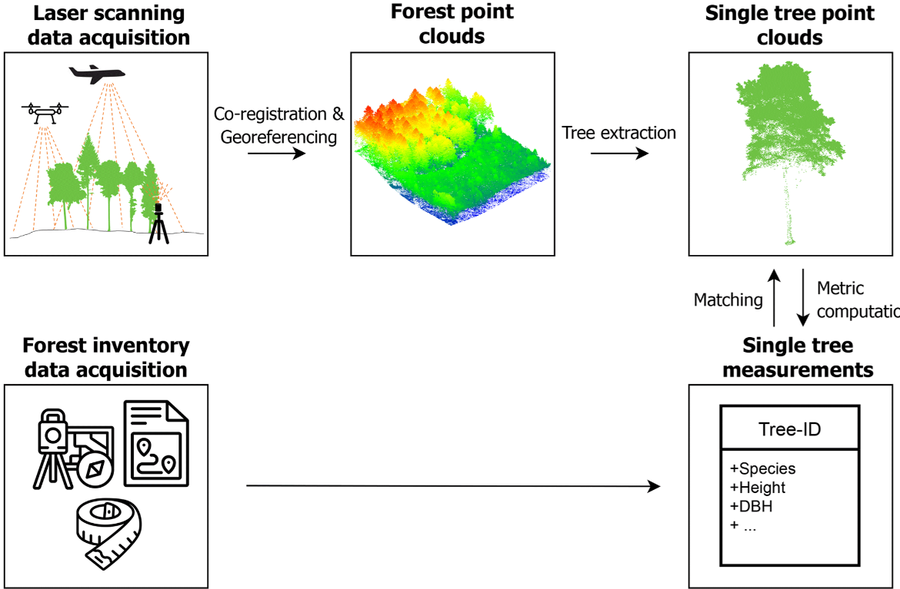
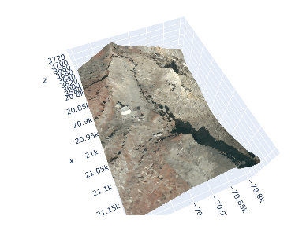
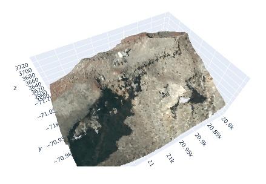
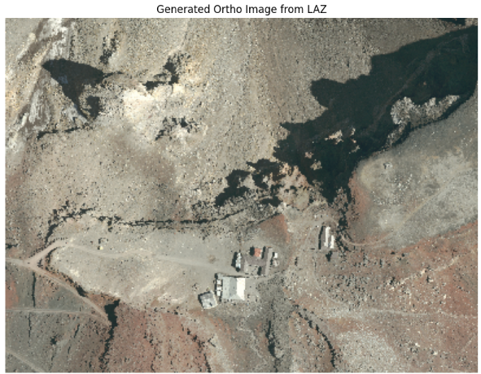

地域の航空写真を撮影後、撮影した画像から広大なマップを作りたいという場合にオルソ画像という画像を使うことがあります。
通常の画像に比べて正確な地理を理解したり、画像を接合するという面では非常に有用な画像です。

本日はそんなオルソ画像について説明、実際に3Dデータから生成する処理について説明していこうと思います。


## オルソ画像とは

オルソ画像（オルソフォト）は、**航空写真や衛星画像を「地図のように正しく（正射投影）」補正した画像**です。

通常の航空写真は、カメラのレンズ中心から放射状に写るため、地形の起伏や建物の高さの影響で、**中心から離れるほど位置がずれます**（遠近感や傾きが生じる）。一方、オルソ画像は、**地形の高さやカメラの傾きによる歪みをすべて除去**し、地図と同じように「真上から見た」状態に変換しています。

### 主な特徴

1. **位置精度が高い**  
   - 画像上の各ピクセルが、現地の座標（緯度・経度・標高）と対応しているため、**距離や面積を画像上で直接計測**できます。

2. **地形の起伏・建物の高さの影響を除去**  
   - 例えば、山の斜面に建つ建物が斜めに写るのではなく、**真上から見た形**で表示されます。

3. **複数枚の写真をシームレスにつなぎ合わせ**  
   - 広範囲をカバーするために、多数の航空写真を撮影し、重なり部分を調整して一枚の大きな画像に合成します。

## オルソ画像の特徴・用途

通常の空撮画像（航空写真）とオルソ画像を比較すると、主に以下のような特徴の違いがあります。

### 1. 投影方式と歪みの有無

- **通常の空撮画像**  
  - カメラのレンズ中心から放射状に写る**中心投影**です。  
  - 地形の起伏や建物の高さの影響で、**中心から離れるほど位置がずれ**、建物が斜めに写ったり、遠近感が強く出たりします。

- **オルソ画像**  
  - 地形の高さやカメラの傾きによる歪みを除去し、**真上から見た状態（正射投影）**に変換しています。  
  - 画像上の各点が、**地図と同じように正確な位置**に対応します。


### 2. 計測・測量への向き

- **通常の空撮画像**  
  - 見た目の把握には優れますが、**距離や面積をそのまま画像上で測るのは難しい**です。  
  - 中心から離れた部分は歪みが大きく、正確な計測には向きません。

- **オルソ画像**  
  - 各ピクセルが座標と対応しているため、**画像上で直接、距離・面積・座標を計測**できます。  
  - GISや測量用途で「背景画像＋計測ツール」として使われます。

### 3. 建物・地形の見え方

- **通常の空撮画像**  
  - 建物の側面が見えたり、**高い建物が斜めに傾いて写る**ことがあります。  
  - 山の斜面では、斜面に沿って建物が傾いて見えます。

- **オルソ画像**  
  - 建物は**真上から見た平面形状**で表示され、高さによる傾きは除去されます。  
  - 地形の起伏も補正されるため、**平坦な地図のように見える**のが特徴です。


### 4. 広域での利用（つなぎ合わせ）

- **通常の空撮画像**  
  - 単独の写真として見る場合は問題ありませんが、**複数枚をそのままつなぎ合わせると、歪みの影響でズレや段差が目立つ**ことがあります。

- **オルソ画像**  
  - 各写真を正射投影に変換したうえで**シームレスにつなぎ合わせる**ため、広範囲を一枚の大きな画像として扱えます。  
  - 都市全体や広域の土地利用図として利用しやすいです。


### 5. 作成の手間とコスト

- **通常の空撮画像**  
  - 撮影だけなら比較的シンプルで、**低コスト・短時間**で取得できます。

- **オルソ画像**  
  - 撮影に加えて、**標高データ（DEM）やレーザー測量データを用いた補正処理**が必要です。  
  - 複数画像の位置合わせ・補正・合成を行うため、**処理に時間とコストがかかる**傾向があります。


### 作成方法のイメージ

1. 航空機やドローンで**多数の写真を撮影**（隣り合う写真が重なるように）。
2. レーザー測量（LiDAR）や既存の標高データ（DEM）を使って**地形の高さを把握**。
3. 写真の各ピクセルを、地形の高さを考慮しながら**正射投影変換**。
4. 変換後の画像を**つなぎ合わせて一枚のオルソ画像**に合成。

このように、オルソ画像は「写真のリアルさ」と「地図の正確さ」を両立させた画像であり、測量・地図作成・都市計画など幅広い分野で重要な基盤データとして使われています。


## LAZファイルからオルソ生成
3次元点群データ（LAS形式の圧縮版）があればオルソ画像を生成することが可能です。
以下に処理の流れを説明します。

### 処理の基本的な流れ

LAZファイルは圧縮された3次元点群データ（LAS形式の圧縮版）です。点群データからオルソ画像（真上から見下ろした正投影画像）を作成する場合、点群に含まれる情報によって作成方法が2パターンに分かれます。

1. **RGB（色）情報が含まれている場合:** 点の色（赤・緑・青）を2Dの格子（グリッド）に投影し、オルソカラー画像を作成できます。
2. **RGB情報が含まれていない場合（標高データのみ）:** 点のZ値（高さ）や反射強度（Intensity）を画像化して、標高画像（DEM/DSM）や反射強度オルソ画像を作成します。

点群からオルソ画像を作る処理は、実質的に3Dの散乱点を2Dの規則正しいグリッドに落とし込む処理（ラスタライズ）です。
具体的なステップは以下の4段階です。

* **LAZファイルの読み込み:** `laspy` ライブラリを使用してデータを展開・読み込みます。
* **2Dグリッド（ピクセル）の設定:** 解像度（例: 1ピクセル = 10cm など）を決めて、画像を格納する2次元配列を準備します。
* **グリッドへの割り当て:** 各点群の (X, Y) 座標がどのピクセルに入るかを計算し、そのピクセルに RGB値や標高値（Z）を割り当てます。
* **GeoTIFFなどの画像出力:** `rasterio` を使って位置情報（CRS）付きの画像ファイルとして保存します。




## 実験

以下の公開された富士山の点群データ(las形式)を用いてオルソ画像化してみようと思います。

公開元データの配布場所：https://gsj-seamless.jp/pointCloud/sample/crater/





因みに3D点群を立体的に可視化したコードはこれです。

```python
import laspy
import numpy as np
import plotly.graph_objects as go

las = laspy.read("08ME3562.las")

# 描画負荷を軽くするため100点に1点抽出（ダウンサンプリング）
skip = 100
x = las.x[::skip]
y = las.y[::skip]
z = las.z[::skip]

# RGBカラーの生成 (0-255表記に変換)
r = (las.red[::skip] / 256).astype(int)
g = (las.green[::skip] / 256).astype(int)
b = (las.blue[::skip] / 256).astype(int)
color_strings = [f'rgb({r_i},{g_i},{b_i})' for r_i, g_i, b_i in zip(r, g, b)]

# Plotlyで3D散布図を描画
fig = go.Figure(data=[go.Scatter3d(
    x=x, y=y, z=z,
    mode='markers',
    marker=dict(
        size=1.5,
        color=color_strings,
        opacity=0.8
    )
)])

fig.update_layout(
    scene=dict(aspectmode='data'),
    title="富士山火口 3D点群プレビュー (Plotly)"
)

fig.show()
```

### Pythonによるオルソ化

以下は、`laspy` と `numpy` を使用して、LAZファイルからRGBオルソ画像（GeoTIFF形式）を生成する最小限の実装例です。

事前に必要なライブラリをインストールしてください：

```bash
pip install laspy[lazrs] numpy rasterio

```

```python
import os
import laspy
import numpy as np
import rasterio
from rasterio.transform import from_origin
import matplotlib.pyplot as plt

laz_file = "08ME3562.las"

# 3. LAZファイルの読み込み
las = laspy.read(laz_file)

# 座標の取得
x = las.x
y = las.y

# RGB情報の取得（16bitから8bitへ変換）
# ※データによってはRGBがなくIntensity（反射強度）のみの場合もあります
r = (las.red / 256).astype(np.uint8)
g = (las.green / 256).astype(np.uint8)
b = (las.blue / 256).astype(np.uint8)

# 4. 2Dグリッド（ピクセル）の設定
pixel_size = 1.0  # 1ピクセル = 1m （処理を軽量化するため1mに設定）

x_min, x_max = np.min(x), np.max(x)
y_min, y_max = np.min(y), np.max(y)

width = int(np.ceil((x_max - x_min) / pixel_size))
height = int(np.ceil((y_max - y_min) / pixel_size))

# ピクセルインデックスの計算
col_idx = np.floor((x - x_min) / pixel_size).astype(int)
row_idx = np.floor((y_max - y) / pixel_size).astype(int)

# 範囲外のインデックスを制限
col_idx = np.clip(col_idx, 0, width - 1)
row_idx = np.clip(row_idx, 0, height - 1)

# 5. グリッドへRGBを配置
ortho_image = np.zeros((height, width, 3), dtype=np.uint8)

# 点群の色を割り当て
ortho_image[row_idx, col_idx, 0] = r
ortho_image[row_idx, col_idx, 1] = g
ortho_image[row_idx, col_idx, 2] = b

# 6. GeoTIFFとして保存
transform = from_origin(x_min, y_max, pixel_size, pixel_size)
output_tif = "output_ortho.tif"

with rasterio.open(
    output_tif,
    'w',
    driver='GTiff',
    height=height,
    width=width,
    count=3,
    dtype=ortho_image.dtype,
    crs=las.header.parse_crs() if las.header.parse_crs() else "EPSG:2992", # フォールバック座標系
    transform=transform,
) as dst:
    dst.write(ortho_image[:, :, 0], 1)
    dst.write(ortho_image[:, :, 1], 2)
    dst.write(ortho_image[:, :, 2], 3)

print("GeoTIFFの生成が完了しました！")

# 7. 生成したオルソ画像のプレビュー表示
plt.figure(figsize=(10, 10))
plt.imshow(ortho_image)
plt.title("Generated Ortho Image from LAZ")
plt.axis('off')
plt.show()

```

実際に実行した結果は以下です。
うーん。見事に上空写真、それも遠近感のゆがみがなくなった画像になりました。
それがオルソ画像です(笑)





### 実際に作成する際のポイント

* **データの欠損（隙間）対策:** 点群の密度が低い場合、画像化した際に黒い隙間ピクセルが生じることがあります。`scipy.interpolate` などを用いて周囲のピクセルから補間（インペインティング）を行うと綺麗な画像になります。
* **最上面の優先（Z値フィルタ）:** ビルや樹木が重なっている場所では、Z座標（標高）が一番高い点のRGBを優先して配置することで、見栄えの良い真上からのオルソ画像が得られます。
* **PDALの活用:** より本格的・大規模に処理したい場合は、Pythonから **PDAL (Point Data Abstraction Library)** という点群処理ライブラリを呼び出すパイプラインを組むのも非常に強力です。

## 総括

オルソ画像は、**写真の見た目と地図の正確さを両立した画像**で、主に以下の用途で使われます。

- **GIS・地図作成**：背景画像として道路・建物・土地利用を正確に重ねる  
- **都市計画・インフラ管理**：開発計画や施設配置の検討  
- **防災・環境モニタリング**：浸水・土砂災害リスク、植生分布の把握  
- **農業・林業**：農地・森林の区画・樹種の把握  

### 作成のコツ（3D点群からオルソ生成）

- **点群のRGBをグリッドに落とす**  
  - 各点の (X, Y) からピクセル位置を計算し、RGBをそのまま割り当てる（ラスタライズ）。
- **解像度（ピクセルサイズ）を用途に合わせる**  
  - 都市部は 10–50 cm、広域は 1 m など、必要精度で調整。
- **隙間対策**  
  - 点密度が低いと黒い穴ができるので、周囲ピクセルから補間（インペインティング）を検討。
- **最上面の優先**  
  - 建物や樹木が重なる箇所は、Z値が最大の点のRGBを採用すると見栄えが良い。
- **GeoTIFFで座標情報を付与**  
  - `rasterio` などで CRS・座標変換を設定し、GISでそのまま使えるようにする。

要するに、**「3D点群を真上から見た2Dグリッドに落とし込み、隙間を埋めて座標付きで保存する」** のがオルソ画像生成の基本です。


