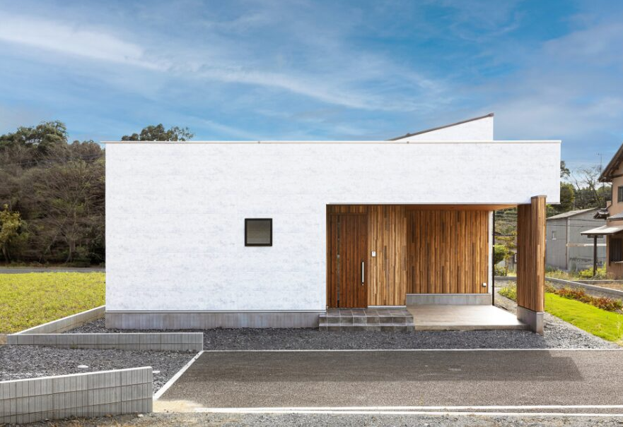
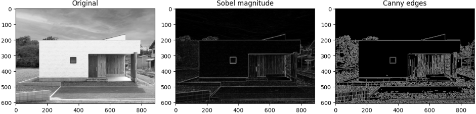
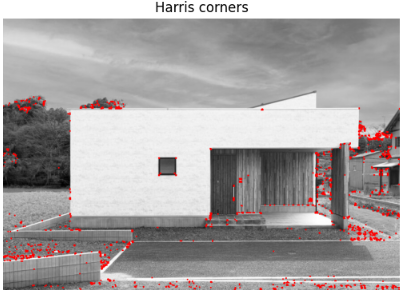
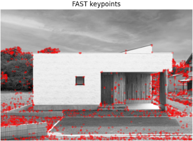
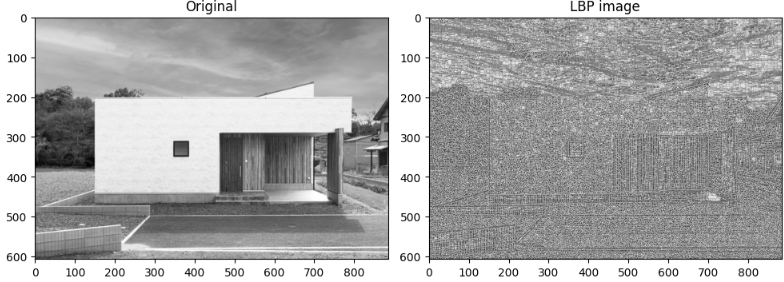
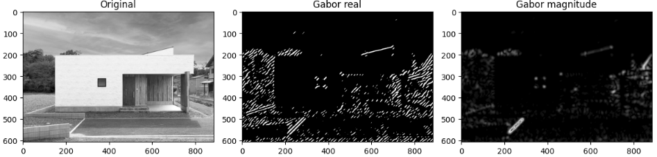

大学の研究室で画像処理系の研究室に入った場合、まず研究室で当たり前のように"特徴量"という言葉を聞くことになります。
ですが、大学の講義で画像処理を受けてこなかった場合、"?"となることが多いはずです。

画像処理を行う場合、ほぼ確実に出てくる特徴量という言葉。
特徴量とは一体何なんでしょう？

本日は特徴量の正体について説明します。

## 特徴量

画像処理で扱うことになる特徴量は、おおまかに次の3つに分けられます。

1. **画素値そのもの（輝度・色）**
   - 最も原始的な特徴量で、画像をグレースケールにしたときの「明るさ（輝度）」や、カラー画像のR/G/Bチャンネル値などです。
   - 多くの処理は、この画素値の集合に対してフィルタや統計処理をかけることから始まります。

2. **局所的な形状・エッジ・テクスチャ**
   - **エッジ**：Sobelフィルタ、Cannyエッジ検出などで抽出される「輪郭」や「境界」。
   - **コーナー**：Harrisコーナー、FASTなどで検出される「角」や「特徴点」。
   - **テクスチャ**：LBP（Local Binary Patterns）、Gaborフィルタなどで表される「模様」や「質感」。
   - 物体認識やマッチングでは、こうした局所特徴が非常に重要になります。

3. **統計的・大域的な特徴**
   - **ヒストグラム**：画像全体の明るさや色の分布。
   - **HOG（Histogram of Oriented Gradients）**：局所的な勾配方向の分布をまとめた特徴。
   - **SIFT / SURF / ORB**：スケールや回転に比較的頑健な局所特徴量（最近はディープラーニングに置き換えられつつありますが、基礎として学ぶことが多いです）。

最近はディープラーニング（CNNなど）で「特徴量を自動学習する」ことが主流ですが、その入力として使われるのは結局「画素値」であり、学習された特徴の中身を分解すると、上記のようなエッジ・テクスチャ・形状の組み合わせになっていることが多いです。

まとめると、
- 画像処理の基本は「画素値（輝度・色）」を出発点に、
- そこから「エッジ・コーナー・テクスチャ」などの局所特徴を抽出し、
- 必要に応じて「ヒストグラム」などの統計特徴にまとめる、
という流れで、これらはほぼ必ず扱うことになる特徴量と言えます。


## 実装してイメージ

実際に画像を使って求めてみるとイメージが良くわきます。
以下では、OpenCVとscikit-imageを使って、エッジ・コーナー・テクスチャを求めるPythonコード例を示します。

今回実験ではコントラストがきれいな画像が良いということで以下のような実家の写真を利用します。



### 事前準備

```bash
pip install opencv-python scikit-image matplotlib numpy
```

### 1. エッジ（Sobel, Canny）

エッジ抽出系の手法です。

エッジ検出の基本は「画像中の輝度（明るさ）の急激な変化を見つける」ことです。SobelやCannyは、その変化をどのように計算・評価するかが異なります。

__1. エッジ検出の共通原理__

- 画像は画素値（輝度）の集まりで、エッジとは「輝度が急に変化する場所」です。
- 数学的には、輝度変化の大きさ＝**勾配（gradient）** を計算し、勾配が大きい場所をエッジとみなします。
- 勾配は、x方向（横）とy方向（縦）の変化をそれぞれ計算し、その大きさと方向を求めます。

__2. Sobelフィルタの原理__

Sobelは「一次微分」に基づくシンプルなエッジ検出です。

1. **カーネルによる畳み込み**
   - 画像に対して、x方向の勾配を求めるカーネル（例：`[-1,0,1; -2,0,2; -1,0,1]`）と、y方向の勾配を求めるカーネル（例：`[-1,-2,-1; 0,0,0; 1,2,1]`）を畳み込みます。
   - これにより、各画素における「横方向の変化量（Gx）」と「縦方向の変化量（Gy）」が得られます。

2. **勾配の大きさと方向**
   - 勾配の大きさ：`magnitude = sqrt(Gx^2 + Gy^2)`
   - 勾配の方向：`direction = arctan(Gy / Gx)`
   - 大きさが大きい画素ほど「エッジっぽい」と判断します。

3. **特徴**
   - 計算が軽く実装も簡単ですが、ノイズに弱く、エッジが太くなりやすいです。

__3. Cannyエッジ検出の原理__

CannyはSobelよりも高度で、次の4ステップからなります。

1. **ガウシアンフィルタによる平滑化**
   - まず画像を少しぼかしてノイズを減らします（ガウシアンフィルタ）。
   - これにより、細かいノイズ由来の偽エッジを減らします。

2. **勾配の計算（Sobelなど）**
   - Sobelなどで各画素の勾配の大きさと方向を求めます。

3. **非極大値抑制（Non-Maximum Suppression）**
   - 勾配方向に対して、その画素が「周囲より極大」かどうかをチェックします。
   - 極大でない画素はエッジ候補から除外し、エッジを細く・シャープにします。

4. **ヒステリシス閾値処理（Hysteresis Thresholding）**
   - 2つの閾値（高い方：`T_high`、低い方：`T_low`）を使います。
   - 勾配が `T_high` 以上の画素は「強いエッジ」として確定。
   - `T_low` 以上 `T_high` 未満の画素は、「強いエッジとつながっている場合のみ」エッジとして採用。
   - これにより、細切れのエッジを連結しつつ、ノイズを抑えます。


- **Sobel**：単純な一次微分で勾配を計算し、大きさが大きいところをエッジとみなす。軽量だがノイズに弱い。
- **Canny**：平滑化 → 勾配計算 → 非極大値抑制 → ヒステリシス閾値処理という多段階の処理で、細く・つながった・ノイズに強いエッジを抽出する。

どちらも「輝度の急激な変化＝勾配」を検出するという点では共通ですが、Cannyはその後の後処理により、より高品質なエッジマップを得ることを目指しています。


```python
import cv2
import numpy as np
import matplotlib.pyplot as plt

# 画像読み込み（グレースケール）
img = cv2.imread("input.jpg", cv2.IMREAD_GRAYSCALE)
assert img is not None, "画像が読み込めませんでした"

# Sobelエッジ（x方向・y方向）
sobelx = cv2.Sobel(img, cv2.CV_64F, 1, 0, ksize=3)
sobely = cv2.Sobel(img, cv2.CV_64F, 0, 1, ksize=3)
sobel_mag = np.sqrt(sobelx**2 + sobely**2)  # 勾配の大きさ

# Cannyエッジ
edges_canny = cv2.Canny(img, threshold1=50, threshold2=150)

# 可視化
plt.figure(figsize=(12, 4))
plt.subplot(1, 3, 1)
plt.imshow(img, cmap="gray")
plt.title("Original")
plt.subplot(1, 3, 2)
plt.imshow(sobel_mag, cmap="gray")
plt.title("Sobel magnitude")
plt.subplot(1, 3, 3)
plt.imshow(edges_canny, cmap="gray")
plt.title("Canny edges")
plt.tight_layout()
plt.show()
```

__結果__

上記で処理を行った結果です。
Sobelで処理したものは建物の輪郭がくっきりとしていることが確認出来ます。



### 2. コーナー（Harris, FAST）

コーナー検出の基本は「どの方向に動かしても画像の局所パターンが大きく変わる点」を見つけることです。HarrisとFASTは、その判定の仕方が大きく異なります。

__Harrisコーナーの原理__

Harrisコーナーは「局所ウィンドウを少し動かしたときの画像の変化量」に基づきます。

1. **局所ウィンドウの移動による変化量を計算**
   - ある画素を中心とする小さなウィンドウ（例：3×3や5×5）を考えます。
   - このウィンドウを `(u, v)` だけ移動させたときの、画素値の二乗誤差の和（SSD）を計算します。
   - SSDは、x方向とy方向の勾配（Sobelなどで求める）を使うと、近似的に次のように書けます：
     $$
     E(u,v) \approx [u\ v] M \begin{bmatrix}u \\ v\end{bmatrix}
     $$
     ここで `M` は「構造テンソル」と呼ばれ、局所的な勾配の共分散行列です。

2. **Mの固有値で「フラット・エッジ・コーナー」を判別**
   - `M` の固有値 `λ1, λ2` を考えると：
     - 両方とも小さい → フラット（どの方向に動かしてもあまり変わらない）
     - 片方だけ大きい → エッジ（ある方向に動かすと大きく変わる）
     - 両方とも大きい → コーナー（どの方向に動かしても大きく変わる）

3. **コーナー応答関数**
   - 実際には固有値を直接計算せず、次のような「コーナー応答」Rを計算します：
     $$
     R = \det(M) - k \cdot \text{trace}(M)^2
     $$
   - `R` が大きいほどコーナーとみなします。

4. **特徴**
   - 回転に対して比較的頑健で、安定したコーナー検出ができます。
   - 計算コストはエッジ検出より高めです。

__FASTコーナーの原理__

FAST（Features from Accelerated Segment Test）は、名前の通り「高速」を重視したコーナー検出です。

1. **円周上の画素との比較**
   - 注目画素 `p` を中心に、半径3ピクセル程度の円周上に16個の画素を取ります。
   - `p` の明るさを `I_p`、円周上の画素の明るさを `I_i` とします。

2. **連続するN画素が閾値を超えるかチェック**
   - 閾値 `t` を決め、次の条件を満たす連続する画素数が `N` 個以上あるかを見ます：
     - `I_i ≥ I_p + t`（明るい側）
     - または `I_i ≤ I_p - t`（暗い側）
   - 典型的には `N = 9` や `N = 12` が使われます。

3. **高速化の工夫**
   - 円周上の1, 5, 9, 13番目の画素だけを先にチェックし、コーナーになり得ない場合は早期に打ち切ることで高速化します。
   - 候補点に対してのみ、残りの画素も含めて完全なチェックを行います。

4. **特徴**
   - 非常に高速で、リアルタイム処理やモバイル向けに適しています。
   - 回転やスケール変化にはあまり頑健ではありませんが、単純さと速度が最大の利点です。


- **Harris**：局所ウィンドウを動かしたときの画像変化（構造テンソル）を解析し、固有値やコーナー応答関数で「どの方向に動いても大きく変わる点」をコーナーと判定する。
- **FAST**：注目画素の周囲の円周上の画素と明るさを比較し、「連続するN画素が閾値を超えて明るい／暗い」場合をコーナーとみなす。シンプルで高速。

Harrisは理論的に整理された安定性重視、FASTは実用上の速度重視、という位置づけです。


__Harrisコーナー__

```python
import cv2
import numpy as np
import matplotlib.pyplot as plt

img = cv2.imread("input.jpg", cv2.IMREAD_GRAYSCALE)
assert img is not None, "画像が読み込めませんでした"

# Harrisコーナー検出
dst = cv2.cornerHarris(img.astype(np.float32), blockSize=2, ksize=3, k=0.04)
dst = cv2.dilate(dst, None)  # コーナーを強調

# 閾値以上の点をコーナーとしてマーク
img_color = cv2.cvtColor(img, cv2.COLOR_GRAY2BGR)
img_color[dst > 0.01 * dst.max()] = [0, 0, 255]  # 赤点

plt.imshow(cv2.cvtColor(img_color, cv2.COLOR_BGR2RGB))
plt.title("Harris corners")
plt.axis("off")
plt.show()
```

__FASTコーナー__

```python
import cv2
import matplotlib.pyplot as plt

img = cv2.imread("input.jpg", cv2.IMREAD_GRAYSCALE)
assert img is not None, "画像が読み込めませんでした"

# FAST検出器
fast = cv2.FastFeatureDetector_create(threshold=30)

# キーポイント検出
keypoints = fast.detect(img, None)

# 描画
img_kp = cv2.drawKeypoints(img, keypoints, None, color=(255, 0, 0))

plt.imshow(img_kp, cmap="gray")
plt.title("FAST keypoints")
plt.axis("off")
plt.show()
```

__結果__

結果は以下のように得られます。
Harrisコーナーは比較的綺麗にコーナーを抽出していると思います。(でもない部分もありますが)
Fastは可検出が多いことが見て取れます。





### 3. テクスチャ（LBP, Gabor）
LBPとGaborフィルタは、どちらもテクスチャを数値化するための代表的な手法です。ただし、そのアプローチは大きく異なります。

>__テクスチャ__  
>画像処理における「テクスチャ」とは、**局所的な画素パターンの繰り返しや規則性・不規則性によって生じる、見た目の「質感」や「模様」** のことです。
>- 例：
>  - 木目、布の織り目、レンガの並び、砂利のざらざら感、水面のさざ波など。
>- 特徴：
>  - 単一の画素値では表せず、**周辺画素との関係（パターン）** として現れます。
>  - 明るさや色の変化の頻度・方向・大きさなどで特徴づけられます。
>- 画像処理での扱い：
>  - LBP（Local Binary Patterns）やGaborフィルタなどを使って、局所的なパターンを数値化し、「テクスチャ特徴量」として扱います。
>  - これにより、材質の違い（布 vs 革 vs 金属など）や表面の状態（なめらか vs ざらざら）を識別するのに役立ちます。
>要するに、テクスチャは「画素の集合として見たときの模様や質感」であり、エッジやコーナーとは別の種類の局所情報として扱われます。

__LBP（Local Binary Patterns）の原理__

LBPは、**局所的な明るさの大小関係を2進数で符号化する**ことでテクスチャを表現します。

1. **局所近傍との比較**
   - 注目画素を中心に、周囲の円周上に等間隔で複数の画素を取ります（例：半径1で8点）。
   - 中心画素の明るさを基準に、周囲の各画素が「それ以上か／未満か」を判定します。

2. **2進数への符号化**
   - 周囲の画素が中心より明るければ1、暗ければ0としてビット列を作ります。
   - 例：時計回りに `[1,0,1,1,0,0,1,0]` → 2進数 `10110010` → 10進数 `178` など。

3. **LBP値の分布でテクスチャを表現**
   - 画像全体に対してこのLBP値を計算し、そのヒストグラム（どのパターンがどれだけ現れるか）を特徴量として使います。
   - 回転や照明変化に対して比較的頑健で、計算も軽いのが特徴です。

__Gaborフィルタの原理__

Gaborフィルタは、**特定の方向・周波数・スケールの模様成分を抽出する「バンドパスフィルタ」** です。人間の視覚系の単純細胞の応答をモデル化したものとして知られています。

1. **ガボール関数によるフィルタ**
   - ガウス関数（ぼかし）と正弦波（周期的な模様）を掛け合わせた関数です。
   - 例：`Gabor(x,y) = exp(-(x'^2 + y'^2)/2σ^2) * cos(2πf x')`
     - `(x', y')` は回転座標（特定の方向に合わせる）
     - `f` は周波数（模様の細かさ）
     - `σ` はスケール（範囲の広さ）

2. **畳み込みによる応答**
   - 画像とGaborフィルタを畳み込むことで、その方向・周波数・スケールに合った模様が強い場所で大きな応答（値）が得られます。
   - 実部と虚部（または振幅と位相）を計算し、振幅の大きさをテクスチャの強さとして使うことが多いです。

3. **マルチスケール・マルチ方向のフィルタバンク**
   - 1つのGaborフィルタだけでは不十分なため、複数の方向（例：0°, 45°, 90°, 135°）と複数のスケール（細かい模様〜粗い模様）でフィルタバンクを作ります。
   - 各フィルタの応答をまとめて、テクスチャ特徴ベクトルとして使います。


- **LBP**：局所的な明るさの大小関係を2進数で符号化し、そのパターンの分布でテクスチャを表現する。シンプルで高速。
- **Gaborフィルタ**：特定の方向・周波数・スケールの模様成分を抽出するフィルタで、マルチスケール・マルチ方向の応答を特徴量として使う。より表現力が高いが計算コストも高い。

LBPは「局所的な順序関係」に着目し、Gaborは「周期的な模様成分」に着目する、という違いがあります。

__LBP（Local Binary Patterns）__

```python
import cv2
import numpy as np
from skimage.feature import local_binary_pattern
import matplotlib.pyplot as plt

img = cv2.imread("input.jpg", cv2.IMREAD_GRAYSCALE)
assert img is not None, "画像が読み込めませんでした"

# LBPパラメータ
radius = 1
n_points = 8 * radius

# LBP画像を計算
lbp = local_binary_pattern(img, n_points, radius, method="uniform")

# 可視化
plt.figure(figsize=(10, 4))
plt.subplot(1, 2, 1)
plt.imshow(img, cmap="gray")
plt.title("Original")
plt.subplot(1, 2, 2)
plt.imshow(lbp, cmap="gray")
plt.title("LBP image")
plt.tight_layout()
plt.show()
```

__Gaborフィルタ__

```python
import cv2
import numpy as np
from skimage.filters import gabor
import matplotlib.pyplot as plt

img = cv2.imread("input.jpg", cv2.IMREAD_GRAYSCALE)
assert img is not None, "画像が読み込めませんでした"

# Gaborフィルタ適用（実部・虚部）
freq = 0.1
theta = np.pi / 4  # 45度
real, imag = gabor(img, frequency=freq, theta=theta)

# 応答の大きさ
gabor_mag = np.sqrt(real**2 + imag**2)

# 可視化
plt.figure(figsize=(12, 4))
plt.subplot(1, 3, 1)
plt.imshow(img, cmap="gray")
plt.title("Original")
plt.subplot(1, 3, 2)
plt.imshow(real, cmap="gray")
plt.title("Gabor real")
plt.subplot(1, 3, 3)
plt.imshow(gabor_mag, cmap="gray")
plt.title("Gabor magnitude")
plt.tight_layout()
plt.show()
```

__結果__

両手法とも、自分が狙った質感・パターンを抽出する方法です。
但し、表現力と呼ばれる気にする詳細度のような能力はLBPの方が良いため、得られる結果としてはLBPの方が、特定の場所に注目してそうということが見て取れます。





## 総括
特徴点とは画像のエッジ、コーナー、テクスチャなどの特定の要素に注目して、エッセンスを抜き出した情報です。
人間は頭の中で自然と行っていますが、画像処理を行う場合は自分で実施する必要があります。
また、エッジ、コーナー、テクスチャそれぞれで、意味合いも変わってくることが説明出来ればと思います。

最後に本の紹介です。
画像処理はOpenCVとの付き合いだといっても過言ありません。
認識はニューラルネットワークで行うとは言え、前処理から取得したデータの後処理はOpenCVが必須です。
そんな画像処理とOpenCVの理解を行う専門書として基礎から理解するならば、この本はベストです。

<div class="shop-card">
    <div class="shop-card-image">
        
    </div>
    <div class="shop-card-content">
        <div class="shop-card-title">OpenCVによる画像処理入門</div>
        <div class="shop-card-description">理数科高校生,工業高等専門学校生,大学学部生などを対象とした講義用教科書としての利用を想定し,基本的かつ汎用性の高い画像処理アルゴリズムを選定して解説した.また初学者が独学でも学べるように,開発環境の構築方法,トラブルシューティングなどの詳細な手順を載せている.本書ではまず,画像処理アルゴリズムについて解説し,内部で行われる処理が十分に理解されることに重点を置いている.その後,C言語での実装例を並べて表記し,各アルゴリズムがどのようにコーディングされるのかを解説する.さらに,OpenCVの関数を用いたプログラム(Python,C++言語)も併記し,OpenCVの利用方法を説明する.</div>
        <div class="shop-card-link">
            <a href="https://www.amazon.co.jp/OpenCV%E3%81%AB%E3%82%88%E3%82%8B%E7%94%BB%E5%83%8F%E5%87%A6%E7%90%86%E5%85%A5%E9%96%80-%E6%94%B9%E8%A8%82%E7%AC%AC3%E7%89%88-KS%E6%83%85%E5%A0%B1%E7%A7%91%E5%AD%A6%E5%B0%82%E9%96%80%E6%9B%B8-%E5%B0%8F%E6%9E%9D-%E6%AD%A3%E7%9B%B4/dp/4065301173?__mk_ja_JP=%E3%82%AB%E3%82%BF%E3%82%AB%E3%83%8A&crid=1GKZ84JYI9K43&dib=eyJ2IjoiMSJ9.oW3hXIDRmo7kFHpx9f9Tsb0qUPCKaITSf3s7tb8UZjjxNBfY2yYcviCNTJxQXY2211tyOkWNmBBW_5TNom0jgXVnQqwZrYeHnBeMxwhRCBNyIokL2BA0z5Avha8YPA2oCEirn6P1XZOkJ659PnHk2S57PH5MXqWgNER_bT0eLxt8R3-WxIKQ-K45ldpZFkbqDJXjH99W4GeWtUngKgrO-PaOaHcAT_yoip5vBB5PxigDyTQ0lRW4rlVphO8ib2OKOXsT9tV7IzXgg5lYjNSm7xeXv-LWBBgiNIJHXk0lkbo.ryeDz6BL8MFKAUscsfgQErKijhC1Pa1Cy6RMXfMcwp0&dib_tag=se&keywords=%E7%94%BB%E5%83%8F%E5%87%A6%E7%90%86&qid=1776556677&sprefix=%E7%94%BB%E5%83%8F%E5%87%A6%E7%90%86%2Caps%2C176&sr=8-7&linkCode=ll2&tag=yoshishinnze-22&linkId=59006882367baf5c6cdbd8902ce21e62&ref_=as_li_ss_tl" target="_blank" rel="noopener">Amazonで詳細を見る</a>
        </div>
    </div>
</div>


