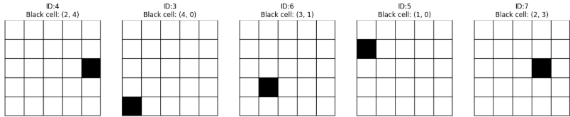

強化学習をやっていて少し疑問に感じたことがあります。
盤目やワールドをCNNモデルに視覚情報を入力として与えているが、果たしてどの程度の精密さで認識しているのだろうか？
正確にグリッドを当てるようなことが可能なのだろうか？
ということで、確認していこうと思います。

本日テーマ：
>ワールドをCNNに与えてグリッドレベルで認識することは可能なのだろうか？試していこう

## 問題設定

以下に、ご提示の内容を「機械学習の問題設定」として整理いたします。

### 1. 問題の概要

- **タスク**：  
  5×5のグリッド（マス目）画像から、黒く塗られた1マスの座標（行・列）を推定する。

- **入力**：  
  5×5マスで構成される画像。  
  各マスは「白」または「黒」のいずれかであり、黒マスは必ず1マスだけ存在する。

- **出力**：  
  黒マスの位置を表す座標（行番号・列番号）。  
  例：`(2, 3)` など。

### 2. データ生成の前提

- **グリッド構造**：  
  - グリッドサイズ：5×5（行数・列数ともに5）。  
  - 各マスは正方形で、1マスあたりのピクセル数は一定（例：64×64ピクセル）。

- **画像生成**：  
  - 背景は白（画素値255）。  
  - ランダムに選ばれた1マスだけを黒（画素値0）で塗りつぶす。  
  - それ以外のマスは白のまま。

- **ラベル（annotation）**：  
  - 黒マスの位置を `(row, col)` 形式で記録する。  
  - 行・列のインデックスは 0〜4 の整数。

### 3. 機械学習としての定式化

__3.1 入力空間__

- 入力画像は、グレースケールまたはRGBの2次元（または3次元）配列。  
- 画像サイズ：  
  - 1マスあたり `CELL_SIZE × CELL_SIZE` ピクセル。  
  - 全体サイズ：`(5 * CELL_SIZE) × (5 * CELL_SIZE)`。

__3.2 出力空間（予測対象）__

- **分類問題として扱う場合**：  
  - 5×5 = 25クラスの多クラス分類問題。  
  - 各クラスは「どのマスが黒か」を表す。  
  - 出力層：25ユニットのソフトマックス。

- **回帰問題として扱う場合**：  
  - 連続的な座標を予測する回帰問題。  
  - 出力層：2ユニット（`(row, col)`）の回帰出力。  
  - ただし、実際には離散的なマス位置なので、分類として扱う方が自然。

__3.3 学習用データセット__

- **訓練データ**：  
  - 上記のルールで生成した画像と、その黒マス座標のペア。  
  - 例：`(画像, (row, col))`。

- **評価指標（例）**：  
  - 分類問題の場合：  
    - 正解率（Accuracy）  
    - 各マスごとの精度（マクロ平均F1など）  
  - 回帰問題の場合：  
    - 平均二乗誤差（MSE）  
    - マス単位での「正しいマスに予測できた割合」

### 4. CNNモデルに期待する役割

- **特徴抽出**：  
  - グリッド構造と黒マスの位置関係を学習し、どのマスが黒かを識別する特徴量を抽出する。

- **位置推定**：  
  - 画像全体を見て、黒マスがどの行・どの列にあるかを

## データ生成

今回は上記の学習データを作成するコードを作成します。
学習用データ生成コードの「実装のポイント」を整理します。

### 1. 全体の流れ

1. **グリッド構造の定義**  
   - 5×5マス、1マスあたりのピクセル数、画像全体のサイズを定数で定義。
2. **1枚の画像＋ラベル生成**  
   - 白い画像を作成し、ランダムに選んだ1マスだけを黒く塗る。
   - そのマスの座標 `(row, col)` をラベルとして返す。
3. **データセット生成**  
   - 指定枚数分の画像とラベルを生成し、ファイルとして保存。
   - annotationファイル（CSV形式）に画像ID・ファイル名・黒マス座標を記録。
4. **サンプル表示**  
   - 生成したデータセットからランダムに画像を選び、画像とラベルを可視化。

### 2. 実装のポイント

__2.1 グリッド構造の扱い__

- **定数で管理**  
  - `GRID_SIZE = 5`（5×5マス）  
  - `CELL_SIZE = 64`（1マスあたり64×64ピクセル）  
  - `IMG_SIZE = GRID_SIZE * CELL_SIZE`（画像全体のサイズ）  
  と定数化することで、変更が容易でバグが入りにくい設計にしています。

- **インデックスとピクセル座標の対応**  
  - マス番号 `(row, col)` から画像上のピクセル範囲への変換を、  
    ```python
    y_start = row * CELL_SIZE
    y_end = (row + 1) * CELL_SIZE
    x_start = col * CELL_SIZE
    x_end = (col + 1) * CELL_SIZE
    ```
    のように計算しています。  
  - これにより、「どのマスを黒く塗るか」を `(row, col)` だけで指定でき、画像上の矩形領域に自動で対応付けられます。

__2.2 画像生成のポイント__

- **NumPy配列による効率的な画像生成**  
  - まず `np.full((IMG_SIZE, IMG_SIZE), 255, dtype=np.uint8)` で白一色の画像配列を作成し、  
    該当マスだけを `img_array[y_start:y_end, x_start:x_end] = 0` で黒く塗っています。  
  - NumPyのスライス操作を使うことで、ループを使わず高速に矩形領域を塗りつぶせます。

- **PILへの変換**  
  - `Image.fromarray(img_array, mode='L')` でNumPy配列をPILのグレースケール画像に変換しています。  
  - `mode='L'` は8bitグレースケールを意味し、白=255、黒=0 の表現に対応します。

__2.3 グリッド線（黒枠）の描画__

- **ImageDrawによる線描画**  
  - `ImageDraw.Draw(img)` で描画オブジェクトを取得し、`draw.line()` や `draw.rectangle()` で線を描画しています。
  - 縦線・横線・外枠をそれぞれ別に描画することで、マス目がはっきり見えるようにしています。

- **線の太さと色**  
  - `line_width=2` で線の太さを指定し、`fill=0` または `outline=0` で黒色を指定しています。  
  - 必要に応じて `line_width` や色を変更することで、見た目を調整できます。

__2.4 ラベル（annotation）の設計__

- **座標形式のラベル**  
  - 黒マスの位置を `(row, col)` というタプルで保持しています。  
  - 0〜4の整数インデックスで表現することで、後続のCNNモデルで「25クラス分類」や「2次元回帰」として扱いやすくしています。

- **annotationファイル（CSV）の構造**  
  - `image_id, file_name, black_cell_row, black_cell_col` という列を持つCSV形式で保存しています。  
  - これにより、学習時に「どの画像がどのラベルに対応するか」を簡単に読み込めます。

__2.5 データセット生成とサンプル表示__

- **一括生成と保存**  
  - `generate_dataset()` で指定枚数分の画像とannotationを一括生成し、ディレクトリに保存しています。  
  - `os.makedirs(output_dir, exist_ok=True)` で出力ディレクトリを自動生成し、既存の場合は上書きを避けています。

- **可視化による確認**  
  - `display_samples()` でランダムに選んだ画像とラベルを `matplotlib` で表示し、  
    - 画像が正しく生成されているか  
    - ラベルが正しく付与されているか  
    を目視で確認できるようにしています。

### 3. この実装の利点

- **再現性の高さ**  
  - 乱数シードを固定すれば、同じデータセットを何度でも再現できます。
- **拡張性**  
  - `GRID_SIZE` や `CELL_SIZE` を変えるだけで、3×3や10×10など別のグリッドサイズにも対応可能です。
- **学習データとしての扱いやすさ**  
  - 画像とラベルの対応が明確で、PyTorchやTensorFlowのデータローダーに組み込みやすい形式になっています。

### 4. 実装

それでは実装していきます。

```python
import numpy as np
from PIL import Image
import random
import os

# 画像サイズとグリッド設定
GRID_SIZE = 5     # 5x5マス
CELL_SIZE = 64    # 1マスのピクセル数
IMG_SIZE = GRID_SIZE * CELL_SIZE  # 画像全体のサイズ

def generate_single_black_cell_image_and_label():
    """
    5x5グリッドからランダムに1マスだけ黒く塗った画像を生成し、
    そのマスの座標（行, 列）を返す
    """
    # 白いキャンバス（グレースケール画像）
    img_array = np.full((IMG_SIZE, IMG_SIZE), 255, dtype=np.uint8)

    # ランダムに1マスを選ぶ（0〜4の範囲）
    row = random.randint(0, GRID_SIZE - 1)
    col = random.randint(0, GRID_SIZE - 1)

    # 選んだマスを黒く塗る
    y_start = row * CELL_SIZE
    y_end = (row + 1) * CELL_SIZE
    x_start = col * CELL_SIZE
    x_end = (col + 1) * CELL_SIZE

    img_array[y_start:y_end, x_start:x_end] = 0  # 黒=0

    # PIL Imageに変換
    img = Image.fromarray(img_array, mode='L')  # 'L' = 8bitグレースケール

    return img, (row, col)


def generate_dataset(num_images=100, output_dir="dataset"):
    """
    指定枚数分の画像とannotationファイルを生成する
    """
    os.makedirs(output_dir, exist_ok=True)

    annotations = []

    for i in range(num_images):
        img, (row, col) = generate_single_black_cell_image_and_label()

        # 画像保存
        img_path = os.path.join(output_dir, f"img_{i:04d}.png")
        img.save(img_path)

        # annotation情報を記録
        annotations.append({
            "image_id": i,
            "file_name": f"img_{i:04d}.png",
            "black_cell_row": row,
            "black_cell_col": col
        })

    # annotationをテキストファイルに保存（CSV形式の例）
    with open(os.path.join(output_dir, "annotations.txt"), "w") as f:
        f.write("image_id,file_name,black_cell_row,black_cell_col\n")
        for ann in annotations:
            f.write(f"{ann['image_id']},{ann['file_name']},{ann['black_cell_row']},{ann['black_cell_col']}\n")

    print(f"Generated {num_images} images and annotations in '{output_dir}/'")


if __name__ == "__main__":
    # 100枚の画像とannotationを生成
    generate_dataset(num_images=100)
```

上記コードで作成した学習データは以下のようになります。
マス目が示された番目に、黒い塗りつぶしと塗りつぶされた座標情報が示されています。




## 総括

以下に、今回のデータ作成コードにおける「キーポイント」を総括的にまとめます。

### 1. グリッド構造の明示的な定義

- **グリッドサイズとマスサイズを定数化**  
  - `GRID_SIZE = 5`（5×5マス）  
  - `CELL_SIZE = 64`（1マスあたり64×64ピクセル）  
  - `IMG_SIZE = GRID_SIZE * CELL_SIZE`（画像全体のサイズ）  
  と定数で管理することで、変更が容易でバグが入りにくい設計にしています。

- **インデックスとピクセル座標の対応付け**  
  - マス番号 `(row, col)` から画像上の矩形領域への変換を、  
    ```python
    y_start = row * CELL_SIZE
    y_end = (row + 1) * CELL_SIZE
    x_start = col * CELL_SIZE
    x_end = (col + 1) * CELL_SIZE
    ```
    のように計算しています。  
  - これにより、「どのマスを黒く塗るか」を `(row, col)` だけで指定でき、画像上のピクセル範囲に自動で対応付けられます。

### 2. 画像生成の効率化と一貫性

- **NumPy配列による高速な矩形塗りつぶし**  
  - まず白一色の画像配列を作成し、該当マスだけを `img_array[y_start:y_end, x_start:x_end] = 0` で黒く塗っています。  
  - NumPyのスライス操作を使うことで、ループを使わず高速かつ簡潔に矩形領域を塗りつぶせます。

- **PILによる画像形式の統一**  
  - `Image.fromarray(img_array, mode='L')` でNumPy配列をPILのグレースケール画像に変換しています。  
  - `mode='L'` により、白=255、黒=0 という一貫した表現で画像を扱えます。

### 3. グリッド線（黒枠）による可視性の確保

- **ImageDrawによる境界線の描画**  
  - `ImageDraw.Draw(img)` で描画オブジェクトを取得し、`draw.line()` と `draw.rectangle()` で縦線・横線・外枠を描画しています。  
  - これにより、マス目がはっきり見えるようになり、CNNモデルがグリッド構造を認識しやすくなります。

- **線の太さと色の調整**  
  - `line_width=2` で線の太さを指定し、`fill=0` または `outline=0` で黒色を指定しています。  
  - 必要に応じてパラメータを変更することで、見た目やモデルへの影響を調整できます。

### 4. ラベル（annotation）設計

- **座標形式のラベル**  
  - 黒マスの位置を `(row, col)` というタプルで保持しています。  
  - 0〜4の整数インデックスで表現することで、後続のCNNモデルで「25クラス分類」や「2次元回帰」として扱いやすくしています。

- **annotationファイル（CSV）の構造**  
  - `image_id, file_name, black_cell_row, black_cell_col` という列を持つCSV形式で保存しています。  
  - これにより、学習時に「どの画像がどのラベルに対応するか」を簡単に読み込めます。
