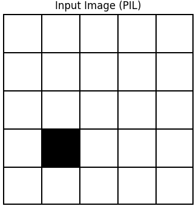

前回より
["盤目やワールドをCNNモデルに視覚情報を入力として与えているが、果たしてどの程度の精密さで認識しているのだろうか？"](https://yoshishinnze.hatenablog.com/entry/2025/10/02/000000)
という疑問を解消するべくCNNモデルで盤面の座標を正確に当てられるかを確認しています。

前回は学習用のデータを作れるようにしました。
今回は学習用データを使って学習を行うモデルを構築していきます。

本日テーマ：
>画像情報を見て座標の予測を行うモデルの構築

## CNNアーキテクチャ

以下に、今回設計したモデルが「CNNアーキテクチャ」であることの意味と、設計上の重要なポイントを整理して説明します。

### CNN（畳み込みニューラルネットワーク）とは

- **局所的な特徴抽出**：  
  画像の一部分（局所領域）ごとにフィルタ（カーネル）を適用し、エッジやテクスチャなどの特徴を抽出します。
- **位置不変性**：  
  同じパターンが画像内のどこにあっても、畳み込みフィルタによって検出できる性質があります。
- **パラメータ共有**：  
  同じフィルタを画像全体に適用するため、全結合層に比べてパラメータ数が大幅に少なくて済みます。

### 今回のタスクにCNNが適している理由

- 5×5のグリッド画像は「マス目という局所構造」と「黒マスという局所的な変化」を持っています。
- CNNは、その局所構造を効率的に捉え、「どのマスが黒いか」という位置情報を学習しやすくなります。


## 設計上の重要なポイント

### 畳み込み層の設計

- **カーネルサイズとパディング**：  
  - `kernel_size=3, padding=1` とすることで、空間サイズを維持したまま畳み込みを行っています。  
  - これにより、画像の端の情報も失わずに特徴抽出ができます。

- **チャネル数の増加**：  
  - 1チャネル（グレースケール） → 32チャネル → 64チャネル と増やし、  
    浅い層では単純なエッジや明暗、深い層ではより複雑なパターンを捉えるように設計しています。

### プーリング層の役割

- **MaxPool2d(2)**：  
  - 2×2の最大プーリングにより、空間サイズを1/2に縮小します。  
  - これにより、
    - 計算量の削減  
    - 位置の微小なずれに対するロバスト性の向上  
    が期待できます。

- **プーリングの位置**：  
  - 畳み込み層の直後に配置することで、局所的な特徴を抽出した後、その情報を凝縮しています。

### 活性化関数（ReLU）の採用

- **非線形性の導入**：  
  - 各畳み込み層・全結合層の後に `F.relu()` を適用し、モデルに非線形性を持たせています。  
  - これにより、線形変換だけでは表現できない複雑な関係も学習可能になります。

- **勾配消失の緩和**：  
  - ReLUは負の入力で0になるため、勾配が0になりにくく、学習が安定しやすいという利点があります。

### 全結合層の設計

- **フラット化と次元削減**：  
  - プーリング後の特徴マップを `view()` で1次元にフラット化し、全結合層に入力しています。  
  - `fc_input_size`（プーリング後の全要素数） → 128次元 → 25クラス という流れで、  
    高次元の特徴をクラスごとの確率に変換しています。

- **出力層の設計**：  
  - 最終層は25ユニットの線形出力（ロジット）とし、`CrossEntropyLoss` 内でソフトマックスを適用する形にしています。  
  - これにより、25クラス分類として扱いやすくなります。

### 出力形式の設計（クラスID ↔ 座標）

- **25クラス分類として扱う**：  
  - 5×5=25マスを25クラスに対応付け、`class_id = row * 5 + col` で一意に変換しています。  
  - これにより、標準的な多クラス分類の枠組み（CrossEntropyLossなど）をそのまま利用できます。

- **推論時の座標への変換**：  
  - モデル出力のクラスIDから `row = class_id // 5`, `col = class_id % 5` で座標に戻すことで、  
    人間にとって直感的な `(row, col)` 形式で結果を解釈できます。


## 設計上の工夫・意図

### シンプルさと汎用性のバランス

- 層数やチャネル数を必要最小限に抑えつつ、5×5グリッドのような比較的小さな問題に対して十分な表現力を持つように設計しています。
- グリッドサイズや画像サイズをパラメータ化（`grid_size`, `img_size`）することで、別のサイズにも拡張しやすい構造にしています。

### 画像サイズに依存しないfc_input_sizeの計算

- `_get_fc_input_size()` メソッドでダミー入力を通し、プーリング後の特徴マップの要素数を動的に計算しています。  
- これにより、`IMG_SIZE` を変更しても全結合層の入力サイズを自動で調整できるようになっています。

### グリッド構造を活かした入力設計

- 画像生成時にグリッド線（黒枠）を描画することで、モデルがマス目の境界を明確に認識できるようにしています。  
- これにより、CNNが「マス単位の位置」をより正確に捉えやすくなります。

## 実装コード

実際に実装するとこんな感じになります。

```python
class SimpleGridCNN(nn.Module):
    def __init__(self, grid_size=5, img_size=320):
        super().__init__()
        self.grid_size = grid_size
        self.num_classes = grid_size * grid_size

        self.conv1 = nn.Conv2d(1, 32, kernel_size=3, padding=1)
        self.conv2 = nn.Conv2d(32, 64, kernel_size=3, padding=1)
        self.pool = nn.MaxPool2d(2)

        self.fc_input_size = self._get_fc_input_size(img_size)
        self.fc1 = nn.Linear(self.fc_input_size, 128)
        self.fc2 = nn.Linear(128, self.num_classes)

    def _get_fc_input_size(self, img_size):
        x = torch.zeros(1, 1, img_size, img_size)
        x = self.pool(F.relu(self.conv1(x)))
        x = self.pool(F.relu(self.conv2(x)))
        return x.numel()

    def forward(self, x):
        x = self.pool(F.relu(self.conv1(x)))
        x = self.pool(F.relu(self.conv2(x)))
        x = x.view(x.size(0), -1)
        x = F.relu(self.fc1(x))
        x = self.fc2(x)
        return x
```


以下に、上記の`SimpleGridCNN` モデルの構築上の要点をまとめます。


### 1. モデルの目的と出力設計

- **目的**：  
  5×5グリッド画像から、黒く塗られた1マスの位置（行・列）を推定する。

- **出力形式**：  
  - 内部では「25クラス分類」として扱い、`num_classes = grid_size * grid_size` と定義。  
  - 最終層 `self.fc2` は25ユニットのロジット出力。  
  - 推論時には `torch.max()` でクラスIDを選び、`row = class_id // grid_size`, `col = class_id % grid_size` で座標に変換する設計。

### 2. 入力サイズへの柔軟な対応

- **`_get_fc_input_size()` メソッド**：  
  - ダミー入力 `torch.zeros(1, 1, img_size, img_size)` を実際にフォワードし、  
    プーリング後の特徴マップの要素数（`x.numel()`）を動的に計算。  
  - これにより、`img_size` が変わっても全結合層の入力サイズを自動で調整できる。

- **利点**：  
  - 画像サイズに依存しない汎用的なモデル定義が可能。  
  - 5×5以外のグリッドサイズ（例：3×3, 10×10）にも拡張しやすい。

### 3. 畳み込み層の設計

- **Conv1**：`nn.Conv2d(1, 32, kernel_size=3, padding=1)`  
  - 入力チャネル数：1（グレースケール）  
  - 出力チャネル数：32  
  - カーネルサイズ3、パディング1で空間サイズを維持。

- **Conv2**：`nn.Conv2d(32, 64, kernel_size=3, padding=1)`  
  - 32チャネル → 64チャネルへ増加。  
  - 浅い層では単純なエッジや明暗、深い層ではより複雑なパターンを捉えることを意図。

- **活性化関数**：  
  - 各畳み込み層の後に `F.relu()` を適用し、非線形性を導入。

### 4. プーリング層の役割

- **MaxPool2d(2)**：  
  - 2×2最大プーリングで空間サイズを1/2に縮小。  
  - Conv1 → Pool → Conv2 → Pool の順で適用。

- **効果**：  
  - 計算量の削減。  
  - 位置の微小なずれに対するロバスト性の向上。  
  - 特徴の抽象化（局所的な最大値を残す）。

### 5. 全結合層の設計

- **FC1**：`nn.Linear(fc_input_size, 128)`  
  - プーリング後の特徴マップをフラット化し、128次元の中間表現に変換。

- **FC2**：`nn.Linear(128, num_classes)`  
  - 128次元 → 25クラスのロジット出力。  
  - ソフトマックスは損失関数（`CrossEntropyLoss`）側で適用する前提。

- **活性化関数**：  
  - FC1の後には `F.relu()` を適用し、非線形変換を行う。  
  - FC2の後には活性化関数を適用せず、ロジットのまま出力。

### 6. フォワードパスの流れ

1. 入力 `x`（形状：`(batch, 1, H, W)`）  
2. Conv1 → ReLU → Pool（空間サイズ1/2）  
3. Conv2 → ReLU → Pool（空間サイズさらに1/2）  
4. `view()` でフラット化  
5. FC1 → ReLU  
6. FC2（ロジット出力）

この流れにより、  
- 局所特徴の抽出（Conv）  
- 特徴の凝縮（Pool）  
- クラスへのマッピング（FC）  
が段階的に行われる設計になっています。

## 出力確認
出力の確認を行います。
以下の画像を先程のモデルに入力します。



すると得られた出力は以下のようなものです。
場所を示す5×5の存在確率を示すロジットと呼ばれる数値の列が出力されました。
学習前なので、意味を持つ出力にはなっていませんが、一旦モデルの構築が出来たことになります。

```
=== モデルの出力（ロジット）===
形状: torch.Size([1, 25])
ロジットの先頭5要素（例）:
  class_0: -0.031
  class_1: 0.017
  class_2: 0.044
  class_3: 0.117
  class_4: -0.029
...（中略）
```

## 総括

ご提示のCNNモデル設計の要点を、目的・設計上のポイント・工夫の3点に絞ってまとめます。

### 1. モデルの目的と出力設計

- **目的**  
  5×5グリッド画像から「黒く塗られた1マスの位置（行・列）」を推定する。
- **出力形式**  
  - 内部では 5×5＝25クラス分類として扱い、`num_classes = grid_size * grid_size`。  
  - 最終層 `fc2` は25ユニットのロジット出力。  
  - 推論時はクラスIDを選び、`row = class_id // grid_size`, `col = class_id % grid_size` で座標に変換。

### 2. CNNアーキテクチャの設計ポイント

__畳み込み層__
- `Conv2d(1, 32, kernel_size=3, padding=1)` → `Conv2d(32, 64, kernel_size=3, padding=1)`  
- 3×3カーネル＋パディング1で空間サイズを維持し、端の情報も保持。  
- チャネル数を 1 → 32 → 64 と増やし、浅い層でエッジ・明暗、深い層で複雑なパターンを捉える。

__プーリング層__
- `MaxPool2d(2)` を各畳み込みの直後に適用し、空間サイズを1/2に縮小。  
- 計算量削減・位置ずれへのロバスト性向上・特徴の抽象化を狙う。

__活性化関数__
- 各畳み込み・全結合層の後に `F.relu()` を適用し、非線形性を導入。  
- 勾配消失を緩和しつつ、複雑な関係も学習可能に。

__全結合層__
- プーリング後の特徴マップを `view()` でフラット化し、`fc_input_size` → 128 → 25クラスへ変換。  
- `fc_input_size` は `_get_fc_input_size()` でダミー入力を通して動的に計算し、画像サイズに依存しない設計。

### 3. 設計上の工夫・意図

- **シンプルさと汎用性のバランス**  
  - 層数・チャネル数を最小限にしつつ、5×5グリッド程度なら十分な表現力を持つ。  
  - `grid_size`, `img_size` をパラメータ化し、別サイズにも拡張しやすい。
- **グリッド構造の活用**  
  - 画像生成時にグリッド線（黒枠）を描画し、マス目の境界を明確にすることで、CNNが「マス単位の位置」を捉えやすくしている。
- **出力確認**  
  - 学習前のロジット出力はまだ意味を持たないが、形状 `(1, 25)` のロジット列が得られ、モデル構築自体は完了している。

