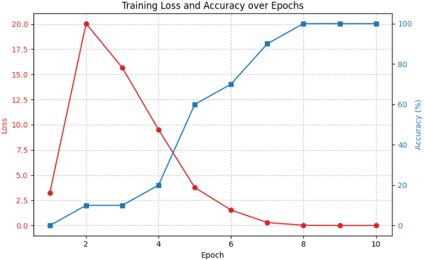

前回[CNNモデルを構築](https://yoshishinnze.hatenablog.com/entry/2025/10/03/000000)してGridの画像データを渡してとりあえず出力を得る、という推論は出来るようにしました。
今回はそのモデルを使って実際に学習してみようと思います。

本日テーマ：
>CNNモデルを実際にGridデータで学習してみる。

## 学習のキーポイント

学習用のデータと推論するモデルが出来ました。
この後は実際にデータとモデルを使って学習を行っていきます。

以下に、これまでに作成したデータとモデルを使って学習を行う際の「キーポイント」を、ロス関数・最適化関数・学習ループの設計も含めて整理して説明します。

### 1. データローダーの構築

__1.1 Datasetクラスの設計__

Datasetクラスは、**「データの読み込み・前処理・ラベル付けを抽象化し、PyTorchのDataLoaderがバッチで取り出せる形式に整える」**役割を担います。

具体的には：
- 画像やラベルを読み込む  
- 必要に応じて変換（ToTensor, Normalizeなど）を適用  
- `__len__`でデータ数を返し、`__getitem__`で指定インデックスのサンプルを返す  

これにより、DataLoaderが自動でバッチ化・シャッフル・並列読み込みを行えるようになります。

- **入力**：  
  - 画像（5×5グリッド、グレースケール）  
- **ラベル**：  
  - 黒マスの位置を表すクラスID（0〜24）  
  - `class_id = row * 5 + col` で変換

- **変換（Transform）**：  
  - `ToTensor()`：PIL Image → Tensor（0–1）  
  - `Normalize(mean=[0.5], std=[0.5])`：標準化（-1〜1にスケーリング）

**キーポイント**：  
- 学習時と推論時で同じ変換を適用すること（一貫性）  
- バッチサイズはメモリと学習速度のバランスで決める（例：32, 64）

### 2. モデルの準備

__2.1 モデルの初期化__

- **デバイスの選択**：  
  - `device = torch.device("cuda" if torch.cuda.is_available() else "cpu")`  
  - GPUがあればGPU、なければCPUを使用。

- **モデルの移動**：  
  - `model = SimpleGridCNN().to(device)`

**キーポイント**：  
- 学習開始前に `model.train()` を設定し、DropoutやBatchNormを訓練モードにすること。

### 3. 損失関数（Loss Function）の選択

__3.1 CrossEntropyLoss の採用__

- **理由**：  
  - 25クラス分類問題として扱っているため、標準的な多クラス分類損失である `CrossEntropyLoss` が適しています。  
  - モデル出力はロジット（softmax前）であり、`CrossEntropyLoss` は内部でsoftmaxを適用します。

- **定義**：  
  - `criterion = nn.CrossEntropyLoss()`

**キーポイント**：  
- ラベルはクラスID（0〜24）の整数テンソルである必要があります。  
- ワンホットエンコーディングは不要です（`CrossEntropyLoss` が内部で処理）。

### 4. 最適化手法（Optimizer）の選択

__4.1 Adam の採用__

- **理由**：  
  - 学習率の自動調整やモーメンタムの効果により、多くのタスクで安定して高性能な結果が得られます。  
  - 手動での学習率調整が比較的少なくて済みます。

- **定義**：  
  - `optimizer = optim.Adam(model.parameters(), lr=0.001)`

**キーポイント**：  
- 学習率（`lr`）はタスクやモデル規模に応じて調整します（例：0.001, 0.0001）。  
- 重み減衰（`weight_decay`）を追加して過学習を抑制することも有効です。

### 5. 学習ループの設計

__5.1 基本的な流れ__

1. **エポックループ**：`for epoch in range(num_epochs):`  
2. **バッチループ**：`for images, labels in train_loader:`  
3. **勾配のリセット**：`optimizer.zero_grad()`  
4. **順伝播**：`outputs = model(images)`  
5. **損失計算**：`loss = criterion(outputs, labels)`  
6. **逆伝播**：`loss.backward()`  
7. **パラメータ更新**：`optimizer.step()`

**キーポイント**：  
- 各バッチで `optimizer.zero_grad()` を忘れないこと（勾配の蓄積を防ぐ）。  
- 損失と精度を定期的に表示し、学習の進捗を確認すること。

### 6. 評価・可視化

__6.1 精度（Accuracy）の計算__

- **予測クラスの取得**：  
  - `_, predicted = torch.max(outputs, 1)`  
- **正解数のカウント**：  
  - `correct += (predicted == labels).sum().item()`  
- **精度の計算**：  
  - `accuracy = 100.0 * correct / total`

**キーポイント**：  
- 訓練データだけでなく、可能であれば検証データ（validation set）でも精度を計算し、過学習を監視します。

__6.2 学習曲線の可視化__

- **LossとAccuracyの記録**：  
  - 各エポックのLossとAccuracyをリストに保存。  
- **matplotlibでのプロット**：  
  - Loss（左軸）とAccuracy（右軸）を同じグラフに表示。

**キーポイント**：  
- 学習が進むにつれてLossが減少し、Accuracyが向上することを確認します。  
- Lossが増加したり、Accuracyが頭打ちになった場合は、学習率やモデル構造の見直しを検討します。

### 7. モデルの保存と読み込み

__7.1 学習済みモデルの保存__

- **保存**：  
  - `torch.save(model.state_dict(), "model.pth")`  
- **読み込み**：  
  - `model.load_state_dict(torch.load("model.pth"))`

**キーポイント**：  
- 学習の途中経過も保存しておくことで、再開や比較が容易になります。  
- 推論時は `model.eval()` を設定し、DropoutやBatchNormを推論モードにします。

### 8. 実装上の注意点

__8.1 再現性の確保__

- **乱数シードの固定**：  
  - `torch.manual_seed(42)`  
  - `random.seed(42)`  
  - `np.random.seed(42)`  
  などで再現性を確保します。

__8.2 過学習の監視__

- **検証データの用意**：  
  - 訓練データとは別に検証データを用意し、各エポックで検証Loss・Accuracyを計算します。  
- **早期終了（Early Stopping）**：  
  - 検証Lossが一定エポック改善しなければ学習を打ち切る、などの戦略も有効です。

## 実装コード

上記のキーポイントを基に実装したコードが以下です。
先日コードを読み込んだ状態で以下を実行下さい。

```python
import torch.optim as optim

# デバイスの設定
device = torch.device("cuda" if torch.cuda.is_available() else "cpu")
print(f"Using device: {device}")

# モデル・損失関数・最適化手法の設定
model = SimpleGridCNN(grid_size=5, img_size=320).to(device)
criterion = nn.CrossEntropyLoss()
optimizer = optim.Adam(model.parameters(), lr=0.001)

# データローダーの準備
dataset = GridDataset(
    annotations_file="dataset/annotations.txt",
    img_dir="dataset",
    transform=transform
)

train_loader = DataLoader(dataset, batch_size=32, shuffle=True)

# 学習ループ
num_epochs = 10

for epoch in range(num_epochs):
    model.train()
    running_loss = 0.0
    correct = 0
    total = 0

    for images, labels in train_loader:
        images = images.to(device)
        labels = labels.to(device)

        # 勾配の初期化
        optimizer.zero_grad()

        # 順伝播
        outputs = model(images)
        loss = criterion(outputs, labels)

        # 逆伝播
        loss.backward()
        optimizer.step()

        # 統計情報
        running_loss += loss.item()
        _, predicted = torch.max(outputs.data, 1)
        total += labels.size(0)
        correct += (predicted == labels).sum().item()

    epoch_loss = running_loss / len(train_loader)
    epoch_acc = 100.0 * correct / total

    print(f"Epoch [{epoch+1}/{num_epochs}], Loss: {epoch_loss:.4f}, Acc: {epoch_acc:.2f}%")
```

## 学習の結果

### ロスの推移

分類問題の学習では通常ロスの推移をよく見ます。
上記コードで実際に学習した結果は以下のようになりました。
いい感じに見えます。



### test

今度はランダムに黒い位置を変化させた問題で予測させてみます。
すると・・・。
5問中2問正解・・・。
惜しいけど、何かずれている。という状態のようです。


```
=== ランダム画像に対する推論結果（5回）===
試行 1:
  正解: 黒マス = (4, 2)
  予測: 黒マス = (2, 4)
  一致: ×

試行 2:
  正解: 黒マス = (3, 1)
  予測: 黒マス = (3, 1)
  一致: ○

/tmp/ipykernel_969/2601611803.py:60: DeprecationWarning: 'mode' parameter is deprecated and will be removed in Pillow 13 (2026-10-15)
  img = Image.fromarray(img_array, mode='L')
試行 3:
  正解: 黒マス = (4, 1)
  予測: 黒マス = (4, 0)
  一致: ×

試行 4:
  正解: 黒マス = (0, 3)
  予測: 黒マス = (1, 3)
  一致: ×

試行 5:
  正解: 黒マス = (3, 1)
  予測: 黒マス = (3, 1)
  一致: ○
```

### 結果の考察

コードを見返して気づいたのですが。。。
テスト用コードで一部違いがありました。
結論から言うと、グリッド線（黒枠）の有無です。

>① 推論用コード（ご提示の最初のコード）
>generate_single_black_cell_image_and_label() の中でimg = draw_grid_lines(img) を呼び出しており、グリッド線（黒枠）が描画された画像を生成します。

>② データセット生成用コード（ご提示の後半のコード）
>generate_single_black_cell_image_and_label() の戻り値はimg, (row, col) のみで、グリッド線は描画されていません。

推論コードからグリッド線を除外すると以下でした。
5問中4問正解。
但し、間違えた問題は大外れです。

```
Using device: cpu
=== ランダム画像に対する推論結果（5回）===
/tmp/ipykernel_1957/1661097273.py:47: DeprecationWarning: 'mode' parameter is deprecated and will be removed in Pillow 13 (2026-10-15)
  img = Image.fromarray(img_array, mode='L')
試行 1:
  正解: 黒マス = (3, 4)
  予測: 黒マス = (0, 0)
  一致: ×

試行 2:
  正解: 黒マス = (1, 4)
  予測: 黒マス = (1, 4)
  一致: ○

試行 3:
  正解: 黒マス = (4, 2)
  予測: 黒マス = (4, 2)
  一致: ○

試行 4:
  正解: 黒マス = (2, 4)
  予測: 黒マス = (2, 4)
  一致: ○

試行 5:
  正解: 黒マス = (4, 2)
  予測: 黒マス = (4, 2)
  一致: ○
```

ここまでの結果から考察すると。

1. 黒い枠線の有無はデータになかった場合、CNNからすると見たことがないデータになる
2. 大外れした問題はおそらく学習データになかったデータで未知だったので解答できなかった

つまり、現状モデルは真に座標の位置(縦横の位置)を見てるというよりは、データのパターンから解答のパターンを覚えているだけの状態と考えられます。

## 総括

以下、これまでの結果を踏まえ、「真に座標の位置を推論できる」ようにするための改善策を、設計思想と具体的な手段に分けて整理します。


### 「真に座標を推論する」ための設計思想
今回良くなかったのが5×5のグリッドの分類問題としていたことです。
ですが、本来は回帰であるべきです。
根本の設計思想が間違っていたと言えます。

__1.1 目的の明確化__

- 目標は「**任意の5×5グリッド画像から、黒マスの位置（row, col）を一意に特定する**」ことです。  
- これは「**グリッド構造を理解し、その上での座標を推定する**」能力が必要です。

__1.2 必要な能力の分解__

1. **グリッド構造の認識**  
   - 画像が5×5のグリッドであることを理解する。  
   - マスの境界や位置関係を把握する。

2. **座標の抽象化**  
   - 「左上が(0,0)、右下が(4,4)」という**座標系**を内部表現として持つ。  
   - 黒マスの位置を「行・列」として表現する。

3. **一般化能力**  
   - グリッド線の有無、背景色、ノイズなどに依存せず、**位置情報だけを抽出**する。

### 2. 具体的な改善策

__2.1 データ設計の改善__

__(1) データの多様化（Data Augmentation）__

- **グリッド線の有無を混在**させる：  
  - 学習データの一部にグリッド線を描画し、一部には描画しない。  
  - モデルが「線の有無」に依存しないようにする。

- **背景色・マス色のバリエーション**：  
  - 背景を白だけでなく、薄いグレーやランダムな明るさに変える。  
  - 黒マスを完全な黒（0）だけでなく、50〜200の範囲でランダムに変える。

- **ノイズの追加**：  
  - ガウシアンノイズや塩胡椒ノイズを少量加え、**位置情報以外の画素パターン**を破壊する。

- **回転・反転の制限**：  
  - グリッドは回転や反転に対して不変ではないため、**位置情報が変わってしまう**ので注意が必要です。  
  - 代わりに、**位置情報を保ったままの微小な平行移動**（1〜2ピクセル程度）は有効です。

**狙い**：  
- モデルが「特定の画素パターン」ではなく、「**グリッド構造と黒マスの相対位置**」に注目するように誘導する。

__2.2 モデル設計の改善__

__(1) 座標回帰（Coordinate Regression）の導入__

- 現在は「25クラス分類」ですが、**座標そのものを回帰**する設計も有効です。  
- 出力を `(row, col)` の2次元ベクトルとし、損失関数を `MSE Loss` や `SmoothL1Loss` に変更します。

```python
# 例：座標回帰モデル
class GridCoordRegressor(nn.Module):
    def __init__(self):
        super().__init__()
        self.conv_layers = ...  # CNN部分は同様
        self.fc = nn.Linear(..., 2)  # 出力は (row, col) の2次元

    def forward(self, x):
        x = self.conv_layers(x)
        x = x.view(x.size(0), -1)
        coords = torch.sigmoid(self.fc(x)) * (GRID_SIZE - 1)  # [0,1] → [0,4]
        return coords
```

- 損失関数：`criterion = nn.MSELoss()` など。  
- メリット：  
  - 「(2,3)と(3,2)は近い」といった**連続的な距離感**を学習しやすい。  
  - クラス境界に縛られず、**滑らかな位置推定**が可能。

__(2) 位置エンコーディングの導入__

- CNNの最終層に**位置エンコーディング**（Positional Encoding）を組み込むことで、  
  「行・列」という**離散的な位置情報**を明示的に与えることもできます。  
- 例：  
  - 各行・各列に対応するone-hotベクトルをCNNの出力と結合し、FC層で統合する。  
  - これにより、モデルが「行・列のインデックス」を意識しやすくなります。

__(3) マルチタスク学習__

- 「クラス分類（25クラス）」と「座標回帰（2次元）」を**同時に学習**するマルチタスク設計も有効です。  
- 損失関数を組み合わせることで、**位置情報の抽象化**と**離散的なクラス識別**の両方を強化できます。

```python
loss_class = criterion_class(outputs_class, labels_class)
loss_coord = criterion_coord(outputs_coord, labels_coord)
loss = loss_class + alpha * loss_coord  # alphaは重み
```

