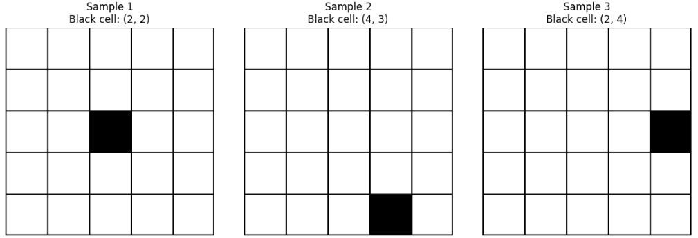
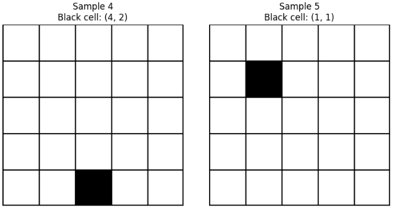

[Gridの座標予測問題](https://yoshishinnze.hatenablog.com/entry/2025/10/02/000000)を続けています。
Gridの座標予測モデルについて、[前回まで分類問題](https://yoshishinnze.hatenablog.com/entry/2025/10/04/000000)として解こうとしていたものを、今度は回帰問題として解いていこうと思います。

本日テーマ：
>座標予測を回帰予測の問題として改めて解きなおす+データ生成のコード実装

## 回帰問題に変更するキーポイント

以下に、今回の「5×5グリッドから黒マスの位置を予測する」タスクを**回帰予測（座標回帰）** に変更する際に必要な修正点を、コードの各パートごとに整理して説明します。

### 1. モデル定義の変更

__1.1 出力次元の変更__

- **現状（分類）**：  
  - 出力は25クラス（0〜24）のロジット。  
  - `num_classes = GRID_SIZE * GRID_SIZE = 25`  
- **回帰に変更**：  
  - 出力は `(row, col)` の2次元ベクトル。  
  - 最終層の出力ユニット数を2に変更します。

```python
# 変更前（分類）
self.fc2 = nn.Linear(128, num_classes)  # 25クラス

# 変更後（回帰）
self.fc2 = nn.Linear(128, 2)  # (row, col) の2次元
```

__1.2 出力のスケーリング__

- モデル出力を `[0, GRID_SIZE-1]` の範囲に収めるため、  
  `sigmoid` や `tanh` でスケーリングするのが一般的です。

```python
def forward(self, x):
    x = self.conv_layers(x)
    x = x.view(x.size(0), -1)
    x = F.relu(self.fc1(x))
    coords = torch.sigmoid(self.fc2(x)) * (GRID_SIZE - 1)  # [0,1] → [0,4]
    return coords
```

**キーポイント**：  
- `sigmoid` で [0,1] に収め、`(GRID_SIZE-1)` を掛けることで [0,4] に変換。  
- あるいは `tanh` で [-1,1] → [0,4] に変換する方法もあります。

### 2. 損失関数の変更

__2.1 CrossEntropyLoss → 回帰用Loss__

- **現状（分類）**：  
  - `criterion = nn.CrossEntropyLoss()`  
- **回帰に変更**：  
  - `MSE Loss` や `SmoothL1Loss` など、連続値の誤差を測る損失関数を使用します。

```python
# 変更前
criterion = nn.CrossEntropyLoss()

# 変更後（例）
criterion = nn.MSELoss()  # または nn.SmoothL1Loss()
```

**キーポイント**：  
- `MSE Loss` は外れ値に敏感ですが、学習が速い場合があります。  
- `SmoothL1Loss` は外れ値に頑健で、勾配爆発を抑制しやすいです。

### 3. データローダー（ラベル形式）の変更

__3.1 ラベルの形式変更__

- **現状（分類）**：  
  - ラベルはクラスID（0〜24）の整数。  
  - `class_id = row * 5 + col`  
- **回帰に変更**：  
  - ラベルは `(row, col)` の浮動小数点数テンソル。  
  - 例：`torch.tensor([row, col], dtype=torch.float32)`

**Datasetクラスの修正例**：

```python
def __getitem__(self, idx):
    # 画像読み込み（既存と同じ）
    img_path = os.path.join(self.img_dir, self.annotations[idx]["file_name"])
    image = Image.open(img_path).convert("L")

    # ラベル取得（回帰用に変更）
    row = self.annotations[idx]["black_cell_row"]
    col = self.annotations[idx]["black_cell_col"]
    label = torch.tensor([row, col], dtype=torch.float32)  # 2次元ベクトル

    if self.transform:
        image = self.transform(image)

    return image, label
```

**キーポイント**：  
- ラベルを `float32` にすることで、回帰損失（MSEなど）と互換性を持たせます。

### 4. 学習ループの変更

__4.1 損失計算部分の変更__

- **現状（分類）**：  
  - `loss = criterion(outputs, labels)`（labelsは整数）  
- **回帰に変更**：  
  - `loss = criterion(outputs, labels)`（labelsは2次元ベクトル）

**変更はほぼ不要**ですが、`outputs` と `labels` の形状が一致していることを確認します。

```python
outputs = model(images)        # shape: (batch_size, 2)
labels = labels.to(device)     # shape: (batch_size, 2)
loss = criterion(outputs, labels)
```

__4.2 精度計算の変更（任意）__

- 回帰タスクでは「正解/不正解」よりも「距離」が重要です。  
- 例：L1距離やL2距離を計算し、平均誤差を表示します。

```python
# 例：L1距離（マンハッタン距離）の計算
diff = torch.abs(outputs - labels)  # shape: (batch_size, 2)
l1_dist = diff.sum(dim=1).mean().item()  # バッチ平均のL1距離
print(f"Epoch [{epoch+1}/{num_epochs}], Loss: {epoch_loss:.4f}, L1 Dist: {l1_dist:.4f}")
```

### 5. 推論コードの変更

__5.1 予測値の取得方法の変更__

- **現状（分類）**：  
  - `_, predicted = torch.max(outputs, 1)` でクラスIDを取得し、  
    `row = class_id // 5`, `col = class_id % 5` で座標に変換。  
- **回帰に変更**：  
  - モデル出力そのものが `(row, col)` の近似値です。  
  - 必要に応じて四捨五入やクリップを行います。

```python
def predict_black_cell_regression(model, image, transform, device):
    model.eval()
    image_tensor = transform(image).unsqueeze(0).to(device)

    with torch.no_grad():
        outputs = model(image_tensor)  # shape: (1, 2)
        coords = outputs.squeeze().cpu().numpy()  # [row_pred, col_pred]

    # 四捨五入して整数座標に変換（0〜4の範囲にクリップ）
    row_pred = int(np.clip(round(coords[0]), 0, GRID_SIZE - 1))
    col_pred = int(np.clip(round(coords[1]), 0, GRID_SIZE - 1))

    return row_pred, col_pred
```

**キーポイント**：  
- `round` で最も近い整数に丸め、`np.clip` で [0,4] の範囲に収めます。  
- これにより、分類タスクと同様に「整数座標」として評価できます。


## 実装

今回は回帰用の学習データセットを生成するコードを実装していきます。
既存の「分類用データ生成コード」をベースに、**ラベルを (row, col) の2次元ベクトル形式**で保存するように実装しています。

### 1. 必要なライブラリのインポート

```python
import os
import random
import numpy as np
from PIL import Image, ImageDraw
```

### 2. グリッド設定とグリッド線描画関数

```python
# 画像サイズとグリッド設定
GRID_SIZE = 5
CELL_SIZE = 64
IMG_SIZE = GRID_SIZE * CELL_SIZE
LINE_WIDTH = 2

def draw_grid_lines(img, grid_size=GRID_SIZE, cell_size=CELL_SIZE, line_width=LINE_WIDTH):
    """
    画像にグリッド線（黒枠）を描画する
    """
    draw = ImageDraw.Draw(img)
    img_width, img_height = img.size

    # 縦線（列の境界）
    for col in range(1, grid_size):
        x = col * cell_size
        draw.line([(x, 0), (x, img_height)], fill=0, width=line_width)

    # 横線（行の境界）
    for row in range(1, grid_size):
        y = row * cell_size
        draw.line([(0, y), (img_width, y)], fill=0, width=line_width)

    # 外枠
    draw.rectangle([0, 0, img_width - 1, img_height - 1], outline=0, width=line_width)
    return img
```

### 3. 1枚の画像とラベルを生成する関数（回帰用）

```python
def generate_single_black_cell_image_and_label():
    """
    5x5グリッドからランダムに1マスだけ黒く塗った画像を生成し、
    そのマスの座標（行, 列）を返す（回帰用：ラベルは (row, col) の浮動小数点数）
    """
    # 白いキャンバス（グレースケール画像）
    img_array = np.full((IMG_SIZE, IMG_SIZE), 255, dtype=np.uint8)

    # ランダムに1マスを選ぶ（0〜4の範囲）
    row = random.randint(0, GRID_SIZE - 1)
    col = random.randint(0, GRID_SIZE - 1)

    # 選んだマスを黒く塗る
    y_start = row * CELL_SIZE
    y_end = (row + 1) * CELL_SIZE
    x_start = col * CELL_SIZE
    x_end = (col + 1) * CELL_SIZE

    img_array[y_start:y_end, x_start:x_end] = 0  # 黒=0

    # PIL Imageに変換
    img = Image.fromarray(img_array, mode='L')  # 'L' = 8bitグレースケール

    # グリッド線を描画（任意：必要に応じてコメントアウト）
    img = draw_grid_lines(img)

    # ラベルは (row, col) の浮動小数点数（回帰用）
    label = (float(row), float(col))

    return img, label
```

**ポイント**：  
- ラベルを `(float(row), float(col))` とすることで、回帰損失（MSEなど）と互換性を持たせています。  
- グリッド線の描画は任意です（学習データと推論データで一貫させてください）。

### 4. データセット全体を生成する関数（回帰用）

```python
def generate_regression_dataset(num_images=100, output_dir="regression_dataset"):
    """
    指定枚数分の画像とannotationファイルを生成する（回帰用）
    - 画像：5x5グリッドに1マスだけ黒く塗った画像
    - ラベル：黒マスの座標 (row, col) を浮動小数点数で保存
    """
    os.makedirs(output_dir, exist_ok=True)

    annotations = []

    for i in range(num_images):
        # 1枚の画像とラベルを生成
        img, (row, col) = generate_single_black_cell_image_and_label()

        # 画像保存
        img_path = os.path.join(output_dir, f"img_{i:04d}.png")
        img.save(img_path)

        # annotation情報を記録（回帰用：row, col を浮動小数点数で保存）
        annotations.append({
            "image_id": i,
            "file_name": f"img_{i:04d}.png",
            "black_cell_row": row,
            "black_cell_col": col
        })

    # annotationをテキストファイルに保存（CSV形式）
    with open(os.path.join(output_dir, "annotations.txt"), "w") as f:
        f.write("image_id,file_name,black_cell_row,black_cell_col\n")
        for ann in annotations:
            f.write(f"{ann['image_id']},{ann['file_name']},{ann['black_cell_row']},{ann['black_cell_col']}\n")

    print(f"Generated {num_images} regression images and annotations in '{output_dir}/'")
```

**ポイント**：  
- `annotations.txt` の形式は分類用とほぼ同じですが、`black_cell_row` と `black_cell_col` が**浮動小数点数**として保存されます。  
- これにより、回帰モデルが `(row, col)` を直接学習できるようになります。

### 5. 実行例

```python
if __name__ == "__main__":
    # 例：100枚の回帰用データセットを生成
    generate_regression_dataset(num_images=100, output_dir="regression_dataset")
```

**出力例**：  
```
Generated 100 regression images and annotations in 'regression_dataset/'
```

`regression_dataset/annotations.txt` の一部：

```text
image_id,file_name,black_cell_row,black_cell_col
0,img_0000.png,2.0,4.0
1,img_0001.png,0.0,1.0
2,img_0002.png,3.0,2.0
...
```

### 6. 次のステップ（回帰モデル用Datasetクラスの例）

回帰用データセットを読み込む `Dataset` クラスの例も簡単に示します。

```python
import torch
from torch.utils.data import Dataset

class GridRegressionDataset(Dataset):
    def __init__(self, annotations_file, img_dir, transform=None):
        self.img_dir = img_dir
        self.transform = transform
        self.annotations = []

        # annotationファイルを読み込み
        with open(annotations_file, "r") as f:
            lines = f.readlines()[1:]  # ヘッダーをスキップ
            for line in lines:
                parts = line.strip().split(",")
                image_id = int(parts[0])
                file_name = parts[1]
                black_cell_row = float(parts[2])
                black_cell_col = float(parts[3])
                self.annotations.append({
                    "image_id": image_id,
                    "file_name": file_name,
                    "black_cell_row": black_cell_row,
                    "black_cell_col": black_cell_col
                })

    def __len__(self):
        return len(self.annotations)

    def __getitem__(self, idx):
        # 画像読み込み
        img_path = os.path.join(self.img_dir, self.annotations[idx]["file_name"])
        image = Image.open(img_path).convert("L")

        # ラベル取得（回帰用：2次元ベクトル）
        row = self.annotations[idx]["black_cell_row"]
        col = self.annotations[idx]["black_cell_col"]
        label = torch.tensor([row, col], dtype=torch.float32)

        if self.transform:
            image = self.transform(image)

        return image, label
```

**ポイント**：  
- `label` を `torch.tensor([row, col], dtype=torch.float32)` として返すことで、  
  回帰モデル（MSE Lossなど）と互換性を持たせています。

### 7. 動作チェック

ランダムにデータ生成して、画像とペアとなる座標を出力してみました。
思った通りの状態になっています。






### 総括
問題を回帰問題として設定しなおした上で、データ生成の実装を行いました。

- **出力次元と損失関数を回帰用に変更**し、  
- **ラベルを (row, col) の浮動小数点数形式に統一**し、  
- **学習・推論で座標ベクトルを直接扱う**ことで、  
  分類タスクから「座標回帰タスク」へとスムーズに移行できます。

回帰モデルでは「どのクラスか」ではなく「どの座標か」を直接学習するため、  
- グリッドサイズが大きくなっても出力次元は常に2で済む  
- 連続的な位置の曖昧さ（境界付近など）も扱いやすい  
といった利点があります。

次回はモデル構築と学習コードの実装を行います。
