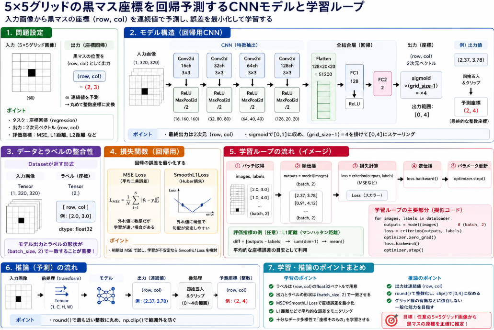

先日に引き続きでGrid座標予測について実装を進めています。
[前回は学習用データの作成](https://yoshishinnze.hatenablog.com/entry/2025/10/05/000000)を行いました。
本日は推論を行うモデルと学習ループを実装していきます。

本日テーマ：
>Grid座標を回帰予測を行うモデルと学習ループの実装を進めていきます。

## モデル実装のキーポイント

以下、回帰予測用CNNモデルを実装する際のキーポイントを整理します。

### 1. モデル全体の設計方針

__(1) 出力次元とタスクの明確化__
- **出力**：`(row, col)` の2次元ベクトル（連続値）
- **タスク**：座標回帰（regression）
- **評価指標**：MSE, L1距離, L2距離など

__(2) アーキテクチャの基本構成__
- 画像入力 → CNN（特徴抽出） → 全結合層（座標回帰）
- CNN部分は分類モデルとほぼ同じでOK（特徴抽出器として共通）

### 2. モデル定義のキーポイント

__(1) 出力層の設計__
- もう分類ではないので最終層の出力ユニット数を **2** に変更（`row, col`）。
- 出力範囲を `[0, GRID_SIZE-1]` に収めるため、`sigmoid` や `tanh` でスケーリング。

```python
# 例
self.fc2 = nn.Linear(128, 2)  # (row, col) の2次元

def forward(self, x):
    x = self.conv_layers(x)
    x = x.view(x.size(0), -1)
    x = F.relu(self.fc1(x))
    coords = torch.sigmoid(self.fc2(x)) * (GRID_SIZE - 1)  # [0,1] → [0,4]
    return coords
```

**ポイント**：
- `sigmoid` で [0,1] に収め、`(GRID_SIZE-1)` を掛けることで [0,4] に変換。
- あるいは `tanh` で [-1,1] → [0,4] に変換する方法もあります。

### 3. 損失関数の選択

__(1) 回帰用の損失関数__
- `MSE Loss`：外れ値に敏感だが学習が速い場合がある。
- `SmoothL1Loss`：外れ値に頑健で勾配爆発を抑制しやすい。

```python
criterion = nn.MSELoss()        # または
criterion = nn.SmoothL1Loss()
```

**ポイント**：
- 初期は `MSE` で試し、学習が不安定なら `SmoothL1Loss` を検討。

### 4. データローダーとの整合性

__(1) ラベル形式の整合__
- Datasetクラスで `label = torch.tensor([row, col], dtype=torch.float32)` を返す。
- モデル出力 `(batch_size, 2)` とラベル `(batch_size, 2)` の形状が一致することを確認。

```python
outputs = model(images)        # shape: (batch_size, 2)
labels = labels.to(device)     # shape: (batch_size, 2)
loss = criterion(outputs, labels)
```

### 5. 学習ループの実装ポイント

__(1) 損失計算__
- 上記の通り、`outputs` と `labels` をそのまま損失関数に渡す。

__(2) 評価指標の追加（任意）__
- 正解率の代わりに、L1距離やL2距離を計算して平均誤差を表示。

```python
diff = torch.abs(outputs - labels)          # L1距離（マンハッタン距離）
l1_dist = diff.sum(dim=1).mean().item()
print(f"Loss: {loss.item():.4f}, L1 Dist: {l1_dist:.4f}")
```

### 6. 推論時の処理

__(1) 座標の取得__
- モデル出力そのものが `(row_pred, col_pred)`。
- 必要に応じて四捨五入・クリップして整数座標に変換。

```python
coords = outputs.squeeze().cpu().numpy()  # [row_pred, col_pred]
row_pred = int(np.clip(round(coords[0]), 0, GRID_SIZE - 1))
col_pred = int(np.clip(round(coords[1]), 0, GRID_SIZE - 1))
```

**ポイント**：
- `round` で最も近い整数に丸め、`np.clip` で [0,4] の範囲に収める。


### 7. モデル定義（回帰用CNN）
上記の点を含めて実装したモデルを以下に示します。

```python
import torch
import torch.nn as nn
import torch.nn.functional as F

class GridRegressionCNN(nn.Module):
    """
    5x5グリッド画像から黒マスの座標 (row, col) を回帰予測するCNN
    """
    def __init__(self, grid_size=5):
        super(GridRegressionCNN, self).__init__()
        self.grid_size = grid_size
        
        # CNN部分（特徴抽出）
        self.conv_layers = nn.Sequential(
            # 入力: (1, 320, 320) ※5x64=320
            nn.Conv2d(in_channels=1, out_channels=16, kernel_size=3, padding=1),
            nn.ReLU(),
            nn.MaxPool2d(kernel_size=2),  # (16, 160, 160)
            
            nn.Conv2d(in_channels=16, out_channels=32, kernel_size=3, padding=1),
            nn.ReLU(),
            nn.MaxPool2d(kernel_size=2),  # (32, 80, 80)
            
            nn.Conv2d(in_channels=32, out_channels=64, kernel_size=3, padding=1),
            nn.ReLU(),
            nn.MaxPool2d(kernel_size=2),  # (64, 40, 40)
            
            nn.Conv2d(in_channels=64, out_channels=128, kernel_size=3, padding=1),
            nn.ReLU(),
            nn.MaxPool2d(kernel_size=2),  # (128, 20, 20)
        )
        
        # 全結合層（回帰用）
        # 入力: 128 * 20 * 20 = 51200
        self.fc1 = nn.Linear(128 * 20 * 20, 128)
        # 出力層: (row, col) の2次元
        self.fc2 = nn.Linear(128, 2)

    def forward(self, x):
        # CNNで特徴抽出
        x = self.conv_layers(x)
        
        # フラット化
        x = x.view(x.size(0), -1)
        
        # 全結合層
        x = F.relu(self.fc1(x))
        
        # 出力層: sigmoidで[0,1]に収め、(grid_size-1)を掛けて[0,4]に変換
        coords = torch.sigmoid(self.fc2(x)) * (self.grid_size - 1)
        
        return coords
```

**ポイント**：
- `self.fc2` の出力ユニット数は **2**（`row, col`）。
- `forward` で `sigmoid` と `(grid_size-1)` を掛けることで、出力範囲を `[0,4]` にスケーリング。

モデルのインスタンス化はこんな感じです。

```python
# モデルインスタンス化
model = GridRegressionCNN(grid_size=5)

# ダミー入力で形状確認
dummy_input = torch.randn(1, 1, 320, 320)  # (batch, channel, height, width)
output = model(dummy_input)
print(f"Output shape: {output.shape}")  # (1, 2)
print(f"Output values: {output}")       # [row_pred, col_pred] の近似値
```

## 学習コードの実装
[先日の学習コード](https://yoshishinnze.hatenablog.com/entry/2025/10/04/000000)と、大きな違いはありません。


### 1. 損失関数とオプティマイザの設定（回帰用）

```python
import torch.optim as optim

# 回帰用損失関数（MSE Loss）
criterion = nn.MSELoss()

# オプティマイザ（例：Adam）
optimizer = optim.Adam(model.parameters(), lr=0.001)
```

**ポイント**：
- 必要に応じて `SmoothL1Loss` も検討可能です。

### 2. 学習ループのイメージ（回帰用）

```python
def train_regression_model(model, dataloader, criterion, optimizer, device, num_epochs=10):
    model.to(device)
    model.train()
    
    for epoch in range(num_epochs):
        epoch_loss = 0.0
        epoch_l1_dist = 0.0
        
        for images, labels in dataloader:
            images = images.to(device)
            labels = labels.to(device)  # shape: (batch_size, 2)
            
            # 順伝播
            outputs = model(images)     # shape: (batch_size, 2)
            loss = criterion(outputs, labels)
            
            # 逆伝播
            optimizer.zero_grad()
            loss.backward()
            optimizer.step()
            
            epoch_loss += loss.item()
            
            # L1距離（マンハッタン距離）の計算（任意）
            diff = torch.abs(outputs - labels)
            l1_dist = diff.sum(dim=1).mean().item()
            epoch_l1_dist += l1_dist
        
        avg_loss = epoch_loss / len(dataloader)
        avg_l1_dist = epoch_l1_dist / len(dataloader)
        print(f"Epoch [{epoch+1}/{num_epochs}], Loss: {avg_loss:.4f}, L1 Dist: {avg_l1_dist:.4f}")
```

**ポイント**：
- `outputs` と `labels` の形状が `(batch_size, 2)` で一致していることを確認。
- L1距離は「平均的な座標誤差」の目安として有用です。

### 3. 推論用関数（回帰モデル）

```python
import numpy as np

def predict_black_cell_regression(model, image, transform, device, grid_size=5):
    """
    1枚の画像から黒マスの座標を回帰予測する
    """
    model.eval()
    image_tensor = transform(image).unsqueeze(0).to(device)  # (1, C, H, W)
    
    with torch.no_grad():
        outputs = model(image_tensor)  # shape: (1, 2)
        coords = outputs.squeeze().cpu().numpy()  # [row_pred, col_pred]
    
    # 四捨五入して整数座標に変換（0〜grid_size-1の範囲にクリップ）
    row_pred = int(np.clip(round(coords[0]), 0, grid_size - 1))
    col_pred = int(np.clip(round(coords[1]), 0, grid_size - 1))
    
    return row_pred, col_pred
```

**ポイント**：
- `round` で最も近い整数に丸め、`np.clip` で範囲外を防ぐ。
- これにより、分類タスクと同様に「整数座標」として評価できます。

## 総括
ということで本日は座標の分類の課題解決策として回帰問題への転換を行ってきています。



本日の要点は以下の点です。

- **出力次元と損失関数を回帰用に変更**し、  
- **ラベルを (row, col) の浮動小数点数形式に統一**し、  
- **学習・推論で座標ベクトルを直接扱う**ことで、  
  分類タスクから「座標回帰タスク」へとスムーズに移行できます。

回帰モデルでは「どのクラスか」ではなく「どの座標か」を直接学習するため、  
- グリッドサイズが大きくなっても出力次元は常に2で済む  
- 連続的な位置の曖昧さ（境界付近など）も扱いやすい  
といった利点があります。

次回は学習の結果と、解析を行います。

