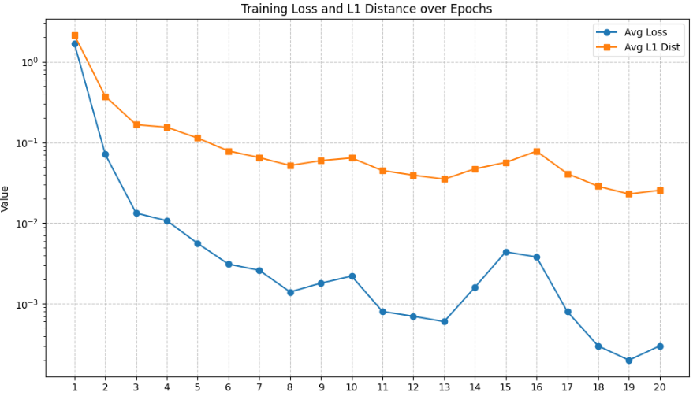
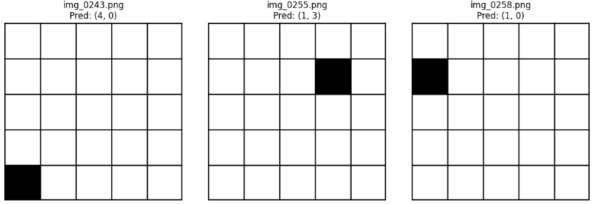
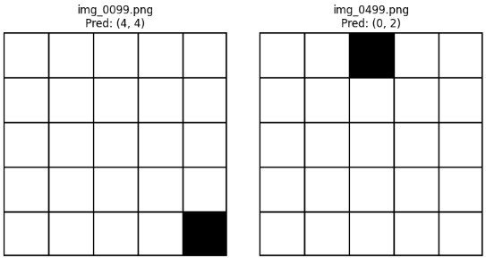
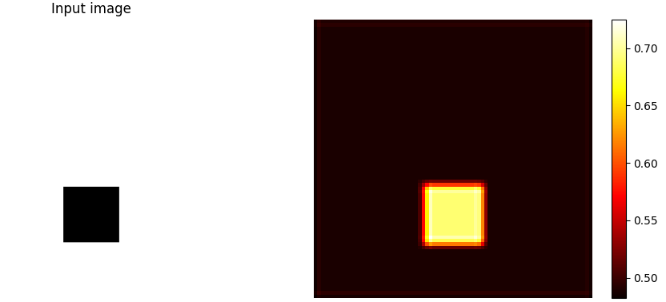
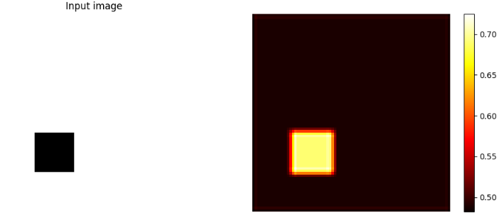

[前回作成したコード](https://yoshishinnze.hatenablog.com/entry/2025/10/06/000000)を用いて、グリッドの位置を推測するモデルを学習、実際の推論をしてみます。

本日テーマ：
>グリッドの位置を推測するモデルを学習、実際の推論をしてみた。

## 学習

### 学習コード

前回作ったコードの再掲です。
`num_epochs` は 10 として学習ロスと推論の正解率を出力してみます。

```python
import torch.optim as optim

# デバイスの設定
device = torch.device("cuda" if torch.cuda.is_available() else "cpu")
print(f"Using device: {device}")

# モデル・損失関数・最適化手法の設定
model = SimpleGridCNNWithAttention(grid_size=5, img_size=320).to(device)
criterion = nn.CrossEntropyLoss()
optimizer = optim.Adam(model.parameters(), lr=0.001)

# データローダーの準備
dataset = GridDataset(
    annotations_file="dataset/annotations.txt",
    img_dir="dataset",
    transform=transform
)

train_loader = DataLoader(dataset, batch_size=32, shuffle=True)

# 学習ループ
num_epochs = 10

for epoch in range(num_epochs):
    model.train()
    running_loss = 0.0
    correct = 0
    total = 0

    for images, labels in train_loader:
        images = images.to(device)
        labels = labels.to(device)

        # 勾配の初期化
        optimizer.zero_grad()

        # 順伝播
        outputs = model(images)
        loss = criterion(outputs, labels)

        # 逆伝播
        loss.backward()
        optimizer.step()

        # 統計情報
        running_loss += loss.item()
        _, predicted = torch.max(outputs.data, 1)
        total += labels.size(0)
        correct += (predicted == labels).sum().item()

    epoch_loss = running_loss / len(train_loader)
    epoch_acc = 100.0 * correct / total

    print(f"Epoch [{epoch+1}/{num_epochs}], Loss: {epoch_loss:.4f}, Acc: {epoch_acc:.2f}%")
```

### 学習の結果

10 epochでのロス関数の推移を表示します。
まだ少し良くなる可能性はありそうですが、ほぼ収束していることが確認されました。



このモデルを使って実際にグリッドの推論を行ってみます。
画像がグリッドと黒く塗りつぶされた位置を示します。
画像上に出ている () 部が実際の座標の推論結果で、 (`縦方向の座標`, `横方向の座標`) の対応です。

全問正解のようです。





座標推論は今回のCNNで十分に推論が可能な問題と思われます。

## CNNにアテンション機構の追加

ついでですので、CNNにアテンション機構を追加してみようと思います。

### 1. アテンションとは何か

**アテンション（Attention）** は、ざっくり言うと  
**「どこにどれだけ注目するかを表す重み」** です。

- 人間が文章を読むとき、すべての単語を同じ重要度で読むわけではなく、  
  キーワードや重要な部分に「注目」します。
- 画像を見るときも、全体をぼんやり見るのではなく、  
  顔や文字など「大事そうな部分」に視線を向けます。

機械学習モデルにも、この「注目の度合い」を**数値として**与える仕組みが  
**アテンション機構**です。

__具体的なイメージ__

- 画像処理の場合：  
  各ピクセル（または特徴マップ上の各位置）に「重要度」を割り当て、  
  その重みを使って特徴を強調・抑制します。
- 自然言語処理の場合：  
  各単語（トークン）に「どれだけ重要か」を表す重みを付け、  
  その重みを使って文脈を集約します。

### 2. アテンションの役割

アテンションには主に次のような役割があります。

1. **情報の選択・強調**  
   重要な部分の特徴を強め、あまり重要でない部分の特徴を弱めます。

2. **解釈性の向上**  
   「モデルがどこを見て判断したか」を、  
   アテンションの重みとして人間が確認できます。

3. **長いシーケンス・広い画像への対応**  
   すべての情報を均等に扱うのではなく、  
   必要な部分に集中して処理できるようになります。

### 3. アテンションをヒートマップにすると何が分かるか

**アテンションをヒートマップ**にすると、  
**「モデルが入力のどの部分を重視して予測したか」** が視覚的に分かります。

__(1) 画像の場合（CNN＋空間アテンション）__

- 元画像の上に、アテンション重みを色の濃さ（赤〜青など）で重ねます。
- **赤い（値が大きい）部分**：モデルが「ここが重要だ」と判断した領域
- **青い（値が小さい）部分**：あまり重視していない領域

例：
- 「黒マスの位置を予測するモデル」で、  
  実際に黒マスがある場所が赤く光っていれば、  
  「モデルは正しく黒マスを見て判断している」と解釈できます。
- 逆に、黒マスとは関係ない場所が赤くなっていれば、  
  「モデルが間違った手がかりを見ているかもしれない」と気づけます。

__(2) 自然言語処理の場合（トークンレベルのアテンション）__

- 各単語の上に色を付けることで、  
  「どの単語に注目して回答を出したか」が分かります。
- 例：質問応答モデルで、答えの根拠となる単語が強調されていれば、  
  モデルの判断理由を確認できます。

### 4. ヒートマップから分かることの具体例

__モデルの挙動の理解__
- 「なぜこのクラスに分類したのか」  
  → ヒートマップを見ると、  
     - 猫の画像で「耳や目」が赤くなっていれば、  
       猫らしい特徴を見ていると理解できる。
     - 逆に背景のテクスチャが赤くなっていれば、  
       誤った手がかりで判断している可能性がある。

__モデルの弱点の発見__
- ヒートマップが常に画像の端やノイズ部分に集中している場合、  
  「学習データに偏りがある」「前処理が不適切」などの問題に気づけます。

__デバッグ・改善のヒント__
- アテンションが意図しない場所に集中している場合、  
  - データ拡張の方法  
  - モデル構造（受容野の大きさ、プーリングの位置など）  
  - 損失関数や正則化  
  を見直すきっかけになります。

### 5. 注意点

- アテンションヒートマップは **「モデルがどこを見たか」** を示しますが、  
  **「なぜその判断をしたか」を完全に説明するものではありません**。
- アテンションが正しい場所にあっても、  
  モデルがその特徴を正しく解釈しているとは限りません。
- 逆に、アテンションが少しずれていても、  
  周辺の情報から正しく推論している場合もあります。

### 6. アテンション機構とヒートマップ化


```python
import torch
import torch.nn as nn
import torch.nn.functional as F

class SimpleGridCNNWithAttention(nn.Module):
    """
    5x5グリッド画像から黒マスの位置を予測するCNNモデル
    空間アテンション機構を追加し、可視化も可能
    """
    def __init__(self, grid_size=5, img_size=320):
        super().__init__()
        self.grid_size = grid_size
        self.num_classes = grid_size * grid_size  # 25クラス

        # 畳み込み層
        self.conv1 = nn.Conv2d(1, 32, kernel_size=3, padding=1)
        self.conv2 = nn.Conv2d(32, 64, kernel_size=3, padding=1)
        self.pool = nn.MaxPool2d(2)

        # 全結合層の入力サイズを計算
        self.fc_input_size = self._get_fc_input_size(img_size)

        # 全結合層
        self.fc1 = nn.Linear(self.fc_input_size, 128)
        self.fc2 = nn.Linear(128, self.num_classes)

        # 空間アテンション用の層
        # 特徴マップのチャネル数を1に圧縮し、空間ごとの重要度を出す
        self.spatial_attention = nn.Sequential(
            nn.Conv2d(64, 32, kernel_size=3, padding=1),
            nn.ReLU(),
            nn.Conv2d(32, 1, kernel_size=1),  # 出力: (batch, 1, H, W)
            nn.Sigmoid()  # 0〜1の重み
        )

    def _get_fc_input_size(self, img_size):
        x = torch.zeros(1, 1, img_size, img_size)
        x = self.pool(F.relu(self.conv1(x)))
        x = self.pool(F.relu(self.conv2(x)))
        return x.numel()

    def forward(self, x, return_attention=False):
        """
        x: (batch_size, 1, img_size, img_size)
        return_attention: Trueならアテンション重みも返す
        """
        # 特徴抽出
        x = F.relu(self.conv1(x))
        x = self.pool(x)  # (B, 32, H/2, W/2)

        x = F.relu(self.conv2(x))
        x = self.pool(x)  # (B, 64, H/4, W/4)

        # 空間アテンションの計算
        attention_weights = self.spatial_attention(x)  # (B, 1, H/4, W/4)

        # アテンション適用（重み付き特徴マップ）
        attended_x = x * attention_weights  # 要素ごとの積

        # フラット化
        x_flat = attended_x.view(attended_x.size(0), -1)

        # 全結合層
        x_flat = F.relu(self.fc1(x_flat))
        logits = self.fc2(x_flat)

        if return_attention:
            # アテンション重みを(バッチ, H, W)に整形して返す
            att = attention_weights.squeeze(1)  # (B, H, W)
            return logits, att
        else:
            return logits
```

学習したモデルからヒートマップを出してみると、以下のようにグリッドの位置に大きなアテンションがかかっていることが確認出来ます。
モデルが画像内の特定の場所を重く見たかが確認できました。





## 総括

以下、ご提示いただいた内容の要約・総括です。

### 1. 学習の概要

- **目的**：5×5グリッド画像から黒マスの位置（25クラス分類）を予測するCNNモデルを学習。
- **モデル**：`SimpleGridCNNWithAttention`（CNN＋空間アテンション付き）。
- **学習設定**：
  - エポック数：10
  - 最適化手法：Adam（lr=0.001）
  - 損失関数：CrossEntropyLoss
  - バッチサイズ：32
- **結果**：
  - 10エポックでロスがほぼ収束し、学習が安定。
  - 推論ではテスト画像すべてで正しいグリッド位置を予測できた。

→ このタスクは、比較的単純なCNNでも十分に解けることが確認されました。

### 2. アテンション機構の追加と役割

__アテンションとは__
- 「どこにどれだけ注目するか」を数値で表す**重み**。
- 画像処理では、特徴マップ上の各位置に重要度を割り当て、  
  重要な部分を強調し、不要な部分を抑制する。

__今回の実装__
- CNNの最終特徴マップ（`(B, 64, H/4, W/4)`）に対して  
  `Conv2d → Conv2d(1) → Sigmoid` で空間アテンションを計算。
- 出力は `(B, 1, H/4, W/4)` の0〜1の重みマップ。
- `forward(..., return_attention=True)` で  
  ロジットとアテンションマップの両方を返すようにした。

__ヒートマップ化の意味__
- アテンションをヒートマップとして可視化することで、  
  「モデルが画像のどの部分を重視して予測したか」が視覚的に分かる。
- 今回の例では、黒マスがあるグリッド位置に強いアテンションがかかっており、  
  モデルが**正しい場所を見て判断している**ことが確認できた。

### 3. 得られた知見・総括

1. **タスクの難易度**  
   - 5×5グリッドの黒マス位置推定は、単純なCNN＋全結合で十分に解ける問題。
   - 10エポック程度で高い精度が得られ、実用上も扱いやすい。

2. **アテンションの効果**  
   - 空間アテンションを追加することで、  
     - モデルがどこを見ているか（ヒートマップ）  
     - その挙動が妥当かどうか（黒マス位置に集中しているか）  
     を確認できる。
   - 解釈性が向上し、モデルの信頼性評価に役立つ。

3. **今後の応用・発展の可能性**  
   - より複雑な画像（ノイズが多い、グリッドが歪んでいるなど）では、  
     アテンションがどこに集中するかを観察することで、  
     モデルの弱点や改善点（データ拡張、モデル構造の変更など）を検討できる。
   - チャネルアテンション（SEブロック、CBAMなど）を追加すれば、  
     さらに表現力・解釈性を高めることも可能。

### 4. まとめ

- 5×5グリッドの黒マス位置推定タスクにおいて、  
  CNN＋空間アテンションを用いたモデルを10エポック学習し、  
  高い精度と安定した収束を確認した。
- アテンションをヒートマップとして可視化することで、  
  モデルが黒マス位置に正しく注目していることが視覚的に確認でき、  
  モデルの挙動理解とデバッグに有用であることが示された。

もし「より複雑なグリッド画像での性能評価」や  
「他のアテンション機構（SE, CBAM, Non-localなど）の比較」についても検討したい場合は、  
その方向での追加実験案もご提案できます。

## ここまでの経緯

### 問題設定

https://yoshishinnze.hatenablog.com/entry/2025/10/02/000000

### 分類問題としての解法(CNNモデル構築)

https://yoshishinnze.hatenablog.com/entry/2025/10/03/000000

### 分類問題としての解法(CNNモデル学習)

https://yoshishinnze.hatenablog.com/entry/2025/10/04/000000

### 回帰問題としての解法(データローダ構築)

https://yoshishinnze.hatenablog.com/entry/2025/10/05/000000

### 回帰問題としての解法(CNNモデル構築と学習ループ実装)

https://yoshishinnze.hatenablog.com/entry/2025/10/06/000000

### 回帰問題としての解法(学習とアテンション機構追加)

本記事です。

