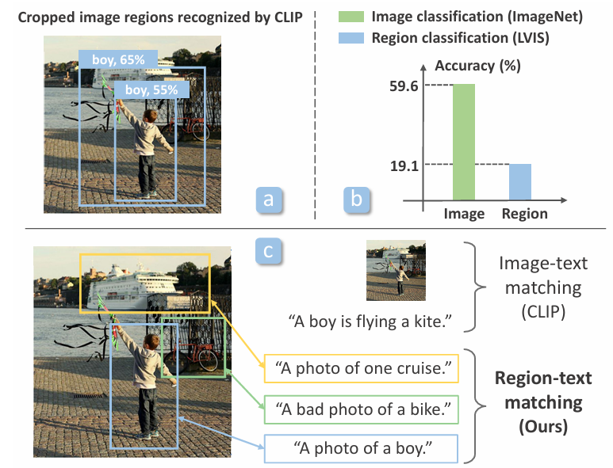
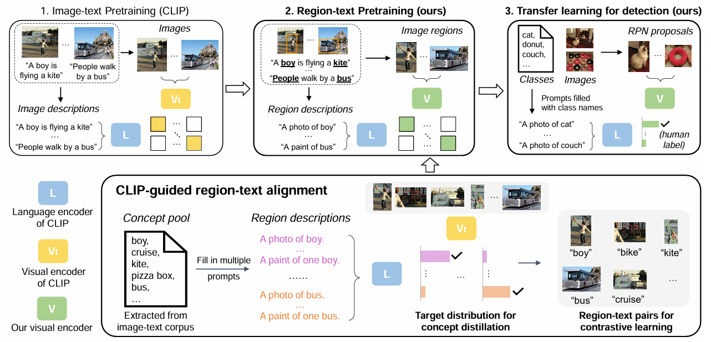
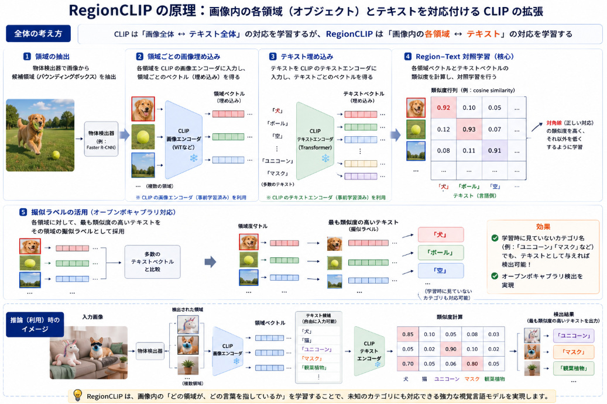
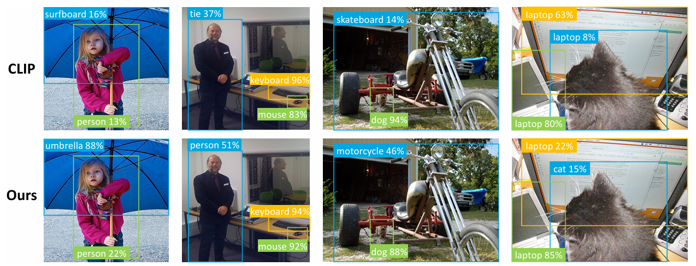

最近一つの画像に複数の対象が移った個々の画像のセマンティック検索をしたいという要望を感じることが多々あります。
そんな要望に合いそうな論文を探していてCVPRからノミネートしてきました。

本日テーマ：
>"RegionCLIP: Region-based Language–Image Pretraining"について調べてみる

## 概要

**RegionCLIP**（Zhong et al., CVPR 2022）の論文概要を整理します。

### 論文情報

- **タイトル**：RegionCLIP: Region-based Language–Image Pretraining  
- **著者**：Yiwu Zhong, Jianwei Yang, Pengchuan Zhang, Chunyuan Li, Jianfeng Gao, etc.  
- **学会**：CVPR 2022  
- **キーワード**：CLIP, region-based pretraining, open-vocabulary detection, semantic image retrieval

### 背景と問題意識

- **CLIP** は画像全体とテキスト全体を対照学習するため、  
  - 画像内の**特定の領域（オブジェクト）** とテキストの対応を直接学習していない。  
  - そのため、**オブジェクトレベルのセマンティック検索**や  
    **オープンボキャブラリ物体検出**（未知のカテゴリも検出）には限界があった。
- RegionCLIP は、  
  - **画像の領域（region）レベル**で画像–テキスト対照学習を行うことで、  
  - オブジェクト単位の意味理解を強化することを目指す。

### 手法の概要

__1. 基本的なアイデア__

- **物体検出器**（例：Faster R-CNN）で画像から**候補領域（region proposals）** を抽出。
- 各候補領域を**CLIP の画像エンコーダ**に入力し、**領域ごとのベクトル**を得る。
- テキスト側も CLIP のテキストエンコーダでベクトル化。
- **領域ベクトルとテキストベクトル**を対照学習し、  
  「この領域はこのテキストに対応する」という対応関係を学習。

__2. 学習のポイント__

- **Region–Text 対照学習**：  
  - 画像全体ではなく、**各領域とテキスト**の類似度を最大化。  
  - これにより、オブジェクトレベルの意味表現が強化される。
- **擬似ラベルの活用**：  
  - 物体検出器の出力（クラスラベル）をそのまま使うのではなく、  
    CLIP のテキストエンコーダで得た**テキスト埋め込み**と照合し、  
    最も類似するテキストをその領域の「擬似ラベル」として利用。
- **オープンボキャブラリ対応**：  
  - テキスト側を自由に変えられるため、  
    学習時に見ていないカテゴリ名（例：「ユニコーン」「マスク」）でも、  
    テキストとして与えれば対応する領域を検出可能。

### 実験と結果

__1. オープンボキャブラリ物体検出__

- LVIS などのデータセットで、  
  - **学習時に見ていないカテゴリ**も含めて物体検出できるか評価。  
- RegionCLIP は、  
  - 既存の CLIP ベース手法より**高い精度**でオープンボキャブラリ検出を実現。

__2. セマンティック画像検索__

- 画像内の**特定のオブジェクト**に着目した検索タスクで評価。  
- RegionCLIP は、  
  - 画像全体を扱う CLIP よりも、 **オブジェクトレベルの検索精度が向上**することを示した。

### まとめ

- **RegionCLIP** は、  
  - CLIP を**領域レベル**に拡張した手法で、  
  - 画像内の各オブジェクトとテキストの対応を直接学習する。
- これにより、  
  - **オープンボキャブラリ物体検出**  
  - **オブジェクトレベルのセマンティック検索**  
  の性能が向上することが示された。

## 課題

**RegionCLIP** が解決しようとした主な課題は、以下の2点です。

### 課題1：CLIP は「画像全体」の意味しか捉えられない

- **CLIP** は、  
  - 画像全体を1つのベクトルにまとめ、  
  - テキスト全体と対照学習するため、  
  **画像内の個々のオブジェクト（領域）とテキストの対応**を直接学習していません。
- その結果、  
  - 「犬とボールが写っている画像」全体は検索できても、  
  - 「犬だけが写っている領域」をピンポイントで検索するのは難しい、  
  という**オブジェクトレベルのセマンティック検索の弱さ**が課題でした。

### 課題2：オープンボキャブラリ物体検出の性能不足

- 従来の物体検出器は、  
  - 学習時に見たカテゴリ（例：犬、猫、車）しか検出できず、  
  - 「ユニコーン」「マスク」など**未知のカテゴリ**は検出できない、という限界がありました。
- CLIP を応用した手法でも、  
  - 画像全体の意味は捉えられるものの、  
  - **オブジェクト単位で未知カテゴリを検出する性能**は十分ではありませんでした。

### RegionCLIP が目指した解決

- **領域レベルでの画像–テキスト対照学習**を行うことで、  
  - 画像内の**各オブジェクト（領域）** とテキストの対応を直接学習。  
  - これにより、  
    - オブジェクトレベルのセマンティック検索  
    - オープンボキャブラリ物体検出  
    の性能を向上させることを目指しました。

## RegionCLIPの原理

**RegionCLIP** の原理を、手順ベースで整理します。

### 全体の考え方

- CLIP は「画像全体 ↔ テキスト全体」の対応を学習しますが、  
  RegionCLIP はこれを **「画像内の各領域（オブジェクト） ↔ テキスト」** の対応に拡張します。
- そのために、  
  - **物体検出器**で領域を抽出し、  
  - 各領域を CLIP の画像エンコーダで埋め込み、  
  - テキスト埋め込みと**領域単位で対照学習**します。

### 手順1：領域の抽出

1. 入力画像を**物体検出器**（例：Faster R-CNN）に入力。  
2. 検出器が**候補領域（region proposals）** を出力。  
   - 例：犬の頭、ボール、空など、複数のバウンディングボックス。

### 手順2：領域ごとの画像埋め込み

3. 各候補領域を**CLIP の画像エンコーダ**に入力し、  
   **領域ごとのベクトル**（region embedding）を得る。  
   - これが「この領域が何を表しているか」の意味表現になります。

### 手順3：テキスト埋め込み

4. テキスト側（例：「犬」「ボール」「空」など）を  
   **CLIP のテキストエンコーダ**に入力し、  
   **テキストごとのベクトル**を得る。

### 手順4：Region–Text 対照学習（核心）

5. **各領域ベクトルとテキストベクトル**の類似度を計算。  
6. 正しい対応（例：犬の領域 ↔ 「犬」というテキスト）の類似度を高く、  
   それ以外の組み合わせの類似度を低くするように**対照学習**を行います。

- これにより、  
  - 「犬の領域」は「犬」というテキストに近く、  
  - 「ボールの領域」は「ボール」というテキストに近い、  
  という**オブジェクト単位の意味対応**が学習されます。

### 手順5：擬似ラベルの活用（オープンボキャブラリ対応）

7. 学習時には、物体検出器のクラスラベルをそのまま使うのではなく、  
   - 各領域ベクトルと**多数のテキストベクトル**を比較し、  
   - 最も類似度の高いテキストをその領域の**擬似ラベル**として採用。
8. これにより、  
   - 学習時に見ていないカテゴリ名（例：「ユニコーン」「マスク」）でも、  
     テキストとして与えれば対応する領域を検出できる**オープンボキャブラリ検出**が可能になります。

つまり**RegionCLIP は「物体検知＋CLIP」を組み合わせて学習したモデル**です。

より正確に言うと：

- **物体検知器**（例：Faster R-CNN）で画像から**領域（オブジェクト）を抽出**
- 各領域を**CLIP の画像エンコーダ**で埋め込み
- テキスト側も CLIP のテキストエンコーダで埋め込み
- **領域ベクトルとテキストベクトルを対照学習**

という「**物体検知＋CLIP を統合した学習**」を行っています。

この組み合わせにより、  
- 画像全体ではなく**オブジェクト単位**で意味を捉えられる  
- オープンボキャブラリ物体検出やオブジェクトレベルのセマンティック検索が可能になる  
というのが RegionCLIP のポイントです。

もし、「どの部分が既存の CLIP と違うのか」「どの部分が物体検知器の役割なのか」など、  
もう一段階細かく整理したい場合は、その点に絞って補足することも可能です。

## 実験

**RegionCLIP** の論文で報告されている**実験内容と結果**を、  
「何をしたか（実験内容）」と「どうなったか（結果）」に分けて整理します。

### 実験1：オープンボキャブラリ物体検出（Open-Vocabulary Detection）

__何をしたか（実験内容）__

- **データセット**：  
  - LVIS など、多数のカテゴリを含む物体検出データセットを使用。
- **評価設定**：  
  - 学習時に**見たことのないカテゴリ（unseen categories）** も含めて、  
    物体検出ができるかどうかを評価。
- **比較手法**：  
  - 従来の CLIP ベースの手法  
  - その他のオープンボキャブラリ検出手法

__どうなったか（結果）__

- RegionCLIP は、  
  - **既存手法より高い精度**でオープンボキャブラリ物体検出を実現。
- 特に、  
  - 学習時に見ていないカテゴリ名をテキストとして与えたとき、  
    対応する物体を**より正確に検出**できることが示されました。

### 実験2：セマンティック画像検索（Semantic Image Retrieval）

__何をしたか（実験内容）__

- **タスク**：  
  - 画像内の**特定のオブジェクト**に着目した検索タスク。  
  - 例：「犬が写っている画像」「赤い車が写っている画像」など。
- **評価方法**：  
  - クエリテキストに対して、  
    画像コーパスから関連する画像をランキングし、  
    正解率（Recall@k など）を測定。
- **比較手法**：  
  - 画像全体を扱う CLIP  
  - その他のベースライン

__どうなったか（結果）__

- RegionCLIP は、  
  - **画像全体を扱う CLIP よりも、オブジェクトレベルの検索精度が向上**。
- 特に、  
  - 画像内に複数の物体が写っている場合でも、  
    クエリに対応する**特定のオブジェクト**をより正確に捉えられることが確認されました。

### 実験3：アブレーションスタディ（手法の各要素の効果）

__何をしたか（実験内容）__

- RegionCLIP の構成要素を1つずつ外したり変えたりして、  
  どの要素が性能に寄与しているかを検証。
- 例：  
  - **領域レベルの対照学習**を外す（画像全体のみ）  
  - **擬似ラベルの生成方法**を変える  
  - **物体検出器の種類**を変える

__どうなったか（結果）__

- **領域レベルの対照学習**が最も重要であることが確認されました。  
  - これを外すと、オープンボキャブラリ検出やオブジェクト検索の性能が大きく低下。
- **擬似ラベルの活用**も性能向上に寄与。  
  - 単純なクラスラベルを使うよりも、  
    CLIP のテキスト埋め込みに基づく擬似ラベルの方が、  
    オープンボキャブラリ性能が高くなる。

## 総括

本論文の要点についてまとめます。

- **領域レベルで CLIP を学習**  
  画像全体ではなく、**各オブジェクト（領域）とテキスト**を直接対応づけて学習。

- **物体検知＋CLIP の統合**  
  物体検出器で領域を抽出し、CLIP で領域ごとに埋め込み、  
  テキスト埋め込みと**領域単位でマッチング**。

- **オープンボキャブラリ検出が可能**  
  学習時に見ていないカテゴリ名（例：「ユニコーン」）でも、  
  テキストとして与えれば対応する物体を検出できる。

- **オブジェクトレベルの検索性能向上**  
  画像全体を扱う CLIP より、  
  「犬だけが写っている領域」のような**オブジェクト単位の検索**が得意。

以上が、RegionCLIP の核心的なポイントです。

