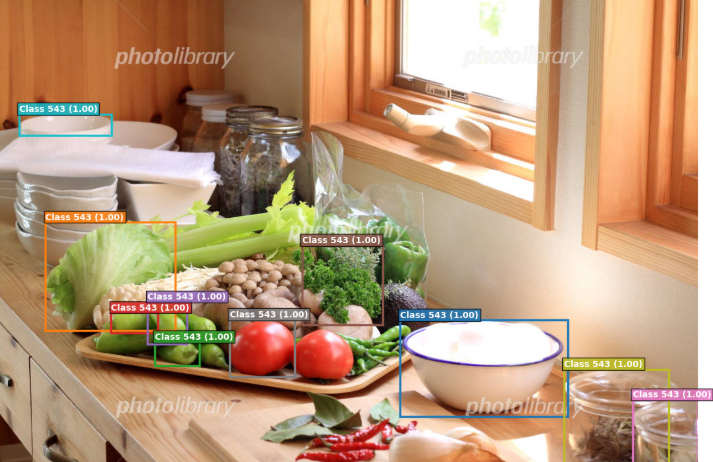

先日のRegionCLIPを動作させてみたくなったのですが、まあ、Quita通りにはいかないと思い知らされたので、手順や考え方について説明しようと思います。

本日テーマ：
>RegionCLIPを動作させ領域に対する埋め込み表現を得るところまで調べてみた。


## 狙い

**RegionCLIP の仕組みを使えば、領域と文章（自然文）の類似度を取ることも可能**です。

### 仕組みのイメージ

1. **領域の抽出**  
   - 物体検出器やセグメンテーションモデルで、画像から**領域（オブジェクト）** を抽出。

2. **領域の埋め込み**  
   - 各領域を CLIP の**画像エンコーダ**に入力し、**領域ベクトル**を得る。

3. **文章の埋め込み**  
   - 任意の文章（例：「犬がボールを追いかけている」「机の上にコーヒーカップがある」など）を  
     CLIP の**テキストエンコーダ**に入力し、**文章ベクトル**を得る。

4. **類似度計算**  
   - 各領域ベクトルと文章ベクトルの**コサイン類似度**などを計算。  
   - これが「その領域が、その文章の内容とどれだけ一致しているか」の指標になります。

### 具体的な使い方の例

- **オブジェクトレベルの画像検索**：  
  - クエリ文章：「犬がボールを追いかけている」  
  - 各画像の領域とこの文章の類似度を計算し、  
    類似度が高い領域を含む画像を上位にランキング。

- **画像キャプショニングの評価**：  
  - 生成されたキャプション文章と、  
    画像内の各領域の類似度を計算し、  
    キャプションがどのオブジェクトを正しく記述しているかを評価。

- **視覚的グラウンディング（Visual Grounding）**：  
  - 文章で指定された物体を画像内で特定するタスクに応用可能。

## 問題設定

RegionCLIPを用いて「画像内の複数領域」と「複数のテキスト（フレーズや説明文）」の間の意味的類似度をマッチングするための問題設定（Task Formulation）を整理しました。

### 1. タスク概要 (Task Overview)

* **タスク名:** 領域—テキスト間クロスモーダル意味類似度マッチング (Region-Text Cross-Modal Semantic Matching)
* **目的:** 入力画像から抽出された複数の関心領域（Region of Interest: RoI）と、与えられた複数のテキスト表現（クラス名、属性、キャプション、フレーズ等）との対応関係を、RegionCLIPの共通埋め込み空間における類似度に基づいて正確に特定する。

### 2. 入力と出力の定義 (Inputs & Outputs)

__入力 (Inputs)__

* **画像:** $I \in \mathbb{R}^{H \times W \times C}$
* **領域集合（Bounding Boxes）:** $\mathcal{B} = \{b_1, b_2, \dots, b_N\}$
* $N$ 個のバウンディングボックス（Region Proposal Network 等で事前検出、またはグリッド状に抽出）。


* **テキスト集合:** $\mathcal{T} = \{t_1, t_2, \dots, t_M\}$
* $M$ 個のテキストフレーズ（例: `"a white dog"`, `"red mug on the table"`, `"running person"` など）。

__出力 (Outputs)__

* **類似度行列 (Similarity Matrix):** $S \in \mathbb{R}^{N \times M}$
* $S_{i,j} \in [-1, 1]$ は領域 $b_i$ とテキスト $t_j$ の意味的類似度を表す。


* **マッチング結果 (Matching Result):**
* **1対1対応の場合:** 各領域に最も適したテキストの割り当て関数 $\pi(i) = \arg\max_j S_{i,j}$
* **1対多・閾値処理の場合:** 閾値 $\tau$ を超えるペア集合 $\mathcal{M} = \{(b_i, t_j) \mid S_{i,j} > \tau\}$

### 3. 数学的定式化 (Mathematical Formulation)

マッチングに用いる原理の数式について示します。

__(1) 特徴抽出 (Feature Extraction)__

RegionCLIPは、画像全体ではなく**特定領域の視覚特徴**をテキスト特徴と直接比較可能な共通空間へ射影します。

* **視覚領域エンコーダ ($E_V$):**
画像 $I$ と領域 $b_i$ から領域レベルの特徴ベクトル $\mathbf{v}_i \in \mathbb{R}^d$ を算出します。

$$\mathbf{v}_i = E_V(I, b_i)$$


* **テキストエンコーダ ($E_T$):**
テキスト $t_j$ からテキスト特徴ベクトル $\mathbf{t}_j \in \mathbb{R}^d$ を算出します。

$$\mathbf{t}_j = E_T(t_j)$$

__(2) 類似度計算 (Similarity Score)__

領域 $b_i$ とテキスト $t_j$ の類似度 $S_{i,j}$ は、正規化されたコサイン類似度として定義します。

$$S_{i,j} = \frac{\mathbf{v}_i^\top \mathbf{t}_j}{\Vert{}\mathbf{v}_i\Vert{}_2 \Vert{}\mathbf{t}_j\Vert{}_2}$$

### 4. マッチング最適化のパターン (Matching Strategies)

用途に応じて、以下のいずれかの問題解法パターンを選択します。

__Open-Vocabulary 識別 (独立選定)__

各領域 $b_i$ に対して独立に最も類似度が高いテキストを選択します（重複許容）。

$$\hat{j}_i = \operatorname*{argmax}_{j \in \{1, \dots, M\}} S_{i,j}$$

* **適用場面:** 1つの画像内に同じカテゴリの物体が複数存在する場合（例: 複数の「`dog`」）。

### 5. 評価指標 (Evaluation Metrics)

一般に考えられるマッチングの指標は以下が考えられます。
今回はTop-1 Accuracyを選択します。

* **Mean Average Precision (mAP):** 各テキストに対する領域検出・アライメント精度（IoU 閾値との併用）。
* **Recall@K / Precision@K:** 上位 $K$ 個の正解マッチングに含まれる割合。
* **Top-1 Accuracy:** 各領域に対して最も類似度の高いテキストが正解ラベルと一致している割合。


## 実験

### 1. 準備

例の如くGoogle Colabを開いて以下を実行下さい。
必要パッケージをインストールします。

```bash
!pip install pyyaml==5.1
!pip install detectron2 -f https://dl.fbaipublicfiles.com/detectron2/wheels/$CUDA_VERSION/torch$TORCH_VERSION/index.html
```

## モデルの構成

**いい質問です。整理すると、必須なのは実質**2つ**で、3つ目は目的によって要不要が変わります。

| ファイル | 役割 | 必須？ |
|---|---|---|
| `regionclip_pretrained-cc_rn50.pth` | RegionCLIP本体（画像→領域埋め込みを作る視覚エンコーダ） | **必須** |
| `rpn_lvis_866.pth` | 領域候補（バウンディングボックス）を提案するRPN | **必須**（RPNで領域を出す設定 `MODEL.CLIP.CROP_REGION_TYPE RPN` を使う場合） |
| `lvis_1203_cls_emb.pth` | 1203個の物体カテゴリ名をCLIPテキストエンコーダで埋め込んだもの | **任意** |

## なぜ分かれているか

- RegionCLIPは「①領域を見つける」処理と「②各領域を埋め込みベクトルにする」処理が分離した設計になっています（region proposalとfeature extractionの分離）。①を担うのがRPN、②を担うのがRegionCLIP本体です。
- 3つ目の `lvis_1203_cls_emb.pth` は、埋め込みベクトル自体には関係なく、「その領域を1203カテゴリのどれに分類するか（ラベル付け）」をしたい場合にだけ使うオプションです。ノートブックの手順6（クラス非依存のRPN領域から埋め込みだけ取る）ではこのファイルは使っていません。

## 目的別まとめ

- **「領域の埋め込みベクトルさえ取れればいい」（分類ラベルは不要）**
  → `regionclip_pretrained-cc_rn50.pth` + `rpn_lvis_866.pth` の2つで十分です（ノートブックの手順6）。

- **「領域ごとに"これは犬""これは車"のようなカテゴリラベルや確信度も一緒に欲しい」**
  → 上の2つに加えて `lvis_1203_cls_emb.pth` も必要です（手順7）。この場合、埋め込み(`feats`)に加えて `classes`（予測クラスID）と `probs`（確信度）も出力に含まれます。

もし独自のクラス概念（LVISの1203カテゴリ以外）でラベル付けしたい場合は、前回説明した「Extract Concept Features」のスクリプトを使って自分で `concepts.txt` から埋め込みファイルを作ることもできます。用途を教えていただければ、その部分のコードも用意します。**


## 実験

### まずはbboxで抽出できているか可視化




