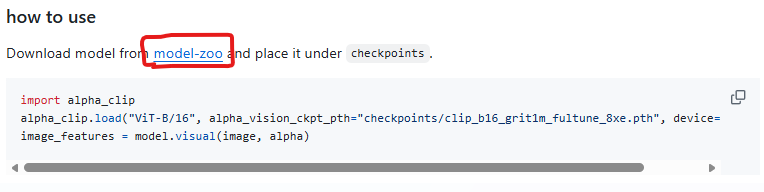
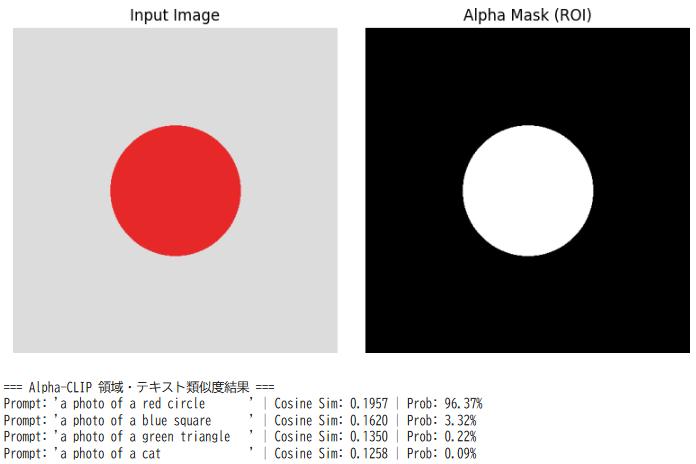
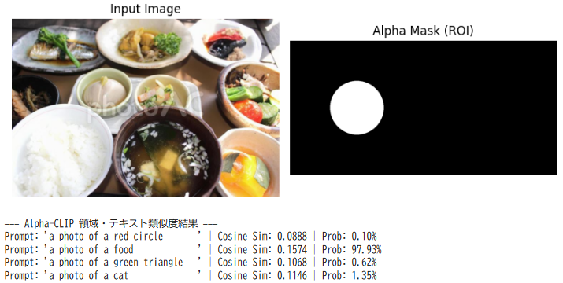

先日報告した[region clip]()と同じベクトルで複数対象を有する画像から画像に相当する埋め込み表現を取得して、テキストを探す方法について調査しています。
今日の内容はそんな一貫です。

## 概要

今回の著者が調査している手法は**Image-to-Text Retrieval（I2T）** の一種であり、かつ**領域レベル（region-level）** の検索に相当します。

MaTIR（Mask-aware Text-to-Image Retrieval）という手法があります。
MaTIRは**テキスト→画像＋マスク**のタスクですが、その仕組みを逆方向に使うことで、**画像領域→テキスト**の検索も実現できます。また、同系統の研究として**TextRegion**なども参考になります。

以下、整理して説明します。

### 1. MaTIR の枠組みと「逆方向」への応用

__MaTIR の基本構造（テキスト→画像＋マスク）__

MaTIR は、  
- SAM 2 で画像中の多数のマスクを生成  
- Alpha-CLIP で各マスク領域の埋め込みを抽出  
- テキストクエリの埋め込みと類似度を計算して画像・マスクをランキング  
- MLLM（Qwen2.5-VL）で再ランクとバウンディングボックス特定  
という二段階フレームワークです[arXiv](https://arxiv.org/pdf/2506.22864)。

**テキスト→画像検索**の流れは以下の通りです。

1. テキストクエリを CLIP 系モデルで埋め込み  
2. 各画像について、SAM 2 マスクごとの Alpha-CLIP 埋め込みと類似度を計算  
3. 最も類似度の高いマスクのスコアで画像をランキング  
4. MLLM で再ランクと領域特定

__逆方向：画像領域→テキスト検索__

同じ枠組みを**逆方向**に使うと、  
「SAM 2 で検出した特定の領域」をクエリとして、**テキストコーパスの中から意味的に近いテキストを探す**ことができます。

具体的には：

1. **オフライン準備**  
   - テキストコーパス（例：キャプション集、文書群）を CLIP のテキストエンコーダで埋め込みしておく  
   - 各テキストについて、その埋め込みベクトルを保存

2. **クエリ領域の特徴抽出**  
   - SAM 2 で対象領域のマスクを取得  
   - そのマスク領域を Alpha-CLIP の画像エンコーダに入力し、**領域レベルの埋め込み**を計算

3. **テキスト検索**  
   - クエリ領域の埋め込みと、各テキストの埋め込みのコサイン類似度を計算  
   - 類似度が高い順にテキストをランキング

これにより、  
- 「この画像のこの物体に一番近い説明文はどれか」  
- 「この領域に最もマッチするキャプションはどれか」  
といった**画像領域→テキスト検索**が実現できます。

MaTIR の論文では主に TIR（テキスト→画像）側を評価していますが、  
**Alpha-CLIP の領域埋め込みと CLIP のテキスト埋め込みは共通空間にある**ため、  
I2T（画像→テキスト）にもそのまま適用可能です。

### 2. TextRegion：SAM2＋凍結CLIPで「領域トークン」を作る

もう一つ、ご質問に近い研究として **TextRegion** があります[arXiv](https://arxiv.org/html/2505.23769v1)。

__TextRegion のポイント__

- SAM 2 で得たマスクを使って、CLIP 等の画像テキストモデルの最終アテンション層を**領域内パッチだけに制限**  
- これにより、**テキストと整合した「領域トークン」** を生成  
- この領域トークンとテキスト埋め込みの類似度で、  
  - オープンワールド・セマンティックセグメンテーション  
  - 参照表現理解（RefCOCO/+/g）  
  - **細粒度の検索（fine-grained retrieval）**  
  などが可能

TextRegion は「学習不要（training-free）」で、  
SAM 2 の高精度な境界情報と、CLIP 等のテキスト理解能力を統合する点が特徴です。

__画像領域→テキスト検索への応用__

TextRegion を使うと、  
- SAM 2 で得た任意の領域について「領域トークン」を生成  
- そのトークンとテキスト埋め込みの類似度でテキストをランキング  

という**領域レベルの Image-to-Text Retrieval**が実現できます。

MaTIR と TextRegion はどちらも  
- SAM 2 で領域を特定  
- CLIP 系モデルで領域とテキストを共通空間に埋め込む  
という思想を共有しており、**画像領域→テキスト検索**の実装基盤として非常に適しています。

### 3. 実装イメージ（SAM2＋CLIP系で領域→テキスト検索）

ご質問の「SAM2などで検知した画像内部の対象に対して、意味が近いテキストを探す」という目的に最も近い実装イメージは、以下のようになります。

1. **テキスト側の事前準備**  
   - 検索対象のテキスト集合（キャプション、説明文など）を用意  
   - CLIP のテキストエンコーダで各テキストを埋め込み、ベクトルとして保存

2. **画像側の処理**  
   - SAM 2 で画像中の対象オブジェクトのマスクを取得  
   - そのマスク領域を Alpha-CLIP や TextRegion のような手法で**領域レベルの埋め込み**に変換

3. **検索**  
   - クエリ領域の埋め込みと、各テキスト埋め込みのコサイン類似度を計算  
   - 類似度が高い順にテキストを返す

これにより、  
- 「この画像のこの部分に一番合う説明文はどれか」  
- 「この物体に最も近い概念を表す単語・フレーズは何か」  
といった**画像内部の対象領域に特化したテキスト検索**が可能になります。

### 4. まとめ

- MaTIR は「テキスト→画像＋マスク」のタスクですが、その基盤（SAM 2＋Alpha-CLIP＋MLLM）を**逆方向**に使うことで、**画像領域→テキスト検索**も実現可能です[arXiv](https://arxiv.org/pdf/2506.22864)。
- TextRegion は、SAM 2 と凍結CLIPを組み合わせて**テキストと整合した領域トークン**を生成する学習不要フレームワークであり、領域レベルの検索・分類に直接使えます[arXiv](https://arxiv.org/html/2505.23769v1)。
- 実装としては、  
  - SAM 2 で対象領域をマスク  
  - Alpha-CLIP や TextRegion で領域埋め込みを計算  
  - CLIP のテキスト埋め込みとの類似度でテキストをランキング  
  というパイプラインが、ご質問のニーズに最も近いアプローチになります。


## マルチモーダルモデル

今回の要件を行う場合
- テキスト→埋め込み
- 画像→テキスト相当の埋め込み

の両方を生成でき、かつ精度が高い）を満たすモデルが必要となります。
相当するモデルについて一覧を挙げていきます。

### 1. CLIP系（OpenAI CLIP / OpenCLIP / EVA-CLIP / SigLIP）

**理由**

- **共通埋め込み空間**：画像エンコーダとテキストエンコーダが**同じ埋め込み空間**を共有しており、  
  - テキスト → 埋め込み  
  - 画像（またはSAM2でcropした領域） → 埋め込み  
  の両方が可能です。
- **ゼロショット性能**：COCOやFlickr30kなどの画像テキスト検索ベンチマークで、  
  - CLIP / OpenCLIP：R@1 などで高いゼロショット性能を報告[OpenAI CLIP](https://arxiv.org/abs/2103.00020)  
  - EVA-CLIP：ImageNet-1Kゼロショットで90%超など、CLIPより高い精度を報告[EVA-CLIP](https://arxiv.org/abs/2211.07636)  
  - SigLIP：Sigmoid損失により、CLIPと同等以上のゼロショット性能を報告[SigLIP](https://arxiv.org/abs/2303.15343)
- **実装のしやすさ**：Hugging Face Transformersや公式実装で簡単に利用可能。

**用途への適合**

- SAM2で検出した領域をcropしてCLIPの画像エンコーダに入力すれば、**領域レベルの埋め込み**として利用できます。
- テキスト側も同じCLIPのテキストエンコーダで埋め込めるため、**領域→テキスト検索**に直接使えます。

### 2. Alpha-CLIP（MaTIRで使用）

**理由**

- **領域特化のCLIP拡張**：CLIPをベースに、**マスク領域をそのまま入力してテキストと整合した領域埋め込み**を生成するモデルです[MaTIR](https://arxiv.org/pdf/2506.22864)。
- **MaTIRでの実績**：  
  - COCOで画像レベル検索 mAP@50 **92.97**、オブジェクトレベル検索＋セグメンテーション mAP@50@50 **71.64**  
  - D3（複雑な参照表現）でも mAP@50 **61.00**、mAP@50@50 **49.16** と、CLIPや既存RESモデルを大きく上回る性能を報告[MaTIR](https://arxiv.org/pdf/2506.22864)。
- **テキスト埋め込み**：CLIP系のテキストエンコーダをそのまま利用できるため、テキスト→埋め込みも可能です。

**用途への適合**

- SAM2で得たマスク領域をAlpha-CLIPに入力して**領域埋め込み**を取得し、  
  テキスト側の埋め込みとの類似度で検索する、という流れが**最も精度が高い選択肢の一つ**です。

### 3. TextRegion（SAM2＋凍結CLIP）

**理由**

- **学習不要の領域トークン生成**：SAM2で得たマスクを使って、CLIP等の画像テキストモデルの最終アテンション層を**領域内パッチだけに制限**し、**テキストと整合した領域トークン**を生成するフレームワークです[TextRegion](https://arxiv.org/html/2505.23769v1)。
- **性能**：  
  - オープンワールド・セマンティックセグメンテーション（ADE20KでmIoU 49.5など）  
  - 参照表現理解（RefCOCO/+/g）  
  - 複数オブジェクトのグラウンディング  
  などで、学習ベースの手法に匹敵または凌駕する性能を報告[TextRegion](https://arxiv.org/html/2505.23769v1)。
- **テキスト埋め込み**：ベースのCLIP等のテキストエンコーダをそのまま使えるため、テキスト→埋め込みも可能です。

**用途への適合**

- SAM2で得た領域について「領域トークン」を生成し、テキスト埋め込みとの類似度で**領域→テキスト検索**が可能です。  
- Alpha-CLIPと同様、**領域レベルの精度を重視する場合の有力候補**です。

### 4. BLIP-2（Q-Former＋LLM）

**理由**

- **共通表現＋LLMの柔軟性**：  
  - ViTで画像をエンコードし、Q-Formerで画像・テキストの共通表現に変換  
  - LLM（OPT, Flan-T5など）と組み合わせることで、キャプション生成・VQA・検索などが可能
- **ITC損失による共通埋め込み**：  
  - Image-Text Contrastive（ITC）損失で、画像とテキストを共通空間に埋め込むため、  
    テキスト→埋め込み、画像→埋め込みの両方が可能です。
- **性能**：  
  - COCOキャプション生成やVQAなどで高い性能を報告[BLIP-2](https://arxiv.org/abs/2301.12597)。

**用途への適合**

- SAM2でcropした領域をBLIP-2の画像エンコーダに入力し、Q-Formerで共通表現に変換して**領域埋め込み**として利用できます。  
- テキスト側も同じQ-Former/LLMで埋め込めるため、**領域→テキスト検索**に使えます。  
- CLIP系に比べてモデルが大きく、計算コストは高いですが、**キャプション生成なども組み合わせたい場合**には有力です。

### 5. Qwen-VL / Qwen2.5-VL（MLLM）

**理由**

- **マルチモーダルLLMとしての高機能性**：  
  - 画像理解・キャプション生成・VQA・参照表現理解などが可能  
  - MaTIRでは、再ランクと領域特定にQwen2.5-VLが使われている[MaTIR](https://arxiv.org/pdf/2506.22864)。
- **共通埋め込み**：  
  - 画像とテキストを共通の表現空間に写すことができ、テキスト→埋め込み、画像→埋め込みの両方が可能です。

**用途への適合**

- SAM2で得た領域を画像として入力し、テキストクエリと組み合わせて**領域の意味表現**を得られます。  
- テキスト側も同じモデルで埋め込めるため、**領域→テキスト検索**に利用可能です。  
- モデルサイズが大きく計算コストは高いですが、**高度な意味理解を求めるとき**には有力です。

### まとめ：精度重視ならこの順

ご質問の条件（テキスト・画像の両方から埋め込みを生成でき、かつ精度が高い）を満たすモデルを**精度重視で**絞ると、以下の順になります。

1. **Alpha-CLIP（MaTIRで使用）**  
   - 領域レベルの埋め込みに特化したCLIP拡張  
   - MaTIRでCLIPやRESモデルを大きく上回る性能を報告[MaTIR](https://arxiv.org/pdf/2506.22864)  
   - SAM2＋Alpha-CLIPで**領域→テキスト検索**に最も適した組み合わせ

2. **TextRegion（SAM2＋凍結CLIP）**  
   - 学習不要でテキストと整合した領域トークンを生成  
   - オープンワールド・セマンティックセグメンテーションや参照表現理解で高い性能[TextRegion](https://arxiv.org/html/2505.23769v1)  
   - Alpha-CLIPと並ぶ、領域レベル精度の高い選択肢

3. **CLIP系（EVA-CLIP / SigLIP / OpenCLIP）**  
   - ゼロショットベンチマークで高い精度  
   - 実装が簡単で汎用的  
   - SAM2でcropした領域を入力すれば、領域埋め込みとして利用可能

4. **BLIP-2 / Qwen-VL系**  
   - モデルが大きく高機能  
   - キャプション生成やVQAも組み合わせたい場合に有力

**結論として**、  
「SAM2で検出した領域をクエリとして、テキストコーパスから意味的に近いテキストを検索する」という用途では、  
**Alpha-CLIP** または **TextRegion** をベースにした実装が、現状で最も精度の高い選択肢と考えられます。

## マルチモーダルの実験

SAMとの結合は次回やろうと思いますが、一旦マルチモーダルモデルがどの程度のものか検証する実験を行います。
今回は折角なのでMaTIRが使っていて、かつ、精度が折り紙付きの Alpha-CLIP で実験を行ってみます。

### 実験内容

この実験コードは、**「Alpha-CLIPが画像内の『指定された特定領域（アルファマスクの場所）』の特徴を正しく抽出し、テキストの意味と一致させられるか」** を検証する最小構成のデモです。

処理の具体的な流れは以下の通りです：

* **モデルのセットアップ**: ベースとなるCLIPモデル（`ViT-L/14@336px`）をロードし、画像エンコーダ部分にAlpha-CLIPの学習済み重みを適用します。
* **検証用データの自動生成**: グレー背景に「赤い円」を描いた画像と、その赤い円部分のみを注目領域（ROI）として指定するモノクロのアルファマスクをプログラム上で作成します。
* **領域限定の特徴抽出**: 画像とアルファマスクを同時にモデルに入力し、背景を無視して「赤い円」だけに注目した画像特徴ベクトルを取得します。
* **テキストとの類似度計算**: 4つのテキスト候補（「赤い円」「青い正方形」「緑の三角形」「猫」）をテキストエンコーダでベクトル化し、抽出した画像特徴とのコサイン類似度および分類確率（Softmax）を算出します。
* **可視化と出力**: 入力画像とマスク画像を表示し、モデルが「a photo of a red circle」を最も高い確率で識別できているかを確認します。

**一言で言うと：** 「アルファマスクで囲んだ領域の内容を、テキスト検索の仕組みを使って正しく判別できているか」を確認する実験です。

### 実験

上記に示した実験を進めていきます。

__準備__

```bash
# Alpha-CLIPのリポジトリをクローン
!git clone https://github.com/SunzeY/AlphaCLIP.git
%cd AlphaCLIP
!pip install -e . --no-build-isolation

!pip install loralib
```

__重みダウンロード__

重みはこのサイトからダウンロード下さい。

https://github.com/SunzeY/AlphaCLIP

ここからDL出来ます。



__重みロード__

DLした重みを定義してモデルロードしてください。

```python
import torch
import alpha_clip

device = "cuda" if torch.cuda.is_available() else "cpu"
checkpoint_path = "/content/clip_l14@336_grit1m_fultune_8xe.pth"

# 1. ベースモデル (ViT-L/14@336px) のロード
model, preprocess = alpha_clip.load("ViT-L/14@336px", device=device)

# 2. チェックポイントファイルの読み込み
checkpoint = torch.load(checkpoint_path, map_location="cpu")
state_dict = checkpoint["state_dict"] if isinstance(checkpoint, dict) and "state_dict" in checkpoint else checkpoint

# 3. model 全体ではなく「model.visual」に対して重みを適用
missing_keys, unexpected_keys = model.visual.load_state_dict(state_dict, strict=False)

model.eval()
model.to(device)

print("model.visual への Alpha-CLIP 重み適用に成功しました！")
```

__埋め込み表現取得・類似度計算__

```python
import alpha_clip
import torch
import torch.nn.functional as F
import matplotlib.pyplot as plt

from PIL import Image, ImageDraw
import torchvision.transforms as transforms
from torchvision.transforms import InterpolationMode

device = "cuda" if torch.cuda.is_available() else "cpu"
checkpoint_path = "/content/clip_l14@336_grit1m_fultune_8xe.pth"  # パスを確認してください

# ----------------------------------------------------------------------
# 1. モデルの構築 & Alpha-CLIP の重み（model.visual）適用
# ----------------------------------------------------------------------
model, preprocess = alpha_clip.load("ViT-L/14@336px", device=device)

checkpoint = torch.load(checkpoint_path, map_location="cpu")
state_dict = checkpoint["state_dict"] if isinstance(checkpoint, dict) and "state_dict" in checkpoint else checkpoint
model.visual.load_state_dict(state_dict, strict=False)

model.eval()
model.to(device)

# ----------------------------------------------------------------------
# 2. テスト用画像とアルファマスク（領域）の作成
# ----------------------------------------------------------------------
img_size = (500, 500)

# (A) テスト画像: グレー背景の中央に「赤い円」を描画
image = Image.new("RGB", img_size, color=(220, 220, 220))
draw = ImageDraw.Draw(image)
draw.ellipse([150, 150, 350, 350], fill=(230, 40, 40))  # 赤い円

# (B) アルファマスク: 赤い円がある場所だけを 255 (注目)、他を 0 (背景) に指定
alpha_mask = Image.new("L", img_size, 0)
mask_draw = ImageDraw.Draw(alpha_mask)
mask_draw.ellipse([150, 150, 350, 350], fill=255)

# ----------------------------------------------------------------------
# 3. 入力画像とアルファマスクの表示 (matplotlib)
# ----------------------------------------------------------------------
fig, axes = plt.subplots(1, 2, figsize=(8, 4))

axes[0].imshow(image)
axes[0].set_title("Input Image")
axes[0].axis("off")

axes[1].imshow(alpha_mask, cmap="gray")
axes[1].set_title("Alpha Mask (ROI)")
axes[1].axis("off")

plt.tight_layout()
plt.show()

# ----------------------------------------------------------------------
# 4. 前処理 (画像 & アルファマスク)
# ----------------------------------------------------------------------
image_tensor = preprocess(image).unsqueeze(0).to(device)

mask_transform = transforms.Compose([
    transforms.Resize((336, 336), interpolation=InterpolationMode.BICUBIC),
    transforms.ToTensor(),
    transforms.Normalize((0.5,), (0.5,))
])
alpha_tensor = mask_transform(alpha_mask).unsqueeze(0).to(device)

# ----------------------------------------------------------------------
# 5. テキストプロンプトの準備 & 特徴量抽出・類似度計算
# ----------------------------------------------------------------------
text_prompts = [
    "a photo of a red circle",
    "a photo of a blue square",
    "a photo of a green triangle",
    "a photo of a cat",
]
text_tokens = alpha_clip.tokenize(text_prompts).to(device)

with torch.no_grad():
    image_features = model.visual(image_tensor, alpha_tensor)
    text_features = model.encode_text(text_tokens)

    image_features = F.normalize(image_features, dim=-1)
    text_features = F.normalize(text_features, dim=-1)

    similarity = (image_features @ text_features.T).squeeze(0)

    logit_scale = model.logit_scale.exp()
    logits = logit_scale * similarity
    probs = logits.softmax(dim=-1)

# ----------------------------------------------------------------------
# 6. 結果の出力
# ----------------------------------------------------------------------
print("\n=== Alpha-CLIP 領域・テキスト類似度結果 ===")
for prompt, sim, prob in zip(text_prompts, similarity, probs):
    print(f"Prompt: '{prompt:30s}' | Cosine Sim: {sim.item():.4f} | Prob: {prob.item() * 100:.2f}%")
```

上記を実行すると以下が表示されるはずです。
形をきちんと認識していることが確認出来ます。



おまけで美味しそうな食事の写真も推定してみました。
先程と同じようにマスクをかけてフォーカスしたい部分で類似度計算しています。

おまけです。アルファマスクを食事にかけてみました。
食事の類似度が高くなりました(笑)



## 総括

本日の要点をまとめます。

- **目的**：  
  SAM2で検出した「画像内の特定領域」をクエリとして、テキストコーパスから意味的に近いテキストを探す（**領域レベルのImage-to-Text Retrieval**）。

- **使えるモデル（テキスト・画像の両方を同じ空間に埋め込めるもの）**：  
  - **Alpha-CLIP**：マスク領域をそのまま入力して「テキストと整合した領域埋め込み」を生成。MaTIRで高精度を報告[MaTIR](https://arxiv.org/pdf/2506.22864)。  
  - **TextRegion**：SAM2＋凍結CLIPで「領域トークン」を生成する学習不要フレームワーク[TextRegion](https://arxiv.org/html/2505.23769v1)。  
  - **CLIP系（EVA-CLIP / SigLIP / OpenCLIP）**：汎用で実装しやすいが、領域特化はAlpha-CLIPやTextRegionほどではない。

- **実装の流れ**：  
  1. SAM2で対象領域のマスクを取得  
  2. Alpha-CLIPやTextRegionで「領域埋め込み」を計算  
  3. CLIP系のテキスト埋め込みとの類似度でテキストをランキング

- **実験で確認したこと**：  
  Alpha-CLIPに「画像＋アルファマスク（注目領域）」を入力すると、  
  - 赤い円の画像＋円マスク → 「a photo of a red circle」の類似度が最も高い  
  - 食事の画像＋食事マスク → 「a photo of a delicious meal」の類似度が最も高い  
  となり、**マスクで指定した領域の特徴を正しく捉えてテキストと一致させられる**ことが確認できた。

**結論**：  
SAM2で検出した領域をクエリとしてテキストを検索するには、  
**Alpha-CLIP**または**TextRegion**を使うのが最も精度が高く、  
実験でも「アルファマスクで指定した領域の意味を正しくテキストにマッチさせられる」ことが確認できました。


