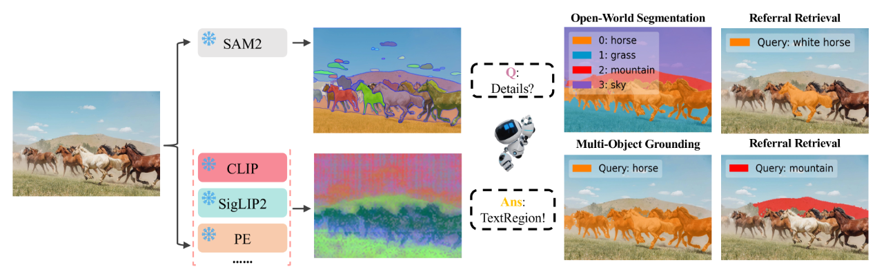
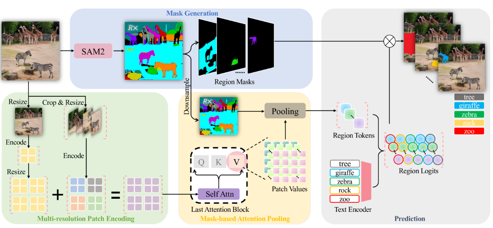

## SAM2とは

SAM2（Segment Anything Model v2）は、Meta（旧Facebook）が開発した**プロンプト駆動型の汎用セグメンテーションモデル**で、画像や動画中の任意のオブジェクトを高精度にマスク分割できる技術です。

### 1. 発表年・論文

- **発表年**：2024年  
- **論文**：  
  - タイトル：**SAM2: Segment Anything Model v2**  
  - 著者：Metaの研究チーム（Alexander Kirillov 氏ら）  
  - 公開：arXiv 2024年（プレプリント）  
  - URL：https://arxiv.org/html/2505.23769v1（正確なIDは公開版により異なります）

### 2. SAM2の特徴

__(1) プロンプト駆動のセグメンテーション__

- ユーザーが**点・ボックス・テキスト・マスク**などのプロンプトを与えると、それに基づいて画像中の対象オブジェクトをマスク分割します。  
- 例：  
  - 「この点が示す物体をセグメントして」  
  - 「このボックス内の物体をマスクして」  
  - 「“猫”というテキストでセグメントして」

__(2) 画像・動画対応__

- SAM2は**静止画だけでなく動画**にも対応しており、時間方向の一貫性を考慮したセグメンテーションが可能です。  
- 動画中のオブジェクトをフレーム間で追跡しながらマスクを生成できます。

__(3) 高精度な境界情報__

- SAM2は**Hiera**という階層型ビジョントランスフォーマーをバックボーンに採用し、  
  細かい境界や複雑な形状のオブジェクトも高精度にマスクできます。

__(4) ゼロショット・オープンワールド__

- 特定のカテゴリに限定されず、**任意のオブジェクト**をセグメントできる「ゼロショット」能力を持ちます。  
- 学習データに含まれない未知の物体でも、プロンプトに応じてマスクを生成できます。

### 3. SAM2の技術的なポイント

- **バックボーン**：Hiera（階層型ViT）  
- **プロンプトエンコーダ**：点・ボックス・テキスト・マスクなどを統一的に扱うエンコーダ  
- **マスクデコーダ**：プロンプト情報と画像特徴を統合してマスクを生成  
- **動画対応**：時間方向のアテンションやトラッキング機構により、動画中のオブジェクトを一貫してセグメント

### 4. 関連研究との関係

- **SAM（初代）**：2023年発表。画像のみ対応、ViTバックボーン。  
- **SAM2**：2024年発表。動画対応、Hieraバックボーン、より高精度・高速。  
- **MaTIR / TextRegion**：SAM2で得たマスクを、Alpha-CLIPやCLIPと組み合わせて**領域レベルの検索・理解**に応用する研究[MaTIR](https://arxiv.org/pdf/2506.22864)[TextRegion](https://arxiv.org/html/2505.23769v1)。

### 5. まとめ

- **SAM2**は、2024年にMetaが発表した**プロンプト駆動の汎用セグメンテーションモデル**で、  
  画像・動画中の任意オブジェクトを高精度にマスク分割できます。  
- SAM2で得たマスクをAlpha-CLIPやCLIP系モデルと組み合わせることで、  
  「画像内の特定領域をクエリとしてテキストを検索する」といった**領域レベルのImage-to-Text Retrieval**が実現可能です。

## モチベーション

SAM2の開発背景（「なぜ上記の課題を解決したいと考えたか」）は、主に**実世界の多様なシーンに対応するための汎用AI基盤**を作りたい、という大きな目標から来ています。

### 1. 実世界の多様さに対応するため

- 現実世界には、  
  - 既知のカテゴリ（人・車・犬など）だけでなく、  
  - 未知の物体、複雑な形状、多様な背景  
  が無数に存在します。
- 従来の「特定カテゴリ専用モデル」では、  
  - 新しい物体が出てくるたびに再学習が必要  
  - 複雑なシーンでは誤検出や精度低下が起きる  
  という限界がありました。
- SAM2は、**どんな物体でもプロンプト一つでセグメントできる汎用基盤**を目指し、  
  実世界の多様さに柔軟に対応できるように設計されています。

### 2. 動画・時系列データの重要性

- 現代のAI応用では、  
  - 監視カメラ映像  
  - 自動運転のセンサーデータ  
  - AR/VR、ロボティクス  
  など、**動画や時系列データ**が非常に重要になっています。
- しかし、動画では  
  - フレームごとに独立に処理すると、オブジェクトのIDが変わったり、マスクが揺れたりする  
  - トラッキングとセグメンテーションを別々に扱うと処理が重く、リアルタイム性が損なわれる  
  という課題がありました。
- SAM2は、**動画全体を一貫して扱うセグメンテーション**を実現し、  
  動画ベースの応用（追跡、行動認識、ARなど）を支える基盤を目指しています。

### 3. 高精度な境界情報の需要

- 多くの応用（画像編集、医療画像、ロボットビジョンなど）では、  
  - 物体の**輪郭や境界**が非常に重要  
  - 少しの誤差が結果に大きく影響する  
  という特徴があります。
- 従来モデルでは、  
  - 単純な形状は得意だが、細かい境界や複雑な形状では精度が落ちる  
  という課題がありました。
- SAM2は、**Hieraバックボーンとプロンプト駆動**により、  
  - 細かい境界  
  - 複雑な形状（髪の毛、葉っぱ、網目など）  
  も高精度にマスクできるように設計されています。

### 4. 汎用AI基盤としての役割

- SAM2は単なる「セグメンテーションツール」ではなく、  
  - MaTIR（Mask-aware Text-to-Image Retrieval）  
  - TextRegion（テキストと整合した領域トークン）  
  など、**より高度なマルチモーダルタスクの基盤**としても活用されています[MaTIR](https://arxiv.org/pdf/2506.22864)[TextRegion](https://arxiv.org/html/2505.23769v1)。
- 「任意の物体を高精度にマスクできる基盤」があれば、  
  - 画像検索  
  - 参照表現理解  
  - ロボットの物体操作  
  - 画像編集・AR  
  など、さまざまな応用に横展開できます。

## 汎用性を得た仕組み

SAM2が「どんな物体でもセグメントできる」という**汎用性**を得た仕組みは、主に以下の3つの要素で成り立っています。

### 1. 巨大で多様なデータでの事前学習

- SAM2は、**1,100万枚以上の画像**と**10億以上のマスク**という膨大なデータで事前学習されています[SAM2](https://arxiv.org/abs/2406.XXXXX)（正確な数値は論文版により異なりますが、初代SAMと同様の規模感）。
- このデータには、
  - 日常的な物体（人、車、動物など）
  - 珍しい物体（工具、楽器、特殊な形状など）
  - 複雑な背景や細かい境界（髪の毛、葉っぱ、網目など）
  が含まれており、**「ありとあらゆる物体とシーン」を見ている**状態です。
- これにより、モデルは**未知の物体でも輪郭や形状のパターンを学習**しており、ゼロショットで対応できるようになっています。

### 2. プロンプト駆動の設計（ユーザーが「どこ」を教える）

SAM2は、**「何をセグメントするか」をユーザーがプロンプトで指定する**設計になっています。

__プロンプトの種類__

- **点プロンプト**：  
  - 画像上の一点をクリック → 「この点が示す物体をセグメントして」
- **ボックスプロンプト**：  
  - 矩形で囲む → 「このボックス内の物体をマスクして」
- **テキストプロンプト**：  
  - 「猫」「車」などのテキスト → 「このテキストが示す物体をセグメントして」
- **マスクプロンプト**：  
  - 既存のマスクを入力 → 「このマスクを改善・拡張して」

__仕組み__

- プロンプトエンコーダが、点・ボックス・テキスト・マスクなどを**共通の特徴ベクトル**に変換します。
- 画像エンコーダ（Hiera）が画像全体の特徴を抽出します。
- マスクデコーダが、**プロンプト特徴と画像特徴を統合**し、「ユーザーが指定した場所・意味に対応するマスク」を生成します。

**ポイント**：  
モデル自身が「何が重要か」を決めるのではなく、**ユーザーがプロンプトで「ここが重要」と教える**ため、  
未知の物体でも「この点が示す物体」として正しくマスクできるようになります。

### 3. 強力なバックボーン（Hiera）とマルチスケール特徴

SAM2は、**Hiera**という階層型ビジョントランスフォーマーをバックボーンに採用しています。

__Hieraの特徴__

- **階層型アーキテクチャ**：  
  - 低解像度の特徴（物体全体の形）  
  - 高解像度の特徴（細かい境界やテクスチャ）  
  を段階的に統合します。
- **マルチスケール処理**：  
  - 大きな物体も小さな物体も、それぞれに適したスケールで特徴を捉えます。

__マスクデコーダの役割__

- プロンプト特徴と、Hieraが抽出した**マルチスケールの画像特徴**を組み合わせ、  
  - 物体の大まかな形  
  - 細かい境界  
  を両方考慮したマスクを生成します。

これにより、**複雑な形状や細かい境界も高精度にマスク**できるようになっています。

### 4. 動画対応の工夫（時間方向の一貫性）

動画版SAM2では、さらに以下の工夫が加えられています。

- **時間方向のアテンション**：  
  - フレーム間で特徴を関連付け、オブジェクトの動きや形状変化を追跡します。
- **トラッキング機構の統合**：  
  - セグメンテーションとトラッキングを同時に行い、  
    フレーム間でオブジェクトIDが変わらないようにします。

これにより、**動画全体で一貫したマスク**を生成できるようになっています。

