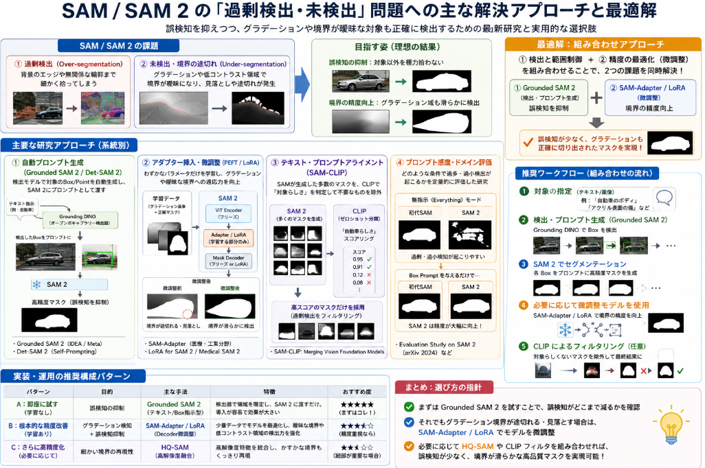

最近画像に対して、学習したことがない対象でも検知したいというニーズを受けることがあります。
どんな時に用いるのは[SAM](https://yoshishinnze.hatenablog.com/entry/2026/08/24/043000)です。

ですが、SAMを扱っているときに、検知対象が安定しない、検出しなくて良い対象を検知するということがあります。

本日テーマ：
>SAMの検知を制御する方法について調査する

## 考えられる手法

SAM 2（Segment Anything Model 2）は非常に強力な基盤モデルですが、「Class-Agnostic（クラス不可知）」なモデルであるため、画像内のあらゆるエッジや構造に対して過剰にマスクを生成してしまったり（過検出）、逆に注目したい物体の境界線を認識できずスルーしてしまう（未検出）という現象がよく起こります。

SAM 2の出力をコントロールし、**特定の検知対象に絞り込んだり精度を高めたり（「自分好み」に調整）するためのアプローチ**は、難易度や運用コストに応じて大きく5つ存在します。

### 1. Grounded SAM 2（Open-Vocabulary検出器との結合）

**最も手軽かつ効果的な方法**です。SAM 2単体では「何がターゲットか」という文脈（意味）を理解できないため、**Grounding DINO** などのテキスト指示型物体検出器と組み合わせます。

* **仕組み:**
1. Grounding DINOに「`person`, `dog`, `damaged blue part`」などのテキストプロンプトを与え、ターゲットのバウンディングボックスを取得。
2. そのボックス領域を**プロンプト（Box Prompt）としてSAM 2に引き渡す**。
3. SAM 2がそのボックス内だけを精密にセグメンテーションする。

* **メリット:** 学習なし（プロンプトのみ）で過検知を劇的に防ぐことができます。

### 2. プロンプト処理（Prompt Engineering）の工夫

SAM 2へ渡すプロンプトの指定方法（ネガティブプロンプトの活用）を調整する手法です。

* **Point Promptの追加（ポジティブ / ネガティブ）**
* **Positive Point:** 検出したい対象の内部をクリック（または座標指定）。
* **Negative Point:** 検出したくない背景や過剰検出された隣接部分に「ネガティブポイント（背景ラベル）」を明示的に指定。

* **Ambiguity（曖昧さ）出力の制御**
* SAM 2は内部的に1つのプロンプトに対して複数階層のマスク（例: 部分 / 全体）を出力します。推論時のコードで `multimask_output=True` に設定し、目的の粒度（IoUスコアや面積）に近いマスクを選択するロジックを挟むことで誤検出を削減できます。

### 3. アダプター学習・ファインチューニング（Efficient Fine-tuning）

特定のドメイン（製造業の異物、医療画像、特定の農産物など）で安定した精度を出したい場合、SAM 2の一部を再学習させます。

フルパラメータのファインチューニングは莫大なコストがかかるため、現在は以下の手法が主流です。

* **LoRA（Low-Rank Adaptation） / SAM-Adapter**
* SAM 2の画像エンコーダやデコーダの重みをフリーズ（固定）し、パラメータを圧縮した小さなアダプター層（LoRA）のみを自分のデータセットで学習させます。

* **Mask Decoderのファインチューニング**
* 軽量なMask Decoder部分だけを目的のデータ（数十〜数百枚のアノテーション）で追加学習させることで、目的の輪郭基準をモデルに覚えさせます。

### 4. 後処理（Post-processing）フィルタリングの導入

SAM 2が出力した大量の候補マスク（特に `everything` モード使用時）に対して、後処理ルールを適用してフィルタリングします。

* **面積・アスペクト比・輝度フィルタ:** 極端に小さい/大きいマスクや、目的の物体と形状が異なるマスクをプログラムで除外。
* **NMS（Non-Maximum Suppression）の調整:** マスク同士の重複率（IoU）閾値を下げて過剰な重複検出を統合・削除。
* **CLIPなどによる分類フィルター:** SAM 2が切り出した各切り抜き画像（Crop）をCLIPに入力し、「目的のカテゴリである確率が高いものだけ」を残す。

### 5. SAM 2 Video Predictorの追跡（Tracking）機能を活用（動画・連続フレームの場合）

もし対象が動画や連続フレーム画像の場合、最初の数フレームだけ人間が手動（ポジティブ/ネガティブポイント）で完璧なプロンプトを与え、残りのフレームはSAM 2の**メモリバンク機能**に追跡・推論させる方法です。

動画におけるフレーム間の時間的一貫性を利用することで、未検出や過検知を劇的に抑えることができます。

### おすすめの進め方

| アプローチ | 手間・コスト | 精度改善効果 | 適用条件 |
| --- | --- | --- | --- |
| **1. Grounded SAM 2** | ★☆☆（低い） | ★★★（高い） | 検出したい対象が言葉で表現できる場合 |
| **2. ネガティブポイント指定** | ★☆☆（低い） | ★★☆（中程度） | 対話型・インタラクティブなUIで使用する場合 |
| **3. 後処理（NMS・面積・CLIP）** | ★★☆（中程度） | ★★☆（中程度） | 大量の全自動アノテーション・検知を行いたい場合 |
| **4. LoRA / デコーダ微調整** | ★★★（高い） | ★★★（高い） | 独自の特殊形状や工業製品などを高精度化したい場合 |

まずは **「1. Grounded SAM 2」** や **「4. 後処理フィルター」** から試すのが最も短時間で効果を実感しやすいためおすすめです。

## その他研究例

SAMやSAM 2が「意図通りに動かない（過剰検出・未検出）」という課題に対しては、コンピュータビジョン分野（CVPRやECCV、arXiv等）で世界中の研究機関や企業が多角的な解決アプローチと論文を公表しています。

研究報告の代表例を、解決策の系統別にご紹介します。

### 1. 自動プロンプト生成（Grounded SAM 2 / Det-SAM 2）

SAM 2単体に丸投げするのではなく、**前段に高度な検出モデルを置いてプロンプト（Box/Point）を自動生成させて流し込むアプローチ**です。

* **Grounded SAM 2 (IDEA Research / Meta)**
* **研究概要:** オープンボキャブラリー検出器（Grounding DINO等）で「テキスト指定された領域」のバウンディングボックスを抽出し、それをプロンプトとしてSAM 2の入力に繋ぐ統合フレームワーク。
* **解決した課題:** SAM 2単体で起きる「背景のあらゆるエッジを拾ってしまう過分割」を回避し、指定したテキストオブジェクトのみに精度を絞り込むことに成功。

* **Det-SAM 2: Self-Prompting Segmentation Framework (2024)**
* **研究概要:** 特定ドメインの軽量検出モデル（YOLO等）とSAM 2を組み合わせ、検出モデルから出力されたBoxを連続的にSAM 2のメモリバンク（Prompt Input）として供給するパイプライン。
* **結果:** 人間の手動指示（Click/Box）なしで完全自動化しつつ、SAM 2特有の過検出をカットして安定したセグメンテーション精度の維持を報告。

### 2. アダプター挿入・パラメータ効率的微調整（PEFT / LoRA）

「基礎モデルの持つ汎用的な特徴表現」を維持したまま、**わずかなパラメータだけを目的のデータセットでファインチューニングする手法**です。

* **SAM-Adapter (Medical / Industrial Vision)**
* **研究概要:** SAMの重みの大半をフリーズ（固定）し、MLP（多層パーセプトロン）や注視機構で構成された軽量な「Adapterモジュール」を特徴抽出部（ViT）やMask Decoderに挟み込む研究。
* **結果:** 医療画像（臓器・腫瘍）や工業用欠陥検出など、SAMが弱点とする「境界線が曖昧な対象」や「背景と同化した対象」において、数十枚〜数千枚程度の学習データで過不足のない正確な領域抽出を実現。

* **LoRA for SAM 2 / Medical SAM 2 (2024)**
* **研究概要:** SAM 2のViTバックボーンおよびデコーダにLoRA（Low-Rank Adaptation）を適用するベンチマーク。
* **結果:** 全パラメータを微調整するよりも遥かに少ないGPUリソースと学習時間で、領域の未検出（Under-segmentation）を抑制し、ドメイン特化の検出精度が大幅に向上することが確認されています。

### 3. テキスト・プロンプトアライメント（SAM-CLIP）

言語モデルの知識を活用して、検出後の不要なマスク（過剰検出）をフィルタリング・分類する報告です。

* **SAM-CLIP: Merging Vision Foundation Models (2023/2024)**
* **研究概要:** SAMの「領域切り出し能力」とCLIPの「ゼロショット概念分類能力」を統合したモデル。
* **解決した課題:** SAMが「背景の木々や石垣」まで細かく1つずつマスク化（過剰検出）してしまう問題に対し、切り出したMask領域をCLIPに通して「ターゲットカテゴリ（例: 自動車）の確信度」を判定し、無関係なマスクを自動除外（フィルタリング）する手法を確立。

### 4. プロンプト感度・ドメイン評価ベンチマーク論文

SAM 2がどのような条件で「過多・過小検出（Over/Under-segmentation）」を起こすかを定量的に検証した研究も複数提示されています。

* **Evaluation Study on SAM 2 for Class-Agnostic Segmentation (arXiv 2024)**
* **研究の発見:**
* 顕著な物体（Salient Instance）や迷彩・保護色物体（Camouflaged Instance）において、**プロンプト（Box Prompt）を与えない無指示状態でのSAM 2は、初代SAMよりも性能が落ちる/過剰・過小検知を起こしやすい**ことを定量的に確認。
* 逆に**Box Promptを正しく1つ与えるだけで、従来モデルを圧倒する精度**に急浮上することを実証。

## 贅沢な悩みに合う手法は？

SAMの優れた汎用性そのままに

1. **誤検知の多さを抑制する**（背景や無関係な輪郭まで細かく拾ってしまう問題の回避）
2. **グラデーションで背景と見分けがつきづらい対象を検知する**（低コントラスト・輪郭が不鮮明な領域の切り出し）

というような贅沢な要望に沿う手法はあるでしょうか？

これらを同時に解決するための最適なアプローチは、「① Grounded SAM 2（またはESC-Net）による枠出し・プロンプト限定」**と**「② SAM-Adapter（またはLoRAによるMask Decoderの微調整）」の組み合わせ、あるいは目的に応じた選定となります。

### 最もおすすめな手法と選定理由

__1. 検出と範囲の制御（誤検知抑制）なら：__

**Grounded SAM 2（テキスト/Box指示型）**

* **選定理由:**
* **誤検知抑制の決定打:** SAM 2単体の全自動モード（`everything`モード）は、画像内のあらゆるエッジや輝度差を拾って過剰検出を起こします。前段に Grounding DINO（オープンボキャブラリー検出器）を置き、「検知したい対象のテキストラベル（例: `smooth gradient part`, `acrylic scratch` 等）」で範囲（Bounding Box）を絞り込んでからSAM 2に引き渡すことで、**関係のない背景の誤検知を原理的に遮断**できます。

__2. 境界面・グラデーションの精度向上（見分けづらい対象の検知）なら：__

**SAM-Adapter / Mask Decoderの微調整（LoRA）**

* **選定理由:**
* **低コントラスト領域への適応:** SAMは一般的な自然画像（はっきりした境界を持つ物体）の10億以上のマスクで学習されているため、「輝度変化が緩やかなグラデーション領域」や「背景と同化した境界」に対しては領域を見失って未検出になるか、途中で領域が途切れる傾向があります。
* **微小パラメータの最適化:** SAM-AdapterやLoRAを用いて、少数の「グラデーション画像と正解マスク」のペア（数十〜数結枚程度）でMask Decoderやアダプター層を学習させることで、**モデルの注目領域（Attention）を「はっきりした輪郭」から「微妙なテクスチャ・色の変化（グラデーション）」へとシフト**させることができます。

#### 3. 細かい境界線をくっきり切り出したい場合：

**HQ-SAM**

* **選定理由:**
* **特徴量の高解像度融合:** SAMの標準デコーダは細かい領域情報の再現性に限界がありますが、HQ-SAMは画像エンコーダの初期層が持つ高解像度な特徴量（低レベルな視覚情報）を統合します。グラデーションの端にある「かすかな境目」を捉える能力に長けています。

### 実装・運用の推奨構成パターン

ご要望の2点を両立させるためのシステム構成案は以下の通りです。

| アプローチ | 解決する課題 | 実装の難易度・ステップ |
| --- | --- | --- |
| **パターンA：即座に試す（学習なし）** | 誤検知の抑制 | **Grounded SAM 2** を導入し、テキストプロンプトで検知対象の「バウンディングボックス」だけを抽出してSAM 2へ渡す。 |
| **パターンB：根本的な精度改善（学習あり）** | グラデーション検知 ＋ 誤検知抑制 | 目的のグラデーション画像データ（数十枚〜）を用意し、**SAM-Adapter / LoRA** でSAM 2のDecoder側を微調整する。 |

**【結論としての選び方】**

* まずは手軽に**Grounded SAM 2**を試し、「事前にテキストやボックスで領域を限定することで誤検知がどこまで減るか」を確認することをお勧めします。
* それでもグラデーション境界が途切れる・見落とされる場合は、**SAM-Adapter (LoRA)** により、グラデーション画像の特性をモデルに追加学習させるアプローチが最も確実です。

## 総括

SAM（Segment Anything Model）は「クラス不可知」なため、**何でも検出しようとして過検出・未検出が起きやすい**という課題があります。  
これを制御する本質的な方法は、以下の3つに集約できます。

### 1. 前段で「何を検出したいか」を限定する（Grounded SAM）

- SAM単体では「何がターゲットか」が分からないため、**テキストで指定できる検出器（Grounding DINOなど）を前段に置く**。
- 「person」「damaged part」などテキストで指定 → バウンディングボックスを取得 → その領域だけSAMに渡す。
- **誤検知（背景まで細かく切る）を原理的に防げる**。

### 2. プロンプトと後処理で「出力を絞り込む」

- **ポジティブ／ネガティブポイント**：  
  検出したい場所をクリック（ポジティブ）、不要な場所をクリック（ネガティブ）してSAMに指示。
- **後処理フィルタ**：  
  SAMが出したマスク候補から、面積・形状・IoU（重複）・CLIP分類などで**不要なマスクを除外**。
- **曖昧さ出力の制御**：  
  1つのプロンプトで複数のマスク候補が出る場合、目的に合う粒度のマスクだけを選ぶ。

### 3. ドメインに合わせて「モデルを少しだけ学習させる」（LoRA / Adapter）

- SAMは自然画像に強いが、**グラデーションや低コントラスト、特殊な形状**には弱い。
- **LoRAやSAM-Adapter**で、  
  - 画像エンコーダやマスクデコーダの一部だけを  
  - 少量のデータ（数十〜数百枚）で微調整する。
- これにより、**境界が曖昧な対象でも安定して検出できるように「モデルの注目の仕方」を調整**できる。

### 所感

- SAMの検知を制御する本質は、  
  **「何を検出したいか」を前段で限定し（Grounded SAM）、  
  プロンプトと後処理で出力を絞り込み、  
  必要なら少量学習でモデルをドメインに合わせる」**  
  ことです。
- これにより、**過検出・未検出を抑えつつ、グラデーションや特殊形状にも対応**できます。

