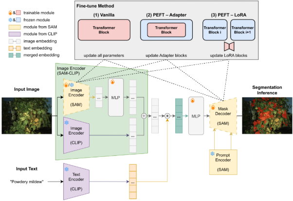
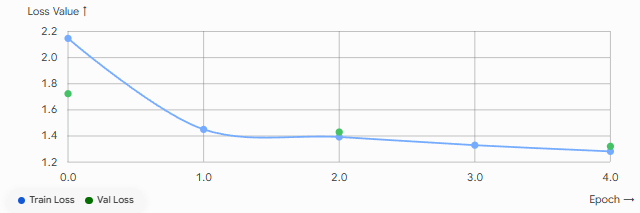
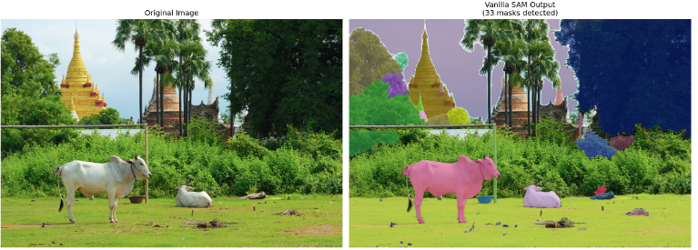
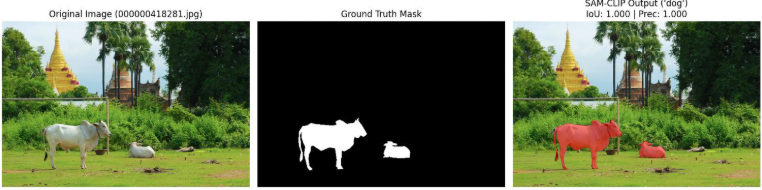
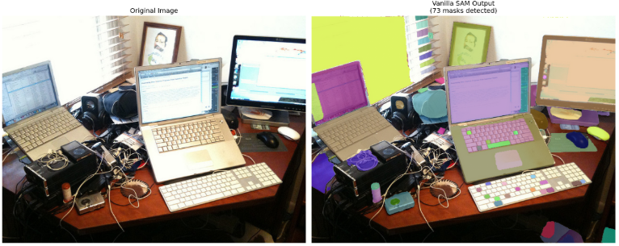
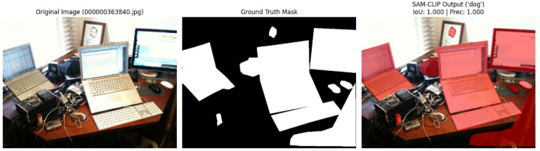
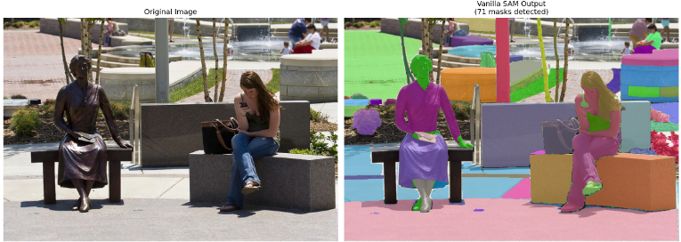
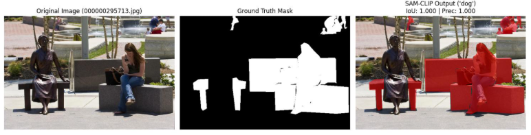

[先日SAMの検知力改善のアイデア](https://yoshishinnze.hatenablog.com/entry/2026/08/11/043000)で説明したCLIPを適用してSAMの優れた境界検知能力による不要な検知カ所の抑制を行いたいと思います。

本日テーマ：
>SAM×CLIPにより主張するような効果が確認できるか確認

## モチベーション

前回記事では現状やりたいことを

1. **誤検知の多さを抑制する**（背景や無関係な輪郭まで細かく拾ってしまう問題の回避）
2. **グラデーションで背景と見分けがつきづらい対象を検知する**（低コントラスト・輪郭が不鮮明な領域の切り出し）

と定義して誤検知の多さはプロンプトで指定する方法を押しました。
しかし実際の用途は **不特定多数の対象を検知する** ということでプロンプトで指定しなかったものも検知したいということにありました。

とした場合とりえる対応法はプロンプトなしでもSAMの結果を、同じく汎用性に優れるCLIPで検証することが妥当かと考えました。

## 簡単に本手法の仕組み

**SAM-CLIP** は、Metaが開発した高精度な画像領域分割モデル **「SAM (Segment Anything Model)」** と、OpenAIが開発した言語-画像相互理解モデル **「CLIP」** の強みを統合したフレームワーク（および統合モデル）です。

一言で言えば、**「物体の境界線を正確にくり抜く能力（SAM）」** と **「それが何であるかを言葉で理解する能力（CLIP）」** を1つのモデルに合体させた仕組みです。

### なぜ統合が必要なのか？

* **SAMの課題**：「画像のどこに物体があるか（境界・マスク）」を抽出するのは極めて得意ですが、「その物体が何という名前か（セマンティッククラス）」を識別する概念理解が弱い。
* **CLIPの課題**：「テキスト（言葉）と画像（概念）」を結びつける理解力は非常に高いですが、「物体の具体的な形状や細かな輪郭」を特定する空間認識は苦手。

SAM-CLIPは、これら2つの基盤モデルの相補的な能力を組み合わせることで、**「任意のテキスト指定で、画像内の該当オブジェクトを正確な輪郭とともに切り出す（オープンボキャブラリー領域分割）」** を実現しています。

### 手法の主な仕組み

__1. 特徴量エンコーダの統合・蒸留__

推論時に「SAMの巨大エンコーダ」と「CLIPのエンコーダ」を2つ同時に動かすと、計算コストやメモリ負荷が非常に大きくなります。SAM-CLIPでは、**単一のバックボーン（ビジョンエンコーダ）** に両者の能力を蒸留・融合させるアプローチをとっています。

* SAMが持つ**幾何学的・局所的な構造特徴**
* CLIPが持つ**言語とアラインメントされた大域的な意味特徴**

これらを1つのエンコーダで同時に出力できるように統一学習（または特徴統合）を行います。

__2. オープンボキャブラリーなマスク生成__

* 画像を入力すると、統合エンコーダが「領域情報」と「意味情報」を含んだマルチスケールな特徴マップを抽出します。
* ユーザーが「a cat sitting on a red sofa（赤いソファに座る猫）」といった自由なテキストを入力すると、テキストの特徴量（CLIPテキストエンコーダ経由）と画像特徴マップの類似度を計算し、**「何がどこにあるか」を一致させます**。
* 最終的にSAMのマスクデコーダ（Mask Decoder）を利用して、該当するテキストが指す物体の**正確なピクセル単位の領域（マスク）** を生成します。

__主なメリット・特徴__

* **推論の効率化**: 2つのモデルを別々に実行して結果を組み合わせる後処理方式に比べ、単一の統合型ネットワークで処理できるため、高速かつ省メモリで動作します。
* **ゼロショット対応**: 事前に学習していない未知のカテゴリや複雑な説明文に対しても、追加学習なしで即座に精度高く領域を抽出可能です。

本モデルの構成は以下のようにSAMとCLIP双方の結果をcatしたものをベースにMLP→マスクのデコーダを行ったというものです。




## 実験方法

SAMの高い領域分割能力（過剰検知傾向）に対し、CLIPのテキスト-画像のアライメント能力を組み合わせて意味的なフィルタリングを行う「SAM-CLIP」のPoCに向け実験手順を検討しました。

### 1. 背景とPoCの目的

* **背景・課題**: SAM（Segment Anything Model）はあらゆるオブジェクトの境界を精密に検出できますが、意味的コンテキストの判定を持たないため、目的外の領域まで過剰に検知してしまう課題があります。
* **解決のアプローチ**: CLIPの汎用的な視覚-言語アライメント能力を検証メカニズムとして組み合わせ、指定したテキストプロンプトに合致する領域のみを正確に抽出・フィルタリングします。
* **PoCの狙い**: 本格的な大規模学習に入る前に、小規模データ（200枚程度のミニデータセット）を用いた高速なバッチテストを実施し、学習・検証パイプラインが正常に回ることを確認します。

### 2. 準備

1. **環境の整理と不足パッケージの追加:**

今回PoCに必要なリソース一式をDLの上、環境にインストールするbashです。

```bash
# 1. リポジトリのクローン
!git clone https://github.com/YiyuanLinXX/SAM-CLIP.git
%cd SAM-CLIP

# 2. 必要なライブラリのインストール
!pip install -q git+https://github.com/facebookresearch/segment-anything.git
!pip install -q ftfy regex tqdm
!pip install -q git+https://github.com/openai/CLIP.git

# 入力用・出力用フォルダの作成
!mkdir -p input_images output_masks

!wget -q -O input_images/test_image.jpg "https://raw.githubusercontent.com/facebookresearch/segment-anything/main/notebooks/images/dog.jpg"
!mkdir -p ckpt

!wget -q https://dl.fbaipublicfiles.com/segment_anything/sam_vit_b_01ec64.pth

!pip install asttokens executing icecream monai nptyping pynrrd SimpleITK slicerio torchio
!pip install tensorboardX
```

2. **PoC用ミニデータセットの自動生成:** 

CLIPやSAMは学習済みなので、アダプター(CLIPとSAMの接続パラメータ)さえ学習できれば動作させることが出来ると思います。
COCO val2017を活用したプロトタイプデータ作成を行いました。
* テストを迅速に行うため、COCO val2017データセットから20枚（Train: 160枚 / Val: 40枚）を抽出。
* アノテーションデータ（JSON）からSAM-CLIP学習用のマスク画像（PNG）を自動生成するスクリプトを作成しました。

```python
import os
import json
import urllib.request
import numpy as np
from PIL import Image
from pycocotools.coco import COCO

base_dir = "mini_dataset_v2"
img_dir = os.path.join(base_dir, "images")
mask_dir = os.path.join(base_dir, "masks")
os.makedirs(img_dir, exist_ok=True)
os.makedirs(mask_dir, exist_ok=True)

# 1. COCO val2017 アノテーションの取得
ann_file = "annotations/instances_val2017.json"
if not os.path.exists(ann_file):
    print("アノテーションファイルをダウンロード中...")
    ann_url = "http://images.cocodataset.org/annotations/annotations_trainval2017.zip"
    urllib.request.urlretrieve(ann_url, "annotations.zip")
    os.system("unzip -q annotations.zip -d .")
    os.remove("annotations.zip")

coco = COCO(ann_file)
img_ids = coco.getImgIds()[:200]
images = coco.loadImgs(img_ids)

train_lines = []
val_lines = []

base_img_url = "http://images.cocodataset.org/val2017/"

print("画像とマスクを生成中...")
for idx, img_info in enumerate(images):
    file_name = img_info["file_name"]
    name_without_ext = os.path.splitext(file_name)[0]
    mask_file_name = f"{name_without_ext}.png"
    
    # 画像ダウンロード
    img_save_path = os.path.join(img_dir, file_name)
    if not os.path.exists(img_save_path):
        urllib.request.urlretrieve(base_img_url + file_name, img_save_path)
        
    # マスク画像の生成 (PNG)
    ann_ids = coco.getAnnIds(imgIds=img_info["id"])
    anns = coco.loadAnns(ann_ids)
    
    mask = np.zeros((img_info["height"], img_info["width"]), dtype=np.uint8)
    for ann in anns:
        mask = np.maximum(mask, coco.annToMask(ann))
        
    mask_save_path = os.path.join(mask_dir, mask_file_name)
    Image.fromarray((mask * 255).astype(np.uint8)).save(mask_save_path)
    
    # リスト形式: ファイル名のみ (画像ファイル名,マスクファイル名)
    line_entry = f"{file_name},{mask_file_name}"
    
    if idx < 40:
        train_lines.append(line_entry)
    else:
        val_lines.append(line_entry)

# テキストファイルの保存
train_list_path = os.path.join(base_dir, "train.txt")
val_list_path = os.path.join(base_dir, "val.txt")

with open(train_list_path, "w") as f:
    f.write("\n".join(train_lines))

with open(val_list_path, "w") as f:
    f.write("\n".join(val_lines))

print("\nリストファイルをファイル名のみの形式に更新しました！")
```


### 3. 完成した検証用パイプラインの全貌

準備が整ったら早速ファインチューニングの開始です。

__データ構造__

前項にて実施した学習用データの構成です。
cocoからデータを200枚抽出して以下のように分けています。

* **画像ディレクトリ (`mini_dataset_v2/images/`)**: COCOから抽出した画像ファイル
* **マスクディレクトリ (`mini_dataset_v2/masks/`)**: 対応するセグメンテーションマスク (PNG)
* **アノテーションリスト (`mini_dataset_v2/train.txt`, `val.txt`)**:
```text
000000397133.jpg,000000397133.png
000000039761.jpg,000000039761.png
...

```

__実行コマンド仕様__

準備出来たらファインチューニングです。
コマンドは一旦以下通りで大丈夫です。
もし気になったら学習率やエポックは変更ください。

```bash
!python train.py \
    -sam_ckpt sam_vit_b_01ec64.pth \
    -dir_checkpoint ckpt \
    -img_folder mini_dataset_v2/images \
    -mask_folder mini_dataset_v2/masks \
    -train_img_list mini_dataset_v2/train.txt \
    -val_img_list mini_dataset_v2/val.txt \
    -text_prompt "dog" \
    -epochs 5 \
    -lr 0.0001 \
    -num_cls 3 \
    -gpu True \
    -gpu_device 0

```


### 4. 次のステップ（PoCの検証フェーズ）

パイプラインの動作が確認でき次第、以下の観点から検証を進めます。

* **動作検証**: ミニデータセットで Loss が正常に収束するか確認。
* **過剰検知抑制の評価**: ファインチューニングした後のパラメータを用いて推論してみます。背景や無関係な領域のオーバーセグメンテーションがCLIPのガイドによって抑制されているか視覚的に評価。
* **スケールアップ**: 小さなトライアルで良好な結果が得られた場合、より大規模なデータセットや独自の目的データセットへの適用を検討。

## 学習と検証

### 学習の推移

学習時のエポックとLOSSの値の推移です。
初めの大きなロスは抑えられていることが確認出来ます。
データ数が少ないのでまだ収束はしていませんが、PoCを行う程度であれば十分でしょう。




### 学習後の検証

学習が終わった状態のモデルで評価を行いました。
結果は以下のようになります。(上段：SAMのみで検知したマスク、下段：SAM+CLIPで検知したマスク)

いずれもSAMで検知したときは不要と思われる対象まで検知していますが、SAM+CLIPとすることで過剰な検知が抑制されていることが確認出来ます。
プロンプトの"dog"である必要もありません。

__結果の見方__
- SAMは入力画像→SAMの検知結果
- SAM+CLIPは入力画像→今回手法での検知結果をマスク化した画像→実際の画像にマスクをオーバーレイした画像

SAM VS SAM+CLIPの結果を比較していきます。

一見良いように見えて、自然背景や空にまでマスクをかけています。



CLIPは当然知らないわけで得られるマスクは自然背景、空はマスクなしです。



机の上の対象、窓まで検知します。



こちらもCLIPは窓を分からないのでマスクなしです。



SAMは公園の中でも検知を沢山してきます。



がCLIPは公園の建造物に対しては認識できません。




今回のファインチューニングはcocoデータセットの200件のみで、上記の結果でした。
恐らくアダプターと、アダプター付近のネットワークパラメータがパラメータ分布が変わることになったと考えています。

結果に対してはPoCとしては上出来では？
というのはSAMの見境のない検知を意味を捉えて認識しなおし、結果、過剰な検知を抑制する効果を確認できたからです。

## 総括

SAMは「クラス不可知」なため、**何でも検出しようとして過検出・未検出が起きやすい**という課題があります。  
これを制御する本質的な方法は、以下の3つに集約できます。

__1. 前段で「何を検出したいか」を限定する（Grounded SAM）__

- SAM単体では「何がターゲットか」が分からないため、**テキストで指定できる検出器（Grounding DINOなど）を前段に置く**。
- 「person」「damaged part」などテキストで指定 → バウンディングボックスを取得 → その領域だけSAMに渡す。
- **誤検知（背景まで細かく切る）を原理的に防げる**。

__2. プロンプトと後処理で「出力を絞り込む」__

- **ポジティブ／ネガティブポイント**：  
  検出したい場所をクリック（ポジティブ）、不要な場所をクリック（ネガティブ）してSAMに指示。
- **後処理フィルタ**：  
  SAMが出したマスク候補から、面積・形状・IoU（重複）・CLIP分類などで**不要なマスクを除外**。
- **曖昧さ出力の制御**：  
  1つのプロンプトで複数のマスク候補が出る場合、目的に合う粒度のマスクだけを選ぶ。

__3. ドメインに合わせて「モデルを少しだけ学習させる」（LoRA / Adapter）__

- SAMは自然画像に強いが、**グラデーションや低コントラスト、特殊な形状**には弱い。
- **LoRAやSAM-Adapter**で、  
  - 画像エンコーダやマスクデコーダの一部だけを  
  - 少量のデータ（数十〜数百枚）で微調整する。
- これにより、**境界が曖昧な対象でも安定して検出できるように「モデルの注目の仕方」を調整**できる。

__まとめ__

- SAMの検知を制御する本質は、  
  **「何を検出したいか」を前段で限定し（Grounded SAM）、プロンプトと後処理で出力を絞り込み、必要なら少量学習でモデルをドメインに合わせる」**  ことです。
- これにより、**過検出・未検出を抑えつつ、グラデーションや特殊形状にも対応**できます。
