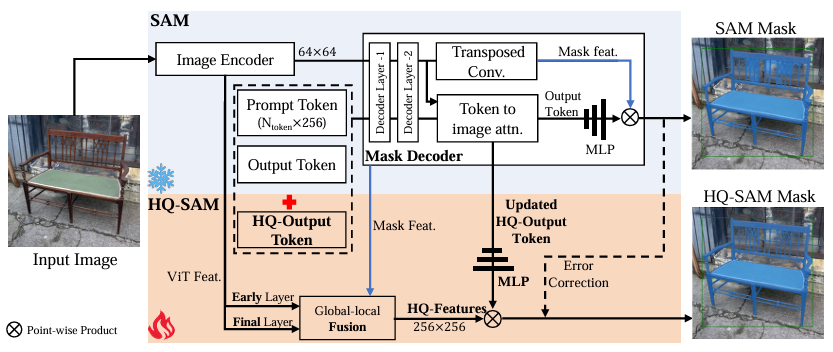
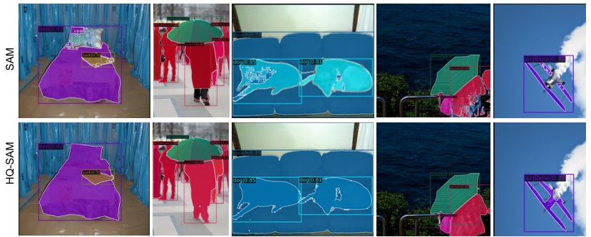
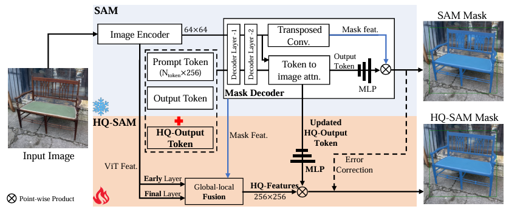
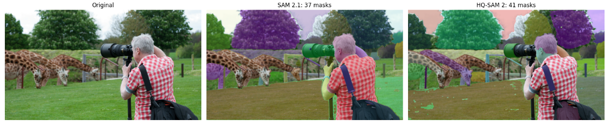
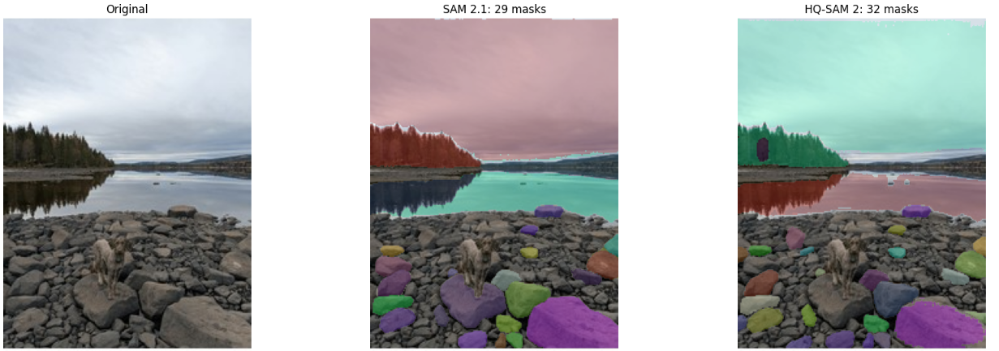

SAMは万能セグメンテーションモデルとして非常に有用です。
ですが、以下のような課題があります。
- 意味的にはあまり重要でない部分に対しても過剰な検知を行う
- 検知して欲しい部分を検知しない検知力不足
昨日取り扱った[SAMの過剰検知を抑制するという方法](https://yoshishinnze.hatenablog.com/entry/2026/09/12/043000)について取り扱いしました。

本日は課題のうち後者である検知力不足について対策となる方法について扱っていきます。

## 論文概要
[検知力不足を補う手法は以前の記事](https://yoshishinnze.hatenablog.com/entry/2026/09/08/043000)で複数案検討しました。

LoRAを用いる手法など複数提案しましたが、うちHQ-SAMが手法として面白かったため本日はHQ-SAMについて説明・PoCしていきます。
HQ-SAM（**Segment Anything in High Quality**）は、MetaのSAM（Segment Anything Model）の**マスク品質を大幅に向上させる**手法として、**NeurIPS 2023** に採択された論文です。

### 論文の基本情報

実は国際学会 NeurIPS に採択されている論文です。

| 項目 | 内容 |
|------|------|
| **タイトル** | Segment Anything in High Quality |
| **著者** | Lei Ke, Mingqiao Ye, Martin Danelljan, Yifan Liu, Yu-Wing Tai, Chi-Keung Tang, Fisher Yu |
| **所属** | ETH Zürich, HKUST, Dartmouth College |
| **発表** | NeurIPS 2023 |
| **arXiv** | 2306.01567 |
| **コード** | https://github.com/SysCV/sam-hq |
| 論文URL | https://arxiv.org/pdf/2306.01567 |

### 研究の背景と問題意識

SAMは11億個のマスクで学習された強力な基盤モデルですが、論文では以下の問題を指摘しています。

- **粗いマスク境界**：オブジェクトの輪郭がぼやけたり、細い構造（髪の毛、凧の糸など）が無視されたりする
- **誤った予測**：複雑な構造に対して壊れたマスクや大きなエラーを生じる

特に、自動アノテーションや画像・動画編集など、**高精度なマスクが必須の場面**ではSAMの品質が不十分でした。

### 提案手法：HQ-SAM

HQ-SAMは、SAMの元の**プロンプト可能な設計・効率性・ゼロショット汎化性を維持しつつ**、マスク品質を高める最小限のアダプテーションです。

__主な技術的貢献__

1. **学習可能な High-Quality Output Token**
   - SAMのマスクデコーダに、新たな「HQ-Output Token」を追加
   - このトークンと関連する3層のMLPが、高品質なマスクを直接予測
   - 元のSAMのoutput tokenとは別に機能

2. **Global-local Feature Fusion（グローバル・ローカル特徴融合）**
   - SAMのマスクデコーダ特徴だけでなく、**ViTエンコーダの初期・最終特徴マップ**も融合
   - 大域的なセマンティック情報と、局所的な細粒度の詳細を両方活用

3. **SAMのパラメータを固定した効率的学習**
   - SAMの事前学習済みパラメータは**すべて固定（凍結）**
   - 学習するのはHQ-Output Token、関連MLP、小さな特徴融合ブロックのみ
   - 追加パラメータは**0.5%未満**と極めて少ない

__データセット：HQSeg-44K__

高品質な学習には細粒度なアノテーションが必要なため、論文では新たなデータセット **HQSeg-44K** を構築しています。

- 6つの既存データセットを統合
- **44,000** の非常に高精度なマスクアノテーション
- **1,000以上**の多様なセマンティッククラスをカバー



__学習効率__

- **8台のRTX 3090 GPUでわずか4時間**の学習で完成
- 大規模データセット（SA-1Bの11億マスク）を使わず、小規模な高品質データセットで効率的に学習

### 実験結果

10の多様なセグメンテーションデータセット（COCO、UVO、LVIS、BIG、COIFT、HR-SODなど）で評価され、**うち8つはゼロショット転送**の設定です。

- SAMより**高品質なマスク**を生成
- **ゼロショット能力を維持**（SAMの強みを失わない）
- 速度・モデルサイズのトレードオフも良好

実験のこんな例が合わせて掲載されています。
SAMに比べると検知して欲しい場所を検知できるようになっていると考えられますよね。



## 提案手法

HQ-SAMのGood Pointは、巨大な基な基盤モデルを壊さずに、最小限の追加で品質だけを高めるという設計です。
そんな手法について解説していきます。

### 1. 基本設計思想

HQ-SAMは、SAMの**事前学習済みパラメータをすべて凍結**した上で、極めて少ない追加パラメータ（**0.5%未満**）だけを学習することで、SAMのゼロショット汎化性を損なわずにマスク品質を向上させます。

論文では「SAMのデコーダを直接ファインチューニングしたり、新しいデコーダモジュールを導入したりすると、ゼロショット性能が著しく劣化する」ことが示されています。そのため、既存のSAM構造を**緊密に統合・再利用**する設計が採用されています。

### 2. 2つの主要な追加要素

__(1) High-Quality Output Token（HQ-Output Token）__

SAMのマスクデコーダには、もともと「IoUトークン」と「マスクトークン（複数）」が入力されています。HQ-SAMでは、これらに加えて**新たな学習可能なHQ-Output Token**を注入します。

- **役割**: 元のマスクトークンとは独立に、**高品質なマスクを直接予測**する
- **関連パラメータ**: HQ-Output Tokenに対応する**3層のMLP**（`hf_mlp`）も新たに学習
- デコーダ内のトランスフォーマー処理自体はSAMの既存ものをそのまま使用

__(2) Global-local Feature Fusion（グローバル・ローカル特徴融合）__

SAMのマスクデコーダ特徴だけでは細部の再現が不十分なため、**ViTエンコーダの異なる階層の特徴を融合**します。

- **Global特徴**: SAMのマスクデコーダが生成する特徴（セマンティックな大域情報）
- **Local特徴**: ViTエンコーダの**初期層（1st global attention block後）の特徴マップ**（細粒度な局所情報）

(2)の方は以下のモデル図の下の方に見えているGlobal-local Featureのラインをご覧頂ければと思います。



これらを以下の3つの畳み込み層で融合・変換します。

| モジュール名 | 役割 |
|-------------|------|
| `compress_vit_feat` | ViTの初期特徴をデコーダ次元に変換・アップスケール |
| `embedding_encoder` | SAMのデコーダ特徴をアップスケール |
| `embedding_maskfeature` | 融合後の特徴をさらに精緻化 |

### 3. ネットワークの詳細な流れ（実装ベース）

__学習時の処理フロー__

```
1. ViTエンコーダ
   ↓
   ├─→ 初期層特徴 (interm_embeddings[0]) ──→ compress_vit_feat ──┐
   └─→ 最終層特徴 (image_embeddings) ─────→ embedding_encoder ─┤
                                                                 ↓
                                                          hq_features
                                                                 ↓
2. マスクデコーダ
   - IoU Token + Mask Tokens + HQ-Output Token を結合
   - SAMのトランスフォーマーで処理
   - src（デコーダ特徴）をアップスケール
                                                                 ↓
   ├─→ upscaled_embedding_sam ──→ masks_sam（元のSAM予測）
   └─→ upscaled_embedding_sam + hq_features ──→ upscaled_embedding_hq
                                          ↓
                                    masks_hq（HQ-SAM予測）
```

__マスク予測の仕組み__

SAMと同様に、**Hypernetwork（ハイパーネットワーク）方式**を使用します。

- 各マスクトークンに対応するMLPが、**マスク埋め込み（upscaled embedding）の係数（重み）を生成**
- 元のSAMマスク: `hyper_in @ upscaled_embedding_sam`
- HQマスク: `hf_mlp(hq_token) @ upscaled_embedding_hq`

最終的に、SAMの予測マスクとHQ-SAMの予測マスクを**結合**して出力します。

### 4. 学習戦略

__凍結するパラメータ__
- SAMの**画像エンコーダ（ViT）全体**
- SAMの**マスクデコーダの既存パラメータ**（output_upscaling, output_hypernetworks_mlps, iou_prediction_headなど）

__学習するパラメータ__
- `hf_token`（HQ-Output Token）
- `hf_mlp`（HQ用3層MLP）
- `compress_vit_feat`（ViT特徴変換層）
- `embedding_encoder`（デコーダ特徴アップスケール層）
- `embedding_maskfeature`（融合特徴精緻化層）

__損失関数__
- 標準的な**バイナリクロスエントロピー損失**と**ダイス損失**の組み合わせ
- HQSeg-44Kデータセットの高精度マスクに対して学習

### 5. 推論時の動作

推論時には2つのモードがあります。

__通常モード（`hq_token_only=False`）__
- SAMの予測マスク（`masks_sam`）とHQ予測マスク（`masks_hq`）を**足し合わせる**
- SAMの大域的な正確性とHQの細部品質を両立

__HQのみモード（`hq_token_only=True`）__
- HQ予測マスク（`masks_hq`）のみを使用
- より細部にフォーカスしたい場合に有効

### 6. なぜこの設計が有効か

__SAMのデコーダの解像度制約__
- トランスフォーマー処理後の特徴 `src` は空間的に粗い解像度（256×256程度のアップスケール前）
- 2段階のConvTranspose2dでアップスケールし、最終的に256×256のマスクを生成→この過程で、 細い構造（髪の毛、凧の糸、網目など）の情報が失われやすい

論文中でも、SAMの失敗例として「凧の糸のような細い構造を誤解釈し、壊れたマスクや大きな穴を生じる」ことが指摘されています。これはデコーダの特徴空間が粗すぎて、細部を保持できないことが主因です。

__ViTエンコーダ初期層の高解像度情報__

HQ-SAMはこの問題に対し、**ViTエンコーダの初期層（1st global attention block後）の特徴マップ**を活用します。

| 特徴 | デコーダ特徴 | ViT初期層特徴 |
|------|------------|-------------|
| **解像度** | 低（粗い） | 相対的に高（細かい） |
| **保持する情報** | 大域的セマンティクス | 局所的なエッジ・テクスチャ・細部構造 |
| **役割** | 「何が」オブジェクトか | 「どこまで」が境界か |

エンコーダの一般的な特徴ですが、`interm_embeddings[0]`（ViTの初期層特徴）は、エンコーダの後期層よりも**空間的な解像度が高く、細かい局所構造の情報をより多く保持**しています。
HQ-SAMはこれを `compress_vit_feat` によってデコーダの次元に変換し、デコーダ特徴と融合することで、**失われた細部情報を復元**します。

__「単なるアップスケーリング」では不十分だったか__

HQ-SAMの精度向上は「デコーダの低解像度特徴の限界を、エンコーダの高解像度・高周波特徴で補完したこと」 に加えて、「HQ-Output Tokenによる直接的な高品質マスク予測機構」 の両方が組み合わさった結果と考えています。

論文では、HQ-SAMと異なるアプローチ（後処理リファインメントや、別デコーダの導入）を比較し、以下の問題を指摘しています：
- CRF（条件付きランダム場）ベースの後処理: 低レベルの色境界に依存し、高レベルセマンティック文脈を十分活用できない。大きなセグメンテーションエラーを修正できない。
- 別ネットワークによるカスケードリファインメント: 過学習しやすく、ゼロショット汎化性を損なう。

つまり、単に「解像度を上げる」だけではなく、**SAMの既存知識を保持しつつ、デコーダ内で自然に高解像度情報を統合**する必要がありました。

__HQ-Output Tokenの役割（「補完」だけではない）__

ただし、HQ-SAMの精度向上は**単なる特徴融合（補完）だけでは説明できません**。

HQ-SAMの核心は、**HQ-Output Tokenが「高品質マスク専用の予測ヘッド」として機能する**点にあります：

- SAMの元のマスクトークンは、粗いマスクを予測するよう学習済み
- HQ-Output Tokenは、**融合後の高品質特徴（upscaled_embedding_hq）を使って、直接高品質マスクを予測**するよう新たに学習
- 最終的に `masks_sam + masks_hq` として、SAMの大域的正確性とHQの細部品質を**両立**

つまり、**「高解像度特徴の補完」＋「その特徴を使う専用予測ヘッドの学習」**の両方が必要でした。

総括するとHQ-SAMの以下の特徴によりSAMのゼロショットの性能を維持しつつ、高解像度の情報をSAMに干渉しないように保持することで、SAMの精度を改善したということです。

| 要素 | 役割 |
|------|------|
| **ViT初期層特徴の融合** | デコーダの低解像度特徴に、高解像度・高周波の局所情報を補完 |
| **HQ-Output Token + hf_mlp** | 補完された特徴を使って、高品質マスクを**直接予測**する専用ヘッド |
| **SAMパラメータ凍結** | 11億マスクで学習されたゼロショット知識を保持 |
| **最終出力（SAM + HQ）** | 大域的な正確性と細部の精緻さを両立 |

## PoC
HQ-SAM 2 vs SAM 2.1 輪郭精度比較 PoC を行ってみます。

> 自動マスク生成による物体検出と境界精度の定量的比較

### 1. PoC の目的

画像内の物体を**プロンプトなし（bbox・点指定なし）**で自動検出し、**SAM 2.1** と **HQ-SAM 2** のセグメンテーション品質、特に**輪郭（境界）精度**を比較することを目的とする。

- 人が物体位置を指定しなくても、画像内の主要物体を自動で検出できるか
- HQ-SAM 2 は SAM 2.1 と比較して、境界の細部がどれだけ改善されるか
- 輪郭の複雑さ（点数・長さ）を定量的に評価する

### 2. 使用モデル

両モデルとも、論文著者・公式リポジトリから配布されている正規の学習済み重みを使用します。

| 項目 | SAM 2.1（ベースライン） | HQ-SAM 2 |
|------|----------------------|----------|
| **配布元** | Meta AI / FAIR | SysCV（lkeab） |
| **重みファイル** | `sam2.1_hiera_tiny.pt` | `sam2.1_hq_hiera_tiny.pt` |
| **VRAM使用量** | ~2 GB | ~2 GB |

> **補足**: VRAM制約（14.56GB）を考慮し、LargeモデルからTinyモデルに切り替え。比較の公平性は保持される。

### 3. 実行手順

| ステップ | 内容 |
|---------|------|
| **1. 環境構築** | `sam-hq2` リポジトリをcloneし、必要なパッケージをインストール |
| **2. 重みダウンロード** | 公式URLから SAM 2.1 Tiny / HQ-SAM 2 Tiny のチェックポイントを取得 |
| **3. ベースラインSAM 2.1のパッチ** | HQ-SAM 2のpredictorが渡す追加引数（`hq_token_only` / `interm_embeddings`）を無視するようforwardを書き換え、互換性を確保 |
| **4. 自動マスク生成（SAM 2.1）** | `SAM2AutomaticMaskGenerator` を使用し、画像全体をグリッド走査して物体を自動検出。結果をCPUに保存後、モデルをGPUから解放 |
| **5. 自動マスク生成（HQ-SAM 2）** | 同様に自動検出を実行。2つのモデルを同時にGPUに載せないことでメモリを確保 |
| **6. 比較対象の選択** | 検出された複数マスクの中から「面積最大」のものを自動選択（画像の主要物体と定） |
| **7. 輪郭抽出** | OpenCV の `findContours` で両マスクの輪郭を抽出 |
| **8. 定量的比較** | 輪郭の点数・長さを計測し、HQ-SAM 2 の改善率を算出 |
| **9. 可視化** | マスク・差分・拡大表示を画像として保存 |

### 4. 遭遇した課題と解決策

色々エラーが出ました。
解決策はこんな感じでした。

__課題 1: デコーダ引数の互換性エラー__

**問題**: ベースラインSAM 2.1のデコーダは `hq_token_only` / `interm_embeddings` 引数を受け取れないため、`TypeError` が発生。

**解決策**: ベースラインの `forward` / `decoder.forward` をモンキーパッチし、HQ-SAM 2用の追加引数を自動的に無視するようにした。

```python
def _patched_forward(*args, **kwargs):
    kwargs.pop("hq_token_only", None)
    kwargs.pop("interm_embeddings", None)
    return _orig_forward(*args, **kwargs)
```

__課題 2: GPUメモリ不足（OutOfMemoryError）__

**問題**: Largeモデル（~14GB）を2つ同時にGPUに載せると、自動マスク生成の計算量でVRAMを使い果たした。

**解決策**: 以下の複合的な対を実施。

| 対策 | 効果 |
|------|------|
| モデルをTiny（~2GB）に変更 | VRAM使用量を約1/7に削減 |
| 逐次ロード（1モデルずつGPU使用） | 同時メモリ占有を回避 |
| `torch.cuda.empty_cache()` | キャッシュを即時解放 |
| 画像リサイズ（512px制限） | 計算コストを低減 |
| `crop_n_layers=0` | クロップ検出によるメモリ消費を停止 |
| `points_per_side=16` | グリッド密度を半減 |

### 5. 結果確認

Anythingモードで画像を入力して実際にマスキングされた結果を比較してみました。
正直改善しているとはいいがたい結果に見えます。

ちょっとHQ-SAM2は敏感な感じがします。
例えば背景に隠れた見分けがつきづらい木を他とは違うと検出しています。

個体識別という能力であればSAM-2よりも使えるかもしれません。





モデルがおかしいかと思い、ポイント指定するモードでやるときちんと人を識別してくれます。


不特定多数を検知という意味だと敏感すぎる、ということのようでした。

## 総括

__何を解決したか__

MetaのSAMは11億マスクで学習した強力な基盤モデルだが、**境界がぼやける・細い構造（髪の毛・糸など）が消える**という品質問題があった。HQ-SAMはこれを**SAMのパラメータを一切触らず**、極めて少ない追加（**0.5%未満**）で解決した。

__技術の核心__

SAMのデコーダ特徴は解像度が粗く、細部が失われる。HQ-SAMは以下の2つで補完する：

| 要素 | 役割 |
|------|------|
| **HQ-Output Token** | 高品質マスクを直接予測する専用ヘッド |
| **ViT初期層特徴の融合** | エンコーダの高解像度・高周波特徴をデコーダに補完 |

SAMの11億マスクで学習されたゼロショット能力は**凍結して保持**し、HQ部分だけをHQSeg-44K（高精度4.4万マスク）で学習する。

__PoCで判明したこと__

| モード | 結果 |
|--------|------|
| **自動検出（Anything）** | ❌ 過敏になり過剰分割。背景の木なども別個体として検出 |
| **点プロンプト指定** | ✅ 正常動作。指定物体の境界が高精度にセグメント化 |

__結論__

**HQ-SAMは「不特定多数を勝手に検出するツール」ではなく、「指定した物体の境界を高精度に切り出すツール」**。自動検出には向かないが、プロンプトで対象を絞ればSAMより明確に品質が向上する。用途は画像編集・自動アノテーション・個体の精密マスキングなど。
