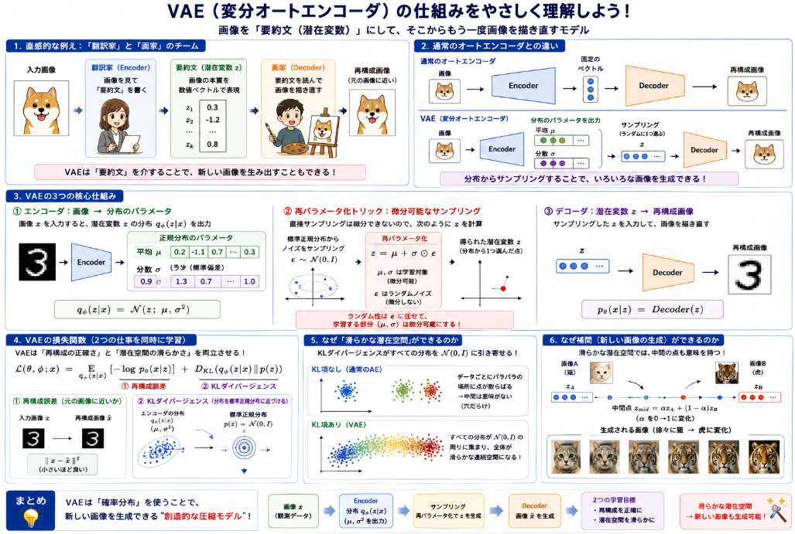

VAEは画像生成モデルのStable Diffusionや回帰モデルに用いる特徴量抽出用モデルとして利用されるモデルです。
VAEの構造や、有用な理由について調べてみます。

## 概要

### VAE（変分オートエンコーダ）とは

__一言で言うと__

> **画像を「圧縮された意味のあるベクトル」に変換し、そのベクトルから元の画像を再構成できるニューラルネットワーク**

__直感的な例え：翻訳家と画家のチーム__

| 役割 | 対応するVAEの部品 | 仕事 |
|------|----------------|------|
| **翻訳家** | **Encoder（エンコーダ）** | 画像を「意味のある要約文」に翻訳 |
| **要約文** | **潜在変数 z** | 画像の本質を数値ベクトルで表現 |
| **画家** | **Decoder（デコーダ）** | 要約文から画像を描き直す |

例えば「猫の画像」を渡すと：

```
Encoder → 「耳が三角形、毛並みがふわふわ、目が丸い」という要約ベクトル $z$
Decoder → その要約から猫の画像を再構成
```

### 通常のオートエンコーダとの違い

通常のオートエンコーダは「そのまま圧縮・展開」ですが、VAEは**確率分布**を使います。

| | 通常のオートエンコーダ | VAE |
|---|---|---|
| 中間表現 | 固定のベクトル | **確率分布**（平均μ + 分散σ） |
| 新しい画像の生成 | ❌ できない | ✅ 分布からサンプリングすれば生成可能 |
| 潜在空間の性質 | 不連続・無秩序 | **滑らか・構造化**（類似画像が近くに集まる） |

### VAEの2つの重要な仕組み

__1. 再パラメータ化トリック（Reparameterization Trick）__

潜在変数を「直接決める」のではなく、**確率分布からサンプリング**します。

```
z = μ + σ × ε    （ε は標準正規分布からのランダムノイズ）
```

これにより、**確率的なサンプリング**しながらも、**ニューラルネットの勾配を計算できる**ようになります。

__2. 2つの損失関数__

VAEは「2つの仕事」を同時に学習します。

| 損失 | 役割 | イメージ |
|------|------|---------|
| **再構成損失** | 入力と出力を一致させる | 「翻訳が正確か？」 |
| **KLダイバージェンス** | 潜在空間を標準正規分布に近づける | 「要約文の形式を統一する」 |

KLダイバージェンスがあることで、[潜在空間](https://yoshishinnze.hatenablog.com/entry/2026/04/10/050000)が**滑らかな連続空間**になります。これにより、潜在空間の2点間を補間（中間を取る）すると、画像も自然に変化します。

### 潜在空間の「滑らかさ」を図で理解

```
通常のオートエンコーダの潜在空間：
  🐱(猫A)                    🐱(猫B)  ← 近くにない
                    🚗(車)

VAEの潜在空間：
  🐱(猫A) ──🐱──🐱──🐱──🐱──🐱(猫B)
   ↑                          ↑
  類似する画像が近くに集まる → 中間を取ると「猫Aと猫Bの中間の猫」が生成できる
```


### 拡散モデルとの関係

Stable Diffusionなどの拡散潜在モデルでは、VAEを以下のように使います：

1. **VAEエンコーダ**が画像を潜在空間（64×64×4）に圧縮
2. **U-Net（拡散モデル）** が潜在空間でノイズ除去を実行
3. **VAEデコーダ**が潜在表現を元の画像サイズ（512×512）に復元

つまり、VAEは **「画像と潜在空間の翻訳者」** として、拡散モデルの計算コストを大幅に下げています。


## 解決しようとした課題

VAEが解決しようとした課題は、主に**3つ**あります。

### 課題1：通常のオートエンコーダは「新しい画像を生み出せない」

__何が問題だったか__

通常のオートエンコーダは「入力を圧縮して、同じものを復元する」のは得意ですが、**訓練データにない新しい画像を作る**のが苦手です。

潜在空間に**訓練データのベクトルしか存在せず、それ以外の場所が「穴」だらけ**だったため、新しいベクトルから画像を生成できませんでした。

__VAEの解決策__

潜在変数を**確率分布**として表現し、**KLダイバージェンス**で潜在空間全体を標準正規分布に近づけます。

潜在変数 $z$ は、平均 $\mu$ と分散 $\sigma^2$（あるいは対数分散）を持つ分布からサンプリングされます：

$$q_{\phi}(z|x) = \mathcal{N}(z; \mu, \sigma^2)$$

KLダイバージェンスの項は、潜在分布 $q_{\phi}(z|x)$ が標準正規分布 $\mathcal{N}(0, I)$ に近づくように制約を与えます：

$$D_{\text{KL}}\big(q_{\phi}(z|x) \,\|\, p(z)\big) = -\frac{1}{2} \sum_{j=1}^{J} \left(1 + \log(\sigma_j^2) - \mu_j^2 - \sigma_j^2\right)$$

ここで $p(z) = \mathcal{N}(0, I)$ は事前分布、$J$ は潜在次元数です。

これにより、潜在空間の**どの点からでも意味のある画像が生成できる**ようになります。


### 課題2：「サンプリング」を使った生成モデルの学習が困難

__何が問題だったか__

「画像を確率分布からサンプリングして生成する」というアイデア自体は古くからありましたが、**ニューラルネットで学習させる**のが難しかったのです。

サンプリング操作 $z \sim q_{\phi}(z|x)$ は直接微分できないため、パラメータ $\phi$ に関する勾配を計算することができません。

__VAEの解決策：再パラメータ化トリック__

$$z = \mu + \sigma \odot \varepsilon, \quad \varepsilon \sim \mathcal{N}(0, I)$$

ここで $\odot$ は要素ごとの積（アダマール積）です。

- ランダム性は $\varepsilon$ に分離（微分の対象外）
- $\mu$ と $\sigma$ は決定的（微分可能）
- 勾配 $\frac{\partial z}{\partial \mu}$, $\frac{\partial z}{\partial \sigma}$ が計算可能

**「ランダム性」と「微分可能性」を両立**させたのが、VAEの最大の技術的貢献です。


### 課題3：「表現学習」と「生成モデル」を同時に実現したい

__何が問題だったか__

従来の手法では、表現学習と生成モデルの両立が難しかった。

__VAEの解決策__

VAEは**「入力データを効率的に圧縮する表現学習」と「新しいデータを生成できる生成モデル」を1つのネットワークで両立**させました。

VAEの目的関数（エビデンス下界、ELBO）は以下のように分解されます：

$$\mathcal{L}(\theta, \phi; x) = \underbrace{\mathbb{E}_{q_{\phi}(z|x)}\big[\log p_{\theta}(x|z)\big]}_{\text{再構成誤差（表現学習）}} - \underbrace{D_{\text{KL}}\big(q_{\phi}(z|x) \,\|\, p(z)\big)}_{\text{KLダイバージェンス（生成モデルとしての正則化）}}$$

- 第1項（再構成誤差）：入力 $x$ を潜在表現 $z$ で効率的に符号化することを学習（表現学習）
- 第2項（KLダイバージェンス）：潜在空間を標準正規分布に近づけ、新しい $z$ から生成可能にする（生成モデル）

```
入力画像 → [Encoder] → 潜在表現 z（圧縮・特徴抽出）
                        ↓
          新しい z をサンプリング → [Decoder] → 新しい画像（生成）
```

## VAE（変分オートエンコーダ）の仕組み

### 1. 直感的な例え：「翻訳家」と「画家」のチーム

VAEは、**画像を「要約文」に変換し、その要約文から元の画像を描き直せる**ニューラルネットワークです。

| 役割 | 対応する部品 | 仕事 |
|------|-----------|------|
| **翻訳家** | **Encoder（エンコーダ）** | 画像を見て「要約文」を書く |
| **要約文** | **潜在変数 $z$** | 画像の本質を数値ベクトルで表現 |
| **画家** | **Decoder（デコーダ）** | 要約文を読んで画像を描き直す |

### 2. 通常のオートエンコーダとの違い

通常のオートエンコーダは「そのまま圧縮・展開」ですが、VAEは **「確率分布」** を使います。

```
通常のオートエンコーダ：
  画像 → [固定のベクトル] → 再構成

VAE：
  画像 → [平均 μ と分散 σ の分布] → サンプリング → z → 再構成
```

**なぜ分布を使うのか？** 後で詳しく説明しますが、これによって「新しい画像を生み出せる」ようになります。

### 3. VAEの3つの核心仕組み

__① エンコーダ：画像 → 分布のパラメータ__

エンコーダは画像 $x$ を入力として、潜在変数 $z$ の**分布のパラメータ**を出力します。

$$q_{\phi}(z|x) = \mathcal{N}(z; \mu, \sigma^2)$$

ここで：
- $\mu$：分布の中心（平均）
- $\sigma$：分布の広がり（標準偏差）
- $\phi$：エンコーダの学習パラメータ

つまり、**「この画像はこんな分布に属している」** と表現します。

__② 再パラメータ化トリック：微分可能なサンプリング__

$z$ を分布から直接サンプリングすると、**微分できなくて学習できません**。

そこでVAEは、このように $z$ を計算します：

$$z = \mu + \sigma \odot \varepsilon, \quad \varepsilon \sim \mathcal{N}(0, I)$$

- $\varepsilon$：標準正規分布からのランダムノイズ（微分しない）
- $\mu$, $\sigma$：エンコーダが出力する決定的な値（微分する）

**「ランダム性はノイズ $\varepsilon$ に任せ、学習対象 $\mu$ と $\sigma$ は微分可能にする」** ことで、勾配を計算できるようになります。

__③ デコーダ：潜在変数 → 再構成画像__

デコーダはサンプリングした $z$ から、元の画像を再構成します。

$$p_{\theta}(x|z) = \text{Decoder}(z)$$

$\theta$ はデコーダの学習パラメータです。

### 4. VAEの損失関数：2つの仕事を同時に学習

VAEは**2つの損失の和**を最小化します。

$$\mathcal{L}(\theta, \phi; x) = \underbrace{\mathbb{E}_{q_{\phi}(z|x)}\big[\log p_{\theta}(x|z)\big]}_{\text{① 再構成誤差}} - \underbrace{D_{\text{KL}}\big(q_{\phi}(z|x) \,\|\, p(z)\big)}_{\text{② KLダイバージェンス}}$$

__① 再構成誤差（画像を正しく復元できているか）__

$$\text{再構成誤差} = \| x - \text{Decoder}(z) \|^2$$

入力画像 $x$ と再構成画像が**できるだけ似ている**ように学習します。

__② KLダイバージェンス（潜在空間を滑らかにする）__

$$D_{\text{KL}} = -\frac{1}{2} \sum_{j=1}^{J} \left(1 + \log(\sigma_j^2) - \mu_j^2 - \sigma_j^2\right)$$

これは、エンコーダが出力した分布 $q_{\phi}(z|x)$ が**標準正規分布** $\mathcal{N}(0, I)$ に近いほど小さくなります。

### 5. なぜ「滑らかな潜在空間」になるのか

__KLダイバージェンスの効果__

KL項が働くことで、各画像の潜在分布が**標準正規分布**に引っ張られます。

```
KL項なし（通常のオートエンコーダ）：
  画像Aのz ●                    画像Bのz ●
                          （中間は何もない＝穴だらけ）

KL項あり（VAE）：
  画像Aの分布 ～～～～～～～～～～～～～ 画像Bの分布
                           ↑
                    中間も自然に埋まる
```

すべての画像の分布が $\mathcal{N}(0, I)$ 周辺に集まるため、潜在空間全体が**滑らかな連続空間**になります。

__補間が自然にできる理由__

潜在空間が滑らかなので、2つの画像の潜在変数の**中間点**も意味のある画像になります。

$$z_{\text{中間}} = \alpha \cdot z_A + (1 - \alpha) \cdot z_B$$

$\alpha$ を0から1まで変えると、画像Aから画像Bへ**自然に変化**する画像が生成できます。



## 総括

### 1. 「点」ではなく「分布」として世界を捉える

通常のオートエンコーダが「画像を1つのベクトルに圧縮する」のに対し、VAEは **「画像を確率分布に変換する」** のが本質です。

```
通常のAE: 画像 → ベクトル z（決定的）
VAE:      画像 → 分布 q(z|x) = N(μ, σ²)（確率的）
```

これにより、**「似た画像は似た分布を持つ」** という構造が生まれ、潜在空間が連続的で意味のある空間になります。

### 2. 「学習」と「生成」の両立を1つの式で実現する

VAEの損失関数（ELBO）は、2つの相反する要求を**同時に**満たします。

$$\mathcal{L} = \underbrace{\mathbb{E}[\log p(x|z)]}_{\text{「入力を正しく覚えろ」}} - \underbrace{D_{\text{KL}}(q(z|x) \| p(z))}_{\text{「世界を滑らかにせよ」}}$$

- **再構成誤差**：入力の本質を抽出する（表現学習）
- **KL項**：潜在空間を標準正規分布に近づけ、新しい $z$ からも生成できるようにする（生成モデル）

この2項の**緊張関係の中で最適解を探す**ことこそが、VAEの学習の核心です。

### 3. 「ランダム性」を学習に組み込む再パラメータ化トリック

$$z = \mu + \sigma \odot \varepsilon, \quad \varepsilon \sim \mathcal{N}(0, I)$$

**「サンプリングは微分できない」** という生成モデルの根本的な障壁を、**「ノイズを外に追い出し、パラメータは微分可能にする」** ことで突破しました。

これは単なるテクニックではなく、**「不確実性を学習の対象に組み込む」** という考え方の転換です。

### 現代AIにおけるVAEの位置づけ

VAEは単体で「完璧な画像を生み出す」モデルではありませんが、**高次元データと低次元の意味空間の橋渡し役**として、現代の生成AIの基盤になっています。

```
画像(512×512×3) ←──VAE──→ 潜在空間(64×64×4)
                              ↓
                    拡散モデル・Transformerが処理
```

**VAEの本質は「圧縮」ではなく「意味のある圧縮」** です。単なるサイズ削減ではなく、**「似たものは近くに、かつどこからでもサンプリングできる滑らかな空間」** を作ること。これがVAEが現代の生成AIに不可欠な理由です。

