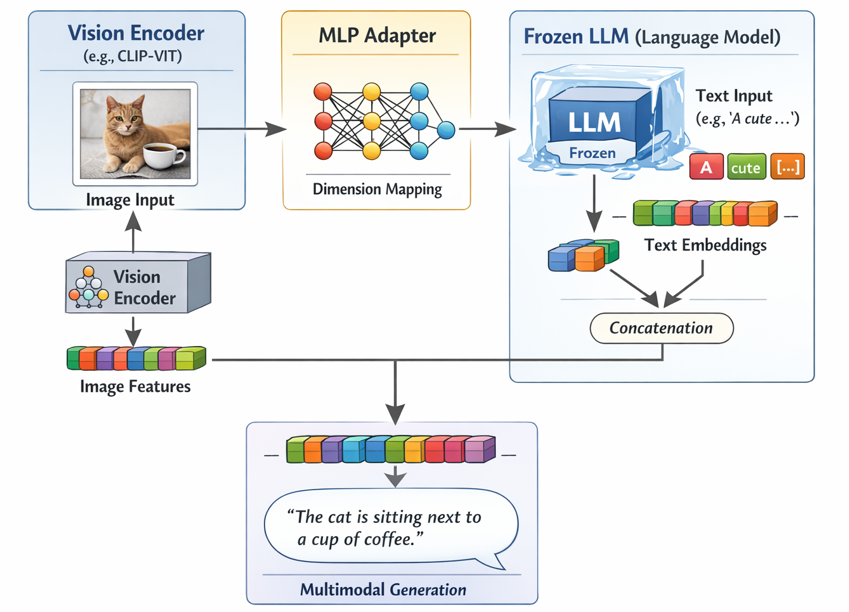
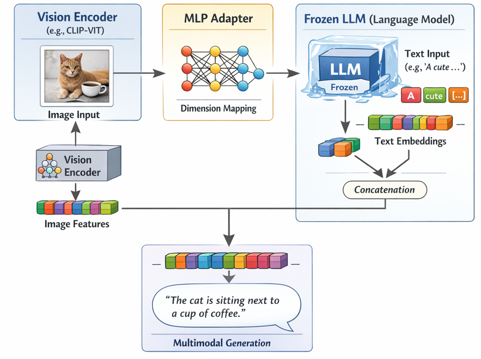

今回はVLM（Vision-Language Model）のアーキテクチャの中で有力なMLP Adapterについて説明の上、実装の手順について説明していきます。


## VLMのアーキテクチャ
VLMのアーキテクチャにおいて、視覚エンコーダ（Vision Encoder）とLLMを接続する「コネクタ（Adapter）」の役割は非常に重要です。Q-Former以外にも、モデルの設計思想や計算コストの要件に応じて、いくつか有力なアーキテクチャが存在します。

主な有力手法を分類して解説します。


### 1. MLP Adapter（単純な射影層）

最もシンプルかつ強力な手法で、近年のオープンソースモデルで主流となっています。

* **仕組み:** Vision Encoderから出力された特徴量を、単層または2層の多層パーセプトロン（MLP）に通して、LLMの埋め込み空間に線形変換します。
* **代表モデル:** **LLaVA** シリーズ。
* **メリット:** 構造が極めて単純で実装コストが低い。また、モデル全体の学習効率が高く、計算資源を節約できます。
* **適した用途:** 軽量かつ高速な推論が求められる環境。

### 2. Perceiver Resampler

可変長の視覚特徴を、固定数の「視覚トークン」に圧縮してLLMに渡す手法です。

* **仕組み:** 学習可能な「潜在クエリ（Latent Queries）」を定義し、画像特徴量に対してクロスアテンションを行うことで、情報を凝縮します。
* **代表モデル:** **Flamingo**。
* **メリット:** 入力画像がどれだけ大きくても、LLMに入力するトークン数を一定に抑えられるため、長文脈の処理や動画処理において計算量を効率的に制御できます。
* **適した用途:** 動画入力や、高解像度の画像入力を前提とするモデル。

### 3. Cross-Attention Adapter

LLMの中間層に対して、視覚情報を直接注入する方式です。

* **仕組み:** LLaVAのような「入力の先頭にトークンを追加する」方式とは異なり、LLMの各トランスフォーマーブロックの間にクロスアテンション層を挿入し、視覚情報を条件付けとして与えます。
* **代表モデル:** **Flamingo**（LLM層間への挿入）、その他多くの独自アーキテクチャ。
* **メリット:** LLMが言語処理の過程で常に視覚情報を参照できるため、画像とテキストの一貫した推論能力が高いとされます。
* **適した用途:** 深い推論や複雑なマルチモーダル理解が必要な場合。


### まとめ：選択の指針

| アーキテクチャ | 視覚情報の処理法 | 主な特徴 |
| --- | --- | --- |
| **Q-Former** | クロスアテンションによるフィルタリング | 画像の「要約」に長けている。学習難易度は高い。 |
| **MLP Adapter** | 線形変換（単純射影） | 高速・軽量。現在のオープンソースモデルの主流。 |
| **Perceiver Resampler** | 潜在クエリへのクロスアテンション | トークン数の固定が可能。動画・高解像度向け。 |
| **Cross-Attention** | LLM内部への直接注入 | 視覚情報の保持力が高い。設計が複雑。 |

Q-Formerは「情報を要約する」という明確な目的がある一方で、最近のトレンドとしては**MLP Adapterのように「学習の簡略化」を重視する方向**へ大きくシフトしています。特に「どれだけ効率的にLLMの能力を損なわずに視覚情報と統合するか」という観点から、ご自身のプロジェクトの目的（推論速度重視か、理解の質重視かなど）に合わせて選択するのが良いでしょう。


## MLP Adapter

現在、VLM（マルチモーダルLLM）の開発において圧倒的に主流であり、最も好まれているのは **MLP Adapter** をベースにしたアーキテクチャです。

特に、**LLaVA** シリーズが先駆けとなり、現在多くのオープンソースモデル（Qwen-VL, Llama-3-Visionなど）がこの設計を採用しています。

### なぜ MLP Adapter が選ばれるのか？（3つの理由）

#### 1. 学習と実装の「圧倒的なシンプルさ」

Q-FormerやPerceiver Resamplerは、それ自体を訓練するための複雑なステージや、ハイパーパラメータの微調整が必要です。一方、MLP Adapterは単なる「行列演算（線形変換）」であるため、 **「視覚エンコーダの出力を、LLMの埋め込み空間に合わせる」** という目的を、最小限の計算リソースで達成できます。

#### 2. LLMの能力を損なわない「柔軟性」

Q-Formerのような複雑な層を介すと、視覚情報が過度に圧縮・変換されてしまい、LLMが元来持っている「論理的思考能力」が阻害されるリスクがあります。MLP Adapterは情報の損失を最小限に抑え、Vision Encoderから得られた生の特徴量をLLMに直接渡すことができるため、**LLMの性能を最大化しやすい**という利点があります。

#### 3. 「エンドツーエンド」での高速な収束

MLP Adapterは、学習の初期段階から視覚情報とテキスト情報を一気にモデル全体で整合させることができます。計算リソースが限られている環境（Colabや個人のGPUサーバなど）でも、**短期間の学習で「そこそこ賢いVLM」が作れる**ため、研究開発のサイクルを高速化したい現代のトレンドに非常にマッチしています。


### 近年のトレンドの結論

かつては「いかに情報を凝縮するか（Q-Formerなど）」に知恵が絞られていましたが、現在は **「いかにLLMをマルチモーダルにするか」** という視点へ完全にシフトしています。

* **トレンドの要約:** 視覚情報を複雑なアダプターで「整形」するのではなく、 **「視覚情報を、言語と同じトークン形式に単に変換して流し込む」** という、極めて素直な設計が勝っています。

| 設計のトレンド | 以前の主流 (〜2023) | 現在の主流 (2024〜) |
| --- | --- | --- |
| **重視ポイント** | 視覚情報の高度な圧縮 | LLMの汎用性と学習効率 |
| **アダプター** | Q-Former, Perceiver | MLP Adapter, Linear Projection |
| **学習コスト** | 高い | 低い |

## MLP Adapterの構成

MLP Adapterの構成は、非常にシンプルです。概念的には「視覚エンコーダの出力ベクトルを、LLMのトークン埋め込み（Embedding）次元に変換する」だけの線形層です。

具体的に、実装レベルで何が起きているのかをコードと図解で整理します。

### 1. 概念的なデータフロー

Vision Encoder（例：CLIPのViT）から出てくる特徴量を、行列演算によってLLMが「理解できる言葉の次元」に写像（Mapping）します。

### 2. PyTorchによる実装の骨格

多くのVLMでは、以下のような単純な `nn.Sequential` をアダプターとして定義しています。

```python
import torch
import torch.nn as nn
from transformers import AutoModel, AutoModelForCausalLM

class SimpleVLM(nn.Module):
    def __init__(self, vision_model_name, llm_model_name, vision_dim, llm_dim):
        super().__init__()
        
        # 1. Vision Encoder (例: CLIP-ViT)
        self.vision_encoder = AutoModel.from_pretrained(vision_model_name)
        
        # 2. MLP Adapter
        self.adapter = nn.Sequential(
            nn.Linear(vision_dim, llm_dim),
            nn.GELU(),
            nn.Linear(llm_dim, llm_dim)
        )
        
        # 3. LLM (Frozen)
        self.llm = AutoModelForCausalLM.from_pretrained(llm_model_name)
        
        # モデルの凍結（Warm-up用）
        for param in self.vision_encoder.parameters(): param.requires_grad = False
        for param in self.llm.parameters(): param.requires_grad = False

    def forward(self, pixel_values, input_ids):
        # A. 画像を特徴量に変換
        # vision_outputs.last_hidden_state: [batch, num_patches, vision_dim]
        vision_outputs = self.vision_encoder.vision_model(pixel_values)
        image_features = vision_outputs.last_hidden_state
        
        # B. アダプターで次元変換
        # image_features: [batch, num_patches, llm_dim]
        image_embeddings = self.adapter(image_features)
        
        # C. LLMの入力埋め込みを取得
        text_embeddings = self.llm.get_input_embeddings()(input_ids)
        
        # D. 画像とテキストを結合 (画像トークンを前方に配置)
        inputs_embeds = torch.cat([image_embeddings, text_embeddings], dim=1)
        
        # E. LLMによる推論
        return self.llm(inputs_embeds=inputs_embeds)
```

### 3. この構成が選ばれる理由：数値計算の観点

なぜこれでうまくいくのかポイントを挙げます。

* **トークン化の統一:** 視覚特徴量を `[num_patches, llm_dim]` という形式に変換することで、LLMにとっては「特殊な単語（特殊トークン）」が並んでいるのと全く同じ扱いになります。これにより、既存のLLMのアーキテクチャを一切変更せずに接続可能です。
* **次元の整合:** 例えばCLIPのViT-L/14であれば `vision_dim=1024` ですが、これをLlama-3の `llm_dim=4096` に射影します。この行列変換が、視覚概念と言語概念を橋渡しする「翻訳辞書」の役割を果たします。
* **学習効率:** 更新すべきパラメータ数が少ないため、アダプターのみを学習させる「Frozen LLM」の手法が非常に安定します。

### 4. 実装のコツ

以下の順序で進めるのが最も効率的です。

1. Frozen: Vision EncoderとLLMの両方を凍結（Freeze）します。
2. Warm-up: このアダプター層だけを数エポック学習させ、LLMが視覚入力を「意味のある入力」として受け取れるようにします。
3. Fine-tuning: その後、必要に応じてLLMの一部を解凍（Unfreeze）して、より細かいニュアンスを調整します。

非常にシンプルですが、現在の最高性能のVLMも基本はこの構造を拡張したものです。





## 本日まとめ

現在のVLMはLLMの構造をいかにそのままに、ビジョンをLLMに取り込むか、ということが重要とされています。

この場合、LLMはそのままで、画像から得た情報をLLMのトークン情報に変換するかということにフォーカスされています。

現状これで精度が出るようになっているので、それ以上の複雑な仕組みはトレンドにはありません。

LLMが視覚を得るということは、現状そこまで複雑に考えるフェーズではなくなった、と言えるのかもしれません。
