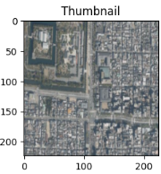
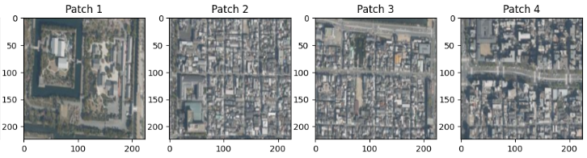

AnyRes（Dynamic High Resolution / Dynamic Cropping）は、近年のVLM（Phi-4, LLaVA-NeXT, InternVLなど）で採用されている、**「画像の細部を潰さずに高解像度で処理する」** ための非常に強力な機構です。

従来のVLMが抱えていた「画像を無理やり正方形に縮小して、文字や小さな物体が読めなくなる」という弱点を解決するために開発されました。


## 1. AnyResの基本的な仕組み

AnyResは、1枚の画像を「全体像」と「細部（タイル）」に分けて処理します。

1. **アスペクト比の維持:** 入力画像の縦横比を崩さずに、最適なグリッド（例：**$2 \times 2$** や **$1 \times 3$**）を決定します。
2. **分割（Cropping）:** 画像を複数のサブ画像（タイル）に分割します。
3. **全体像の追加:** 分割したタイルとは別に、画像全体を低解像度に縮小した「サムネイル」も用意します。
4. **特徴量の結合:** 全てのタイルとサムネイルをVision Encoderに通し、得られた特徴量トークンをLLMに一列に並べて流し込みます。


## 2. なぜこの機構が「精度」に効くのか？

エンジニア的な視点で見ると、AnyResは以下の3つのメリットをもたらします。

* **解像度の実質的な向上:** 例えば **$336 \times 336$** のVision Encoderを使っている場合、**$2 \times 2$** のAnyResを使えば実質的に **$672 \times 672$** 相当の情報を処理できます。
* **OCR能力の飛躍:** 小さな文字も分割されたタイル内では大きく表示されるため、文字認識の精度が劇的に向上します。
* **柔軟な対応:** 横長の画像なら **$1 \times 3$**、縦長なら **$3 \times 1$** のように、被写体に合わせて最適な分割数を選択できるため、情報の歪みがありません。


## 3. 具体的なデータフローの例

Phi-4などでよく見られる、画像がトークン化されるまでの流れは以下の通りです。
ビジョンで見たものをリサイズしてトークン横並びにする。

1. **Original Image:** **$1000 \times 500$** (横長)
2. **Grid Selection:** **$1 \times 2$** のグリッドを選択。
3. **Tiling:** 左半分の **$500 \times 500$** と右半分の **$500 \times 500$** に分ける（各タイルを **$336 \times 336$** にリサイズ）。
4. **Thumbnail:** 全体を **$336 \times 336$** にリサイズ。
5. **Concatenation:** [サムネイルのトークン] + [左タイルのトークン] + [右タイルのトークン] を一列に並べてLLMへ。


## 4. AnyResの課題：トークン数の爆発

精度は上がりますが、注意すべき点もあります。

* **計算コスト:** 分割数が増えるほど、LLMに渡されるトークン数が倍増します（例：1枚576トークンが、5分割で2880トークンに）。
* **VRAM消費:** トークン数が増えると、Attention計算に必要なVRAMも急激に増加します。

**そのため、Phi-4のような小型モデルでは、この大量のトークンをいかに効率よく処理するか（先ほどお話ししたプーリングなど）がセットで設計されています。**


### 5. 処理の意図

AnyResという機構が、なぜこれほどまでに手間をかけて画像を分割・結合するのか。その本質的な意図は、一言で言えば **「LLMの視力を、既存のVision Encoderの限界を超えてブーストすること」** にあります。

エンジニア的視点で、その「意図」を3つの核心的なメリットから紐解きます。

__1. 「情報の蒸発」を防ぐ（高解像度の維持）__

従来のVLM（CLIP-ViTなど）は、入力サイズが **224x224** や **336x336** と固定されています。
例えば、横に長い「1000文字の契約書」をそのまま336ピクセルに縮小すると、文字が潰れて判読不能になります。

- **AnyResの意図:** 画像を無理に縮小せず、「実寸に近い解像度」のまま分割して処理することで、小さな文字（OCR）や細かな物体（数ピクセルの傷など）の情報を損失させずにLLMへ届けることができます。


__2. 「マクロ」と「ミクロ」の両立（空間認識の強化）__

人間も、景色を見るときに「全体の雰囲気」を掴むのと同時に、「特定の部分」を凝視します。AnyResはこの挙動を模倣しています。

- **サムネイル（マクロ）の役割:** 画像全体のレイアウト、構図、大まかな物体の配置を理解させる。
- **分割タイル（ミクロ）の役割:** 個別の物体、テクスチャ、テキストなどの詳細を理解させる。
- **意図:** これらを一列に並べてLLMに渡すことで、LLMは「この文字（タイル内）は、この看板（全体像内）の一部だ」という**相対的な空間関係**を理解できるようになります。

__3. アスペクト比による「歪み」の排除__

多くのVision Encoderは正方形での入力を求めますが、現実に正方形の画像は稀です。

- **従来の処理:** 横長画像を正方形にリサイズすると、物体が横に潰れてしまい、形状の認識精度が落ちます。
- **AnyResの意図:** グリッド（1x3や2x2）を動的に選ぶことで、元の画像の比率を保ったままパッチ化します。これにより、物体が「本来の形」で認識されるため、形状認識の精度が安定します。

### 6. 処理の結果

VLMの内部で起きていることをエンジニア的な視点で整理すると、**「画像という多次元データを、LLMが『言葉』として解釈できる共通のベクトル空間（埋め込み空間）へ無理やり翻訳している」** 状態と言えます。

具体的にどのようなステップで「言語の分散表現（埋め込みベクトル）」に変換されているのか、そのプロセスを分解して解説します。


__1. 視覚特徴から「視覚トークン」への変換__

まず、Vision Encoder（ViTなど）が画像をパッチ（断片）に分け、それぞれのパッチをベクトル化します。この時点では、まだ「画像処理モデルが理解する数値」です。

__2. MLP Adapterによる「翻訳」__

ここで先ほどお話しした **MLP Adapter** が登場します。
* **次元の不一致を解消:** 例えば、画像モデルの出力が1024次元、LLMの入力が4096次元だった場合、この次元を合わせます。
* **空間の写像:** 単に数字の数を合わせるだけでなく、画像特徴が持つ「意味（赤い、丸い、尖っている）」を、LLMの語彙（Vocabulary）が持つ「意味」の近くに配置します。


__3. LLM視点での「画像」__

LLMにとって、アダプターを通過した後の画像トークンは、もはや画像ではなく **「自分が知らない言語で書かれた未知の単語」** のような存在です。

* **分散表現の統合:** テキストの「猫」という単語の分散表現（Embedding）と、画像の「猫のパッチ」から変換された分散表現が、LLM内部の多次元空間において**近い位置**にプロットされるよう学習されます。
* **処理の同一化:** LLMのSelf-Attention機構の中では、テキストトークンも視覚トークンも区別されません。全てのトークンが「同じ次元のベクトル」として並列に処理されます。


__なぜこれが「強力」なのか？__

この仕組みの最大の利点は、**LLMがこれまでに膨大なテキストデータから学んだ「論理」や「常識」を、画像データに対してもそのまま適用できる**点にあります。

> **例:**
> 1. 画像から「割れたグラス」の視覚トークンが来る。
> 2. それが言語空間の「破損」「危険」「液体」などの概念に近いベクトルに変換される。
> 3. LLMは「割れたグラスは危ないので片付けるべき」という既存の知識を使って、適切な回答を生成する。

## 実験
とここまで説明したAnyRes実際に実装してみましょう。

```python
import torch
import torch.nn as nn
from PIL import Image
import torchvision.transforms as T
import matplotlib.pyplot as plt

def simulate_anyres(image_path, patch_size=224):
    # 1. 画像の読み込み
    raw_image = Image.open(image_path).convert('RGB')
    
    # 2. 全体像（サムネイル）の作成
    # どんなに大きくても一旦 patch_size に縮小
    thumbnail_transform = T.Compose([
        T.Resize((patch_size, patch_size)),
        T.ToTensor()
    ])
    thumbnail = thumbnail_transform(raw_image) # [3, 224, 224]

    # 3. 高解像度パッチへの分割 (2x2 グリッドを想定)
    # 元画像を 448x448 にリサイズしてから 224x224 の4枚に分ける
    high_res_transform = T.Compose([
        T.Resize((patch_size * 2, patch_size * 2)),
        T.ToTensor()
    ])
    high_res_img = high_res_transform(raw_image) # [3, 448, 448]
    
    # [3, 448, 448] -> [3, 2, 224, 2, 224] -> [4, 3, 224, 224] に変換
    patches = high_res_img.unfold(1, patch_size, patch_size).unfold(2, patch_size, patch_size)
    patches = patches.contiguous().view(3, -1, patch_size, patch_size).permute(1, 0, 2, 3)
    
    # 4. 可視化 (何が起きているか確認)
    fig, axes = plt.subplots(1, 5, figsize=(15, 5))
    axes[0].imshow(thumbnail.permute(1, 2, 0))
    axes[0].set_title("Thumbnail")
    for i in range(4):
        axes[i+1].imshow(patches[i].permute(1, 2, 0))
        axes[i+1].set_title(f"Patch {i+1}")
    plt.show()

    return thumbnail, patches

# 実行例 (Colabに画像をアップロードしてパスを指定してください)
thumbnail, patches = simulate_anyres("/content/feature-3.png")
```

__結果__

今回は航空写真の画像を入力してみた結果を示します。

これがサムネイル。



こちらが画像から2×2で画像を拡大表示したものになります。



これにより、画像がつぶされて、詳細の分析ができないことを防ぐことが出来るようになります。

## 総括

AnyResが登場する前、VLMは「画像を無理やり正方形にリサイズする」過程で、多くの重要な情報を失っていました。AnyResはこれを以下の3つのアプローチで解決しました。

1. 情報の「非破壊」処理: 画像を分割（パッチ化）することで、Vision Encoderの入力制限（例：336x336）を守りつつ、実質的に数倍〜十数倍の高解像度情報を維持します。
2. アスペクト比の適応: 横長なら横に、縦長なら縦にパッチを並べることで、物体が「潰れる」「伸びる」といった歪みを防ぎ、形状認識の精度を安定させました。
3. 階層的理解: 「全体像（サムネイル）」と「細部（パッチ）」を同時にLLMに流し込むことで、人間が景色を眺めつつ細部に目を凝らすような、マクロ・ミクロ両方の視点を与えました。


