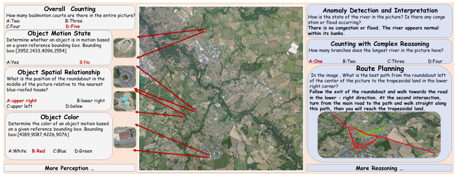
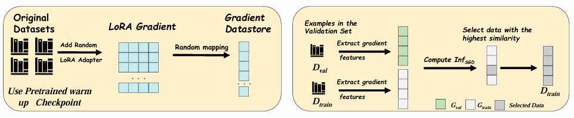
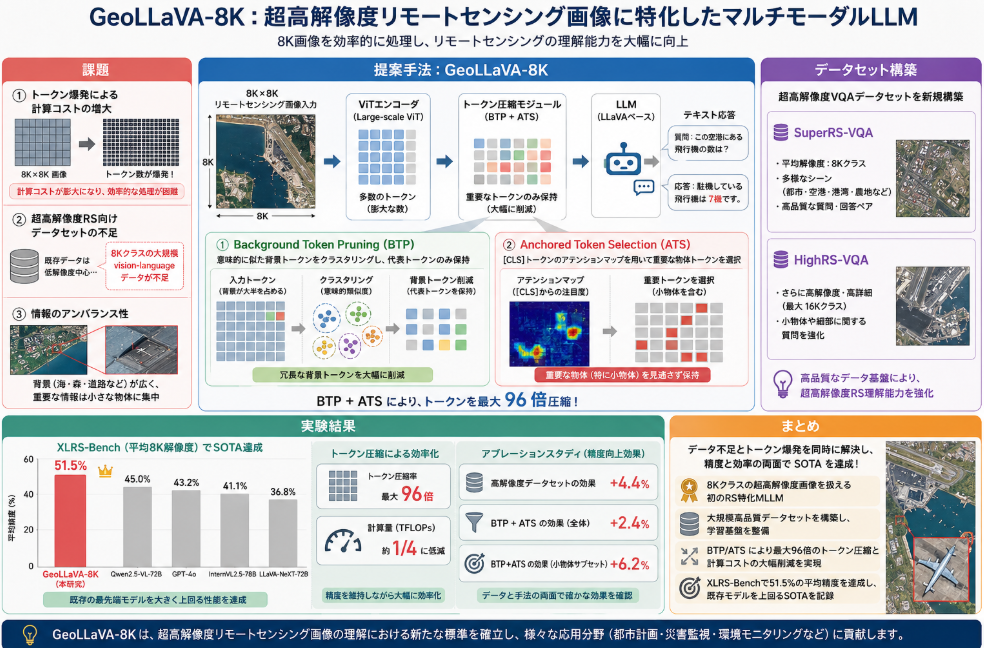

先日に引き続き[NeurIPS 2025]()の採択論文を読んでいきます。
今回もビジョンを用いたLLM=VLMに関s瑠うものです。

人工衛星のような上空から撮影されるデータは地上の目線とは異なり広域の情報を得ることが出来ます。
しかし、データの重量が大きく、処理が難しいという課題があります。
本日はそんな課題に対する方法を提案した論文を扱います。

本日テーマ：
>NeurIPS 2025の採択論文でリモートセンシング対応したGeoLLaVA-8Kについて理解してみる

## 概要

この論文は、**超高解像度（8Kクラス）のリモートセンシング画像**に特化したマルチモーダル大規模言語モデル（MLLM）**GeoLLaVA-8K**を提案するものです。

### 1. 背景と課題

- 衛星画像などの **Ultra-High-Resolution (UHR) リモートセンシング画像**は、地球観測・防災・都市計画などに有用ですが、既存の MLLM には 2 つの大きなボトルネックがあります。
  1. **超高解像度データの学習データ不足**  
     8K×8K のような巨大画像に対応した大規模な vision-language データセットがほとんど存在しない。
  2. **トークン爆発（token explosion）**  
     8K 画像をそのまま Vision Transformer に入力するとトークン数が膨大になり、メモリ・計算コストが爆発的に増える。

### 2. 提案データセット

なんと、論文の著者らは、UHR リモートセンシング向けの大規模 vision-language データセットを 2 つ構築しています。

1. **SuperRS-VQA**  
   - 約 **12K サンプル**、平均解像度 **8,376×8,376** という、現時点で最も高解像度なリモートセンシング VQA データセット。
   - 手動アノテーションによる高品質な対話データで、22 種類の現実タスク（例：物体検出、変化検知、土地利用分類など）をカバー。

2. **HighRS-VQA**  
   - 平均解像度 **2,000×1,912** 程度の高解像度データセット。
   - GPT-4o を用いた半自動アノテーションと、LESS フレームワークによる影響度ベースのサンプル選択を組み合わせて構築。

これらにより、**超高解像度リモートセンシング画像に対する大規模な対話学習**が可能になりました[NeurIPS 2025](https://papers.nips.cc/paper_files/paper/2025/file/e95ef5c6ed4096c609e0b8b47ffaeb9b-Paper-Conference.pdf)。

### 3. 提案手法：GeoLLaVA-8K の設計とトークン削減戦略

GeoLLaVA-8K は、LLaVA フレームワークをベースにしつつ、**8K×8K までの入力**を扱えるように設計されています。  
大きな画像をそのまま扱うとトークン数が膨大になるため、著者らは「**冗長な背景を削り、重要な物体トークンだけを残す**」という発想で、以下の 2 段階戦略を提案しています。

__(1) Background Token Pruning (BTP)__

- リモートセンシング画像では、**海・森林・農地などの広い背景領域が多く、情報密度が低い**ことが多い。
- BTP では、**意味的類似度に基づく適応的トークンクラスタリング**を行い、冗長な自然背景トークンをまとめて削減します。
- これにより、**メモリ使用量を大幅に削減**しつつ、重要な情報を保持します。

__(2) Anchored Token Selection (ATS)__

- Vision Transformer の **[CLS] トークンのアテンションマップ**を利用し、**意味的に重要なトークンや小さな物体トークン**を特定して残します。
- これにより、**物体中心のトークン（object-centric tokens）**を選択的に保持し、性能を落とさずにトークン数を削減できます。

この 2 つの戦略を組み合わせることで、**8K 解像度の画像を効率的に処理できる MLLM**を実現しています[NeurIPS 2025](https://papers.nips.cc/paper_files/paper/2025/file/e95ef5c6ed4096c609e0b8b47ffaeb9b-Paper-Conference.pdf)。

### 4. 性能評価

- GeoLLaVA-8K（7B パラメータ）は、**XLRS-Bench** という超高解像度リモートセンシングベンチマークで評価されています。
- その結果、**オープンソースモデルだけでなく、Qwen2.5-VL-72B や GPT-4o などのクローズドソースモデルも上回る** SOTA 性能を達成したと報告されています[NeurIPS 2025](https://papers.nips.cc/paper_files/paper/2025/file/e95ef5c6ed4096c609e0b8b47ffaeb9b-Paper-Conference.pdf)。

### 5. まとめ

- **GeoLLaVA-8K** は、超高解像度リモートセンシング画像向けに設計された、**初の 8K 対応リモートセンシング MLLM** です。
- **SuperRS-VQA / HighRS-VQA** という大規模高解像度データセットと、
- **Background Token Pruning** と **Anchored Token Selection** による効率的なトークン削減戦略により、
- **トークン爆発とデータ不足を同時に解決し、SOTA 性能を達成**した点が本論文の主な貢献です。

コードとデータセットは GitHub で公開されています[GitHub](https://github.com/wang-fengxiang/GeoLLaVA-8K)。

## 解決したい課題

この論文が対象とする主な「課題」は、**超高解像度（Ultra-High-Resolution, UHR）リモートセンシング画像をマルチモーダル大規模言語モデル（MLLM）で扱う際の根本的なボトルネック**です。大きく分けて以下の2点が中心です。

### 1. 超高解像度リモートセンシング画像の「データ不足」

- 衛星画像などでは、**8K×8K クラスの超高解像度画像**が地球観測・防災・都市計画などで重要ですが、そのような **巨大画像に対応した大規模な vision-language データセットがほとんど存在しません**。
- 既存のリモートセンシング向け MLLM は、比較的低解像度の画像で学習・評価されることが多く、**8K クラスの超高解像度画像を対象とした対話・VQA・物体検出などのタスク用データが不足**していました。
- その結果、**超高解像度画像に特化した MLLM を学習・評価するための基盤データが欠けている**という課題がありました[NeurIPS 2025](https://papers.nips.cc/paper_files/paper/2025/file/e95ef5c6ed4096c609e0b8b47ffaeb9b-Paper-Conference.pdf)。

### 2. トークン爆発（token explosion）と計算効率の悪さ

- 8K×8K の画像を Vision Transformer にそのまま入力すると、**トークン数が膨大になり、メモリと計算コストが爆発的に増大**します。
- 既存の MLLM は、一般画像（例：768×768 程度）を前提に設計されているため、**8K 解像度のリモートセンシング画像を直接扱うと、GPU メモリが足りない・推論が極端に遅い**といった問題が生じます。
- 単純に画像を縮小すると、**小さな物体や細かい構造が失われ、リモートセンシング特有の高解像度の利点が消えてしまう**というトレードオフもありました。

### 3. リモートセンシング画像特有の「背景冗長性」

- リモートセンシング画像では、**海・森林・農地などの広い背景領域が多く、情報密度が低い**一方で、重要な情報は**局所的な物体（建物、道路、船舶など）に集中**しています。
- 既存の MLLM は、画像全体をほぼ均等にトークン化するため、**情報の少ない背景トークンに多くの計算リソースを浪費**してしまうという問題がありました。
- 著者らのパイロットスタディでは、**背景トークンを削減しても性能が落ちないどころか、むしろ改善するケースがある**ことが示され、「**背景冗長性をどう削るか**」が重要な課題として浮かび上がりました[NeurIPS 2025](https://papers.nips.cc/paper_files/paper/2025/file/e95ef5c6ed4096c609e0b8b47ffaeb9b-Paper-Conference.pdf)。

### 4. 既存 MLLM の「リモートセンシング特化性の不足」

- 一般画像向けに設計された MLLM（例：LLaVA 系、Qwen-VL、GPT-4V など）は、  
  リモートセンシング特有の**高解像度・広域・物体スケールの多様性**を十分に考慮していません。
- そのため、**超高解像度リモートセンシング画像に対する精度・効率の両面で最適化されていない**という課題がありました。

## 提案手法

この論文の「提案手法」は、**超高解像度（8Kクラス）リモートセンシング画像に特化したマルチモーダル大規模言語モデル「GeoLLaVA-8K」** と、その**トークン削減戦略**です。  
主な構成要素は以下の通りです。

### 1. 全体アーキテクチャ：LLaVA ベースの 8K 対応 MLLM

- **ベースモデル**：LLaVA フレームワークをベースにした vision-language モデルです。
- **入力解像度**：最大 **8K×8K** の超高解像度リモートセンシング画像を扱えるように設計されています。
- 構成はおおむね  
  - Vision Encoder（ViT 系）  
  - Projection Layer（画像トークン → LLM 入力）  
  - LLM（言語モデル）  
  という標準的な MLLM 構成ですが、**8K 画像をそのまま扱うとトークン数が爆発する**ため、以下の 2 段階戦略でトークンを削減します[NeurIPS 2025](https://papers.nips.cc/paper_files/paper/2025/file/e95ef5c6ed4096c609e0b8b47ffaeb9b-Paper-Conference.pdf)。

### 2. Background Token Pruning (BTP)

**目的**：リモートセンシング画像に多い「情報の少ない広い背景」を効率的に削減し、メモリと計算コストを下げる。

- **背景冗長性の観察**  
  著者らのパイロットスタディでは、リモートセンシング画像では  
  - 海・森林・農地などの広い背景領域は情報密度が低い  
  - 重要な情報は局所的な物体（建物、道路、船舶など）に集中  
  していることが確認されました。

- **適応的トークンクラスタリング**  
  BTP では、**意味的類似度（semantic affinity）に基づくクラスタリング**を行い、  
  類似した背景トークンをまとめて削減します。
  - 類似した自然背景（例：広い海面、森林）をグループ化し、代表トークンだけを残す。
  - これにより、**冗長な背景トークンを大幅に削減**しつつ、重要な情報を保持します。

- **効果**  
  背景トークンを削減しても性能が落ちないどころか、**場合によっては性能が向上する**ことが示されています。  
  これは、MLLM が「ノイズのような背景」に注意を割かなくて済むためと考えられます[NeurIPS 2025](https://papers.nips.cc/paper_files/paper/2025/file/e95ef5c6ed4096c609e0b8b47ffaeb9b-Paper-Conference.pdf)。

### 3. Anchored Token Selection (ATS)

**目的**：BTP で背景を削った後も、**意味的に重要な物体トークンや小さな物体トークンを見逃さないようにする**。

- **[CLS] トークンのアテンションマップを利用**  
  Vision Transformer の **[CLS] トークンがどの画像トークンに強く注意を向けているか**を分析し、  
  そのアテンションマップに基づいてトークンを選択します。

- **物体中心トークンの選択**  
  - アテンションが高いトークンは、**意味的に重要な領域（物体、構造物など）** に対応していると考えられます。
  - 特に、**小さな物体や細かい構造**に対応するトークンも、アテンションが高ければ優先的に残します。

- **BTP との組み合わせ**  
  - まず BTP で背景トークンを削減し、  
  - 次に ATS で [CLS] アテンションに基づき重要なトークンを残す  
  という 2 段階で、**冗長性を削りつつ重要な情報を保持**します[NeurIPS 2025](https://papers.nips.cc/paper_files/paper/2025/file/e95ef5c6ed4096c609e0b8b47ffaeb9b-Paper-Conference.pdf)。

### 4. データセット：SuperRS-VQA と HighRS-VQA

提案手法を学習・評価するために、著者らは 2 つの高解像度 vision-language データセットを構築しています。

1. **SuperRS-VQA**  
   - 約 **12K サンプル**、平均解像度 **8,376×8,376**。  
   - 現時点で**最も高解像度なリモートセンシング VQA データセット**。  
   - 22 種類の現実タスク（物体検出、変化検知、土地利用分類など）をカバーする**手動アノテーション**。

2. **HighRS-VQA**  
   - 平均解像度 **2,000×1,912** 程度。  
   - GPT-4o を用いた半自動アノテーションと、LESS フレームワークによる影響度ベースのサンプル選択を組み合わせて構築。

これらにより、**超高解像度リモートセンシング画像に対する大規模な対話学習**が可能になり、  
GeoLLaVA-8K は 8K 解像度の画像を扱う能力を獲得しています[NeurIPS 2025](https://papers.nips.cc/paper_files/paper/2025/file/e95ef5c6ed4096c609e0b8b47ffaeb9b-Paper-Conference.pdf)。

## 実験結果

以下では、本論文の**実験設定**と**実験結果**をまとめます。

### 1. 実験設定

__1.1 使用ベンチマーク__

- **XLRS-Bench**  
  - 平均解像度 **8K** クラスの超高解像度リモートセンシング画像を対象としたベンチマーク。  
  - 視覚的質問応答（VQA）、物体検出、変化検知など、多様なタスクを含む。  
- **LRS-VQA**  
  - 比較的低解像度のリモートセンシング VQA ベンチマーク。  
  - 既存研究との比較や、汎用性の確認に使用。

__1.2 比較対象モデル__

- **リモートセンシング専用モデル**  
  - GeoChat など、既存の RS 特化 MLLM。
- **クローズドソース MLLM**  
  - GPT-4o  
  - Claude 3.7 Sonnet  
  - Gemini 2.0 Flash  
- **オープンソース MLLM**  
  - LLaVA-Next  
  - InternVL2.5 / InternVL3  
  - Qwen2-VL / Qwen2.5-VL（最大 72B パラメータを含む）

__1.3 評価指標__

- **Accuracy（平均精度）** ：各タスクの正答率の平均。
- **TFLOPs**：推論時の計算量（浮動小数点演算数）。
- **Latency（推論遅延）** ：1サンプルあたりの推論時間。

### 2. 主な実験結果

__2.1 XLRS-Bench での SOTA 達成__

- **GeoLLaVA-8K（7B）** は、XLRS-Bench で **51.5% の平均精度**を達成。
- これは、  
  - オープンソースモデル（LLaVA-Next, InternVL, Qwen2.5-VL-72B など）  
  - クローズドソースモデル（GPT-4o, Claude 3.7 Sonnet, Gemini 2.0 Flash など）  
  を**すべて上回る SOTA 性能**です[NeurIPS 2025](https://papers.nips.cc/paper_files/paper/2025/file/e95ef5c6ed4096c609e0b8b47ffaeb9b-Paper-Conference.pdf)。

__2.2 計算効率（TFLOPs / Latency）__

- **Background Token Pruning (BTP)** と **Anchored Token Selection (ATS)** により、  
  トークン数を最大 **96倍圧縮**し、TFLOPs を**約 1/4 に低減**。
- これにより、**8K 解像度画像を扱いながらも、計算コストと推論遅延を大幅に抑えられる**ことが示されました[NeurIPS 2025](https://papers.nips.cc/paper_files/paper/2025/file/e95ef5c6ed4096c609e0b8b47ffaeb9b-Paper-Conference.pdf)。

### 3. アブレーションスタディ（提案要素の寄与分析）

__3.1 高解像度データセットの効果__

- **SuperRS-VQA / HighRS-VQA** を用いて学習した場合、  
  XLRS-Bench の精度が **+4.4% 向上**。
- これは、**超高解像度リモートセンシング画像に対する大規模な対話学習**が、  
  モデルの理解能力を大きく高めることを示しています[NeurIPS 2025](https://papers.nips.cc/paper_files/paper/2025/file/e95ef5c6ed4096c609e0b8b47ffaeb9b-Paper-Conference.pdf)。

__3.2 BTP / ATS の効果__

- **BTP + ATS を両方適用**した場合、  
  XLRS-Bench の精度が **+2.4% 向上**。
- 特に、**小規模オブジェクト（小さな物体）を含むサブセット**では、  
  LLaVA-Next に対して **+6.2% の改善**を示しました。
- これは、  
  - BTP で背景冗長性を削減し、  
  - ATS で [CLS] アテンションに基づき小さな物体トークンを保持  
  することで、**小規模オブジェクトのセマンティクスをうまく保持できている**ことを示しています[NeurIPS 2025](https://papers.nips.cc/paper_files/paper/2025/file/e95ef5c6ed4096c609e0b8b47ffaeb9b-Paper-Conference.pdf)。

### 4. 実験結果の要点

- **性能面**  
  - GeoLLaVA-8K（7B）は、XLRS-Bench で **51.5% の平均精度**を達成し、  
    既存のオープン・クローズドソース MLLM を**すべて上回る SOTA**を記録。
- **効率面**  
  - BTP / ATS により、トークン数を最大 96倍圧縮し、TFLOPs を約 1/4 に低減。  
  - 8K 解像度画像を扱いながらも、**計算コストと遅延を大幅に削減**。
- **アブレーション結果**  
  - 高解像度データセット（SuperRS-VQA / HighRS-VQA）が **+4.4%** の精度向上に寄与。  
  - BTP / ATS 戦略が **+2.4%** の精度向上に寄与し、特に小規模オブジェクトで **+6.2%** の改善を達成。

以上より、本論文は**超高解像度リモートセンシング画像に対して、精度と効率の両面で優れた MLLM**を実現したことを示しています[NeurIPS 2025](https://papers.nips.cc/paper_files/paper/2025/file/e95ef5c6ed4096c609e0b8b47ffaeb9b-Paper-Conference.pdf)。

## 総括

GeoLLaVA-8K は、**8Kクラスの超高解像度リモートセンシング画像**に特化したマルチモーダルLLMです。

**課題**  
- 8K 画像を扱うとトークン数が爆発し、計算コストが膨大になる。  
- 超高解像度リモートセンシング向けの大規模な vision-language データセットが不足している。  
- リモートセンシング画像は背景が広く情報密度が低い一方、重要な情報は局所的な物体に集中する。

**提案手法**  
- LLaVA ベースの MLLMを拡張し、**8K×8K 入力**を扱えるように設計。  
- **Background Token Pruning (BTP)** ：意味的類似度に基づくクラスタリングで冗長な背景トークンを削減。  
- **Anchored Token Selection (ATS)** ：[CLS] トークンのアテンションマップで重要な物体トークン（特に小物体）を選択的に保持。  
- **SuperRS-VQA / HighRS-VQA**：平均 8K クラスの超高解像度 VQA データセットを構築し、学習基盤を整備。

**実験結果**  
- XLRS-Bench（平均 8K 解像度）で **51.5% の平均精度**を達成し、Qwen2.5-VL-72B や GPT-4o を含む既存モデルを上回る SOTA を記録[NeurIPS 2025](https://papers.nips.cc/paper_files/paper/2025/file/e95ef5c6ed4096c609e0b8b47ffaeb9b-Paper-Conference.pdf)。  
- BTP/ATS によりトークンを最大 96 倍圧縮し、TFLOPs を約 1/4 に低減。  
- アブレーションでは、高解像度データセットで +4.4%、BTP/ATS で +2.4%（小物体サブセットでは +6.2%）の精度向上を確認。

**まとめ**  
超高解像度リモートセンシング画像に対し、**データ不足とトークン爆発を同時に解決し、精度と効率の両面で SOTA を達成した初の 8K 対応 RS-MLLM**です。

