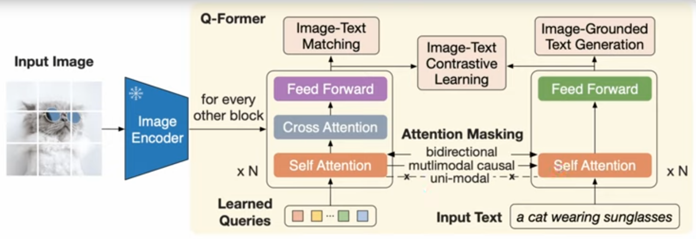
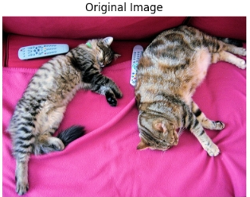
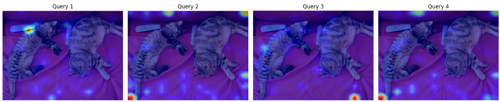

マルチモーダルモデルをビジョンエンコーダとLLMを結合するモジュールをprojector / connectorと呼びます。

# Q-Former

マルチモーダル学習、特に画像と言語を繋ぐ技術において、**Q-Former**は非常に重要な役割を果たすコンポーネントです。

簡単に言うと、Q-Formerは **「膨大な画像情報の中から、言語モデル（LLM）が理解しやすい重要なエッセンスだけを抽出する通訳者」** のような存在です。Salesforceが開発した「BLIP-2」というモデルで初めて導入されました。


## Q-Formerの役割と仕組み

画像データは非常に情報量が多いですが、そのすべてがテキストでの理解に必要なわけではありません。Q-Formerは以下のステップで情報を整理します。

1. **情報の圧縮（ボトルネック）**:
画像エンコーダ（CLIPなど）が出力する膨大な特徴量を、数個〜数十個の「Learnable Queries（学習可能なクエリ）」に集約します。これにより、LLMに渡すデータ量を劇的に減らしつつ、重要な意味情報を保持します。
2. **2つのトランスフォーマー構造**:
Q-Formerの内部は、画像を見るための「Self-Attention」と、テキストとの関連性を探る「Cross-Attention」が組み合わさった構造をしています。
3. **共通空間へのマッピング**:
画像と言語という異なる形式のデータを、同じ意味空間で扱えるように橋渡しをします。

## なぜQ-Formerが画期的なのか？

Q-Formerが登場する前は、画像エンコーダとLLMを直接繋ぐ方法が主流でしたが、それにはいくつかの課題がありました。Q-Formerはそれを解決しています。

* **LLMの負担を軽減**:
LLMに画像をそのまま流し込むのではなく、Q-Formerが「固定長（例えば32トークンなど）」に情報を凝縮するため、計算コストが抑えられます。
* **既存モデルの活用（Frozen Weights）**:
すでに賢い「画像モデル」と「言語モデル」を**重みを固定したまま**使い、その間を繋ぐQ-Formerだけを訓練すればよいため、非常に効率的に学習が可能です。
* **精度の向上**:
画像の中の「何が重要か」を言語の文脈に合わせて抽出するため、画像キャプショニングやVQA（画像応答）の精度が飛躍的に向上しました。


### 代表的な活用例：BLIP-2

Q-Formerの有効性を証明したのが**BLIP-2**です。このモデルは、Q-Formerを介して画像モデルとLLM（OPTやFlan-T5など）を結合することで、当時、はるかに巨大なパラメータを持つモデルよりも高い性能を発揮しました。

## 構造

Q-Formerの具体的な実装は、標準的な **Transformer（特にBERTベース）** をベースにしつつ、画像と言語を融合させるために「クエリ」と「アテンション」の仕組みを独自にカスタマイズしたものになっています。



ざっと概要を説明すると以下のようになります。

- 画像エンコーダと相互作用して視覚特徴を抽出する画像変換モジュール
- テキストエンコーダとテキストデコーダの両方として機能するテキスト変換モジュール
- Self Attention層はこれらのサブモジュール間で共有
- 画像変換モジュールのために、学習可能なクエリ埋め込みを作成
- クエリはSelf Attention層で互いに作用した後、Cross Attention層にて画像エンコーダの特徴と作用

構造による主要な特徴を説明します。

### Self Attention層の共有

Q-Formerにおいて、画像処理（クエリ側）とテキスト処理（テキスト入力側）で **Self-Attention層の重みを共有（Shared Self-Attention）** することには、主に以下の3つの重要な効果があります。
特に一つ目は他のマルチモーダルでも同じく提唱されている考えです。
もしかするとマルチモーダルモデルにおける重要なキーパーツとなっているかもしれません。

__1. 「マルチモーダルな共通空間」の強制的な学習__

画像由来の情報（クエリ）と、言語由来の情報（テキスト）が同じSelf-Attention層を通ることで、モデルは **画像の特徴と言語の概念を同じ次元の「意味」として扱う** ことを余儀なくされます。

* **効果:** 画像の中の「犬」という特徴と、テキストの「犬」という単語が、モデル内部で近い表現（ベクトル）としてマッピングされやすくなります。これにより、画像と言語の橋渡し（アライメント）がよりスムーズかつ強力になります。

__2. インタラクション（相互作用）の効率化__

重みを共有することで、画像クエリとテキストが互いに情報を補完し合うことができます。

* **効果:** テキスト側から得た文脈（例：「色について説明して」という意図）が、共有されたAttention層を通じて画像クエリ側の処理にも反映されます。その結果、Cross-Attentionで画像から情報を抽出する際に、「何に注目すべきか（この場合は『色』）」をより正確に判断できるようになります。

__3. パラメータの節約と過学習の防止__

画像用とテキスト用に別々のTransformerを用意する場合、パラメータ数が膨大になり、学習に必要なデータ量や計算リソースも増えてしまいます。

* **効果:**
* **軽量化:** 2つの独立したエンコーダを持つよりもパラメータ数を抑えられます。
* **汎化性能の向上:** 同じ重みで異なるモダリティ（画像とテキスト）を処理することで、特定のデータ形式に依存しすぎない、より抽象的で汎用的な特徴を学習するようになります（正則化のような効果）。

### 画像エンコーダと相互作用して視覚特徴を抽出する画像変換モジュール

「画像変換モジュール（Q-Formerなど）」は、いわば **「情報の翻訳機 兼 編集者」** です。

具体的には、画像エンコーダ（CLIPのViTなど）が出力する膨大な視覚データを、LLM（言語モデル）が好む「テキストに近い意味論的なデータ」に作り替える役割を担います。

__具体的にどのようなものか__

技術的には、以下の3つの要素で構成された小型のTransformerデコーダのような構造をしています。

1. **学習可能なクエリ（Learnable Queries）**:
モデルの初期入力として、32個程度の固定されたベクトル（クエリ）を用意します。これは「画像の中から何を探すべきか」を学習する「記憶の種」のようなものです。
2. **クロス・アテンション（Cross-Attention）層**:
これが相互作用の核です。先ほどの「クエリ」をQuery（探索側）とし、画像エンコーダから出力された「視覚特徴」をKeyおよびValue（参照側）として計算します。
3. **情報圧縮のメカニズム**:
画像エンコーダは通常、画像から数百〜数千のパッチ（断片）データを出力しますが、モジュールはこれを32個程度のクエリに集約します。

__どのような効果があるのか？__

単に画像とテキストを繋ぐ以上の、以下の3つの決定的なメリットがあります。

__1. 情報の「ノイズ」を取り除き、密度を上げる__

画像エンコーダの出力には、背景の細かい模様やLLMが理解に必要としない微細なピクセル情報が含まれています。

* **効果**: 画像変換モジュールが「重要な文脈（何があるか、何をしているか）」だけを抽出して凝縮するため、LLMに渡されるデータが非常に**高密度**になります。

__2. 計算コストの劇的な削減__

LLMに1,000個の画像パッチをそのまま入力すると、LLMの文脈ウィンドウ（入力枠）を圧迫し、動作が重くなります。

* **効果**: 画像情報をあらかじめ「固定された数（例：32トークン）」に圧縮するため、**LLMの計算負荷を最小限に抑えつつ**、長い会話や複雑な指示に対応できるようになります。

__3. 「見たいもの」への適応（アライメント）__

画像エンコーダは「画像全体」をフラットに見るのが得意ですが、言語モデルは「特定の対象」についての質問に答えたい場合があります。

* **効果**: 変換モジュールを介することで、テキスト側の文脈（質問の内容など）に合わせて、画像エンコーダの出力から **最適な情報を「引き出す」** 柔軟性が生まれます。


### テキストエンコーダとテキストデコーダの両方として機能するテキスト変換モジュール

Q-Formerにおける「テキスト変換モジュール」としての側面は、まさにQ-Formerが単なる「画像圧縮器」ではなく、 **「言語と画像を等価に扱うバイリンガルな変換器」** である理由そのものです。

Q-Formerは、学習フェーズやタスクに応じて、入力されたテキストを「理解（エンコード）」したり、新しいテキストを「生成（デコード）」したりする二面性を持っています。

__1. 「テキストエンコーダ」としての機能と効果__

テキストを入力として受け取り、その意味をベクトル化する機能です。

* **具体的な仕組み**:
入力されたテキスト（例：「猫が座っている」）に対してSelf-Attentionを適用し、テキストの特徴量を抽出します。
* **効果（対照学習 / ITC）**:
画像側から抽出された「クエリ」と、テキスト側から抽出された「特徴量」を比較し、 **「この画像とこの文章は一致しているか？」** を判定します。これにより、画像と単語の結びつき（アライメント）が極めて正確になります。

__2. 「テキストデコーダ」としての機能と効果__

画像情報に基づいて、テキストを1語ずつ生成していく機能です。

* **具体的な仕組み**:
「クエリ」が持つ画像情報を参照（Cross-Attention）しながら、自己回帰的（Autoregressive）に次の単語を予測します。
* **効果（画像キャプショニング学習 / ITG）**:
画像の内容を言語化する訓練（Image-grounded Text Generation）を行うことで、Q-Formerは **「どの画像特徴がどの言葉に対応するのか」** をより深く学習します。ただ画像を分類するだけでなく、「説明する能力」を養うための重要なステップです。

__3. 「エンコーダ」と「デコーダ」を兼ねるメリット__

1つのモジュールで両方をこなす（ユニファイド・アーキテクチャ）ことには、以下の大きな効果があります。

__① マルチタスク学習による相乗効果__

「画像とテキストを比べる（エンコード）」能力と「画像からテキストを作る（デコード）」能力を同時に学習することで、視覚と情報の結びつきがより多角的で強固になります。

__② 柔軟なアテンション・マスクの切り替え__

Q-Formerの実装では、**アテンション・マスク**を動的に切り替えることで、同じ重みのまま「エンコーダ」と「デコーダ」を使い分けます。

* **Bi-directional Mask**: 全単語が互いに見合える状態（エンコーダ用：全体理解）
* **Causal Mask**: 後の単語を見ない状態（デコーダ用：文章生成）
* **Multimodal Mask**: クエリがテキストを参照し、テキストもクエリを参照する状態

__③ 効率的なLLMへの橋渡し__

このモジュールが「テキストの文法」と「視覚の意味」の両方を深く理解しているため、最終的にLLMへ渡される「視覚トークン」が、LLMにとって極めて「読みやすい（言語に近い）」形式になります。


## 実装

主要な実装のポイントを3つに整理して解説します。

### 1. 内部構造：2つのサブモジュールの共有

Q-Formerは、内部的に「画像用」と「テキスト用」の2つの役割を1つのモデルで切り替えて動かせる構造をしています。

* **Self-Attention層の共有**: 内部のSelf-Attention（自己注意）層は、画像情報の処理とテキスト情報の処理の両方で共通の重みを使います。これにより、画像とテキストを共通の概念空間で捉えられるようになります。

* **Cross-Attention層の挿入**: Transformerブロックの途中に「Cross-Attention」が配置されています。ここで、学習可能な **Query Embeddings** が画像エンコーダから出力された視覚特徴（Visual Features）を参照し、必要な情報を吸い上げます。

### 2. 学習可能なクエリ (Learnable Query Embeddings)

実装上の最も特徴的な部分です。

* **固定数の入力**: モデルの入力として、あらかじめ決められた数（BLIP-2では通常 **32個**）の学習可能なベクトル（Query）を用意します。
* **情報集約のボトルネック**: 画像がどんなに高解像度でも、Q-Formerはこの32個のベクトルに情報を凝縮します。これが「ボトルネック」として機能し、LLMにとってノイズの少ない「純粋な意味情報」だけを抽出します。

### 3. アテンション・マスキングによる多機能化

実装レベルでは、 **アテンション・マスク（Attention Mask）** を切り替えることで、1つのQ-Formerに3つの異なる学習目的を持たせています。

| 学習目的 | マスクの仕組み | 役割 |
| --- | --- | --- |
| **画像とテキストの対照学習** | 双方向マスク | 画像とテキストの「一致度」を測る |
| **画像に基づくテキスト生成** | 因果的マスク | 画像を見て説明文（キャプション）を書く訓練 |
| **画像と言語の照合** | 特殊なマスク | 画像と特定の単語が合っているか細かく判定する |

### 実装のスペック（BLIP-2の場合）

Hugging Faceなどのライブラリで公開されている実装値は以下の通りです。

* **ベースモデル**: BERT-base（約188Mパラメータ）
* **クエリ数**: 32個
* **隠れ層の次元**: 768次元
* **レイヤー数**: 12層（Cross-Attentionは通常2層おきに挿入）


### 動かしてみる

Q-Formerに則って構築されたBLIP-2のQ-Formerを動かし、 **32個のクエリが画像のどこに注目しているか（アテンション・マップ）** を可視化してみます。

1. output_attentions=True: これを指定することで、Q-Former内部で行われている計算の「中間結果（どのクエリがどのピクセルに注目したか）」を抽出できます。

2. クロスアテンションの抽出: Q-Formerの各層には、画像特徴を参照するためのクロスアテンション層があります。ここでは情報の統合が最も進んだ「最終層」のデータを使用しています。

```bash
!pip install -q transformers accelerate pillow matplotlib
```


以下をgoogle colab等に張り付けて実行してください。

```python
import torch
from PIL import Image
import requests
import matplotlib.pyplot as plt
import numpy as np
from transformers import Blip2Processor, Blip2ForConditionalGeneration

# 1. デバイスの設定とモデルのロード
device = "cuda" if torch.cuda.is_available() else "cpu"
model_id = "salesforce/blip2-opt-2.7b"

# メモリ節約のため float16 を使用
processor = Blip2Processor.from_pretrained(model_id)
model = Blip2ForConditionalGeneration.from_pretrained(
    model_id, torch_dtype=torch.float16, device_map="auto"
)

# 2. 画像の取得（ここでは公式のサンプル画像を使用）
url = "http://images.cocodataset.org/val2017/000000039769.jpg" # 2匹の猫が寝ている画像
raw_image = Image.open(requests.get(url, stream=True).raw).convert("RGB")

# 3. 前処理
inputs = processor(images=raw_image, return_tensors="pt").to(device, torch.float16)

# 4. Q-Formerの出力を取得 (output_attentions=True がポイント)
with torch.no_grad():
    outputs = model.get_text_features(
        **inputs, 
        return_dict=True, 
        output_attentions=True
    )

# Q-Formerの最終層のクロスアテンションを取得
# 形状: [batch, num_heads, num_queries, num_patches]
# BLIP-2のViTパッチ数は通常 257 (16x16 + CLSトークン)
cross_attentions = outputs.qformer_outputs.cross_attentions[-1]

# 5. 可視化 (最初のいくつかのクエリがどこを見ているか)
num_queries_to_show = 4
fig, axes = plt.subplots(1, num_queries_to_show + 1, figsize=(20, 5))

# 元画像の表示
axes[0].imshow(raw_image)
axes[0].set_title("Original Image")
axes[0].axis("off")

# 各クエリのアテンションマップを表示
# ヘッド平均を取って簡易化
avg_attn = cross_attentions[0].mean(dim=0).cpu().float().numpy() 

for i in range(num_queries_to_show):
    # CLSトークンを除いた 16x16 のパッチにリシェイプ
    # BLIP-2のパッチ配置に合わせてリサイズ
    mask = avg_attn[i, 1:].reshape(16, 16)
    
    # 元画像と同じサイズにリサイズ（補完あり）
    axes[i+1].imshow(raw_image)
    axes[i+1].imshow(mask, cmap='jet', alpha=0.6, extent=(0, raw_image.size[0], raw_image.size[1], 0))
    axes[i+1].set_title(f"Query {i+1} Attention")
    axes[i+1].axis("off")

plt.tight_layout()
plt.show()
```

__出力の結果__

以下にコードの出力を掲載します。

アテンションマップの見方:
- 青色から赤色のグラデーション: 赤い部分ほど、そのクエリが強く注目している場所です。
- クエリごとの違い: 実行結果を見ると、Query 1 はリモコン、Query 2 はしっぽ、Query 3 は背景の一部など、32個のクエリがそれぞれ異なる特徴を捉えようとしている（分業している）のが視覚的に確認できるはずです。




