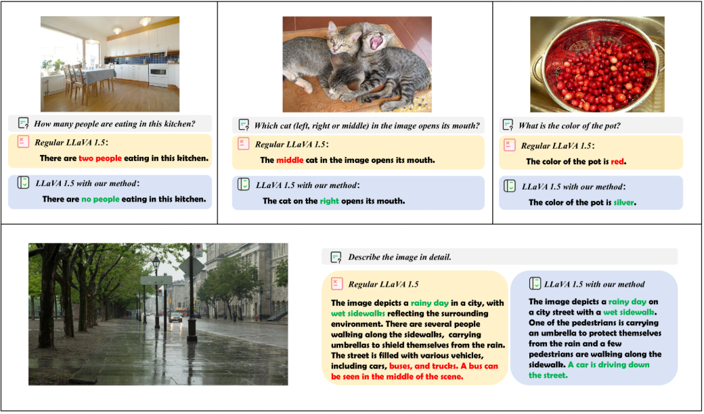
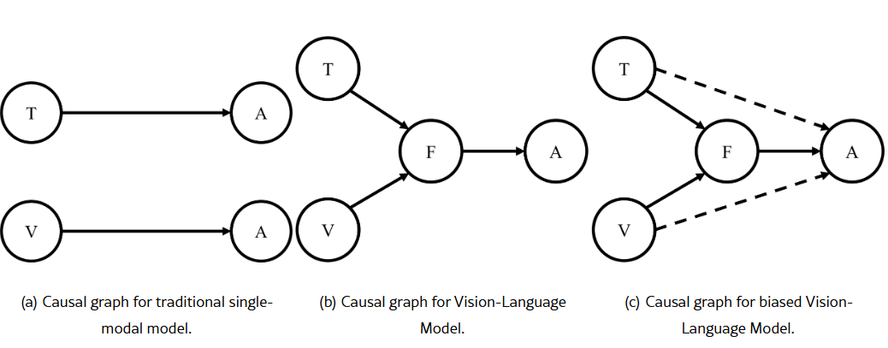
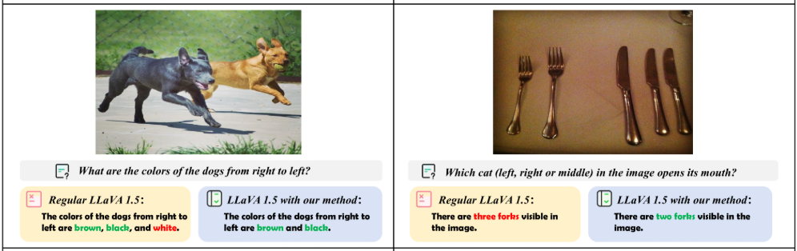

昨日のVLMの視覚幻覚について引用として提示した論文について内容を読んでみました。
本日は論文の要旨について説明の上、どのように使っていけるかについて検討してみます。

## 論文アブスト

この論文（Treble Counterfactual VLMs）のアブストラクトは、以下のような内容です。

> Vision-Language Models（VLM）は、画像キャプショニングや視覚的質問応答、推論などのマルチモーダルタスクで大きな進歩を遂げているが、視覚コンテキストやプロンプトと矛盾する**幻覚（hallucination）** を生成することが多く、自動運転や医療画像などのクリティカルな応用での信頼性を制限している。既存研究は幻覚を統計的バイアス、言語事前分布、偏った特徴学習と結びつけているが、**構造的な因果理解**が不足している。  
> 本研究では、VLMにおける幻覚を分析・軽減するために**因果的視点**を導入する。幻覚は、本来のマルチモーダル融合をバイパスし、視覚またはテキストのいずれかのモダリティが**意図しない直接影響**を及ぼすことから生じると仮説を立てる。  
> この問題に対処するため、VLMの因果グラフを構築し、反事実的解析を用いて、視覚・テキスト・およびそれらの**クロスモーダル相互作用**が出力に与える**Natural Direct Effect（NDE）** を推定する。そして、これらの意図しない直接効果を体系的に特定・軽減し、応答が**真のマルチモーダル融合**によって主に駆動されるようにする。  
> 提案手法は3つのステップからなる：  
> (1) 正しい融合経路とスプリアスなモダリティ・ショートカットを区別する構造的因果グラフの設計、  
> (2) 摂動された画像表現、幻覚テキスト埋め込み、劣化視覚入力を用いたモダリティ固有およびクロスモーダルNDEの推定、  
> (3) テスト時介入モジュールの実装により、各モダリティへの依存度を動的に調整する。  
> 実験結果は、提案手法がタスク性能を維持しつつ幻覚を大幅に削減することを示し、VLMの信頼性向上に向けた**堅牢で解釈可能な枠組み**を提供する。再現性とアクセシビリティのため、コードは公開されている。

（原文の要約：Vision-Language Models（VLM）の幻覚を**因果的視点**から分析し、視覚・テキスト・クロスモーダル相互作用の**Natural Direct Effect（NDE）** を反事実的解析で推定。意図しないモダリティ・ショートカットを特定・軽減し、テスト時介入モジュールで各モダリティへの依存を調整することで、幻覚を大幅に削減しつつタスク性能を維持する枠組みを提案している。）[arXiv](https://arxiv.org/html/2503.06169v2)

因みに実際に起きる幻覚はこんな感じのものとのことです。
なかなかインパクトあります。

## 解決しようとした課題

この論文が解決しようとした課題は、**「VLM（Vision-Language Model）における幻覚（hallucination）を、統計的・経験的な説明ではなく、構造的な因果関係として理解し、体系的に軽減する枠組みを提供すること」** です。

具体的には、以下のような点が課題として挙げられています[arXiv](https://arxiv.org/html/2503.06169v2)。

1. **幻覚の原因が因果的に理解されていない**  
   - 既存研究では、幻覚を「統計的バイアス」「言語事前分布」「偏った特徴学習」などと結びつけているが、  
   - **どのモダリティがどのように出力に直接影響しているか**という**構造的な因果理解**が不足している。

2. **マルチモーダル融合が不十分なまま、モダリティ・ショートカットが生じている**  
   - 本来は画像とテキストがきちんと融合された結果として出力されるべきだが、  
   - 実際には**視覚モダリティやテキストモダリティが単独で出力を決めてしまう「意図しない直接影響（unintended direct effects）」** が存在し、それが幻覚の原因になっている。

3. **幻覚を軽減するための体系的・解釈可能な枠組みがない**  
   - 既存手法は、データのフィルタリングやアライメント最適化などが中心で、  
   - **どのモダリティへの依存が過剰／不足しているかを因果的に診断し、テスト時に動的に調整する**ような枠組みが欠けている。

この論文は、  
- VLMの因果グラフを構築し、  
- 視覚・テキスト・クロスモーダル相互作用の**Natural Direct Effect（NDE）** を反事実的解析で推定し、  
- モダリティ・ショートカットを特定・軽減する**テスト時介入モジュール**を導入することで、  
**「幻覚を因果的に理解し、体系的に減らす」** という課題に取り組んでいます[arXiv](https://arxiv.org/html/2503.06169v2)。

## 提案手法
この論文（Treble Counterfactual VLMs）では、**「VLMの幻覚は、視覚・テキスト・クロスモーダル融合のどれが強く効きすぎているか」を因果的に診断し、テスト時に動的に調整する**手法を提案しています[arXiv](https://arxiv.org/html/2503.06169v2)。

### 1. 何が問題か（背景）

VLMは画像とテキストを融合して出力を生成しますが、実際には

- 画像をあまり見ずに**テキスト側の知識だけで答えてしまう**（言語事前分布に過度依存）
- 逆に、**テキストを無視して画像だけに引きずられる**

といった「**モダリティ・ショートカット**」が起きており、これが幻覚の原因になっています[arXiv](https://arxiv.org/html/2503.06169v2)。

既存研究は「データが偏っている」「言語事前分布が強い」など**統計的な説明**はしますが、

- 「どのモダリティがどの程度、出力に**直接影響**しているか」
- 「本来の**マルチモーダル融合**がちゃんと効いているか」

を**因果的に**診断する枠組みがありませんでした。

### 2. 提案手法の全体像

この論文は、**因果グラフ＋反事実的解析**を使って、以下の3ステップで幻覚を減らします[arXiv](https://arxiv.org/html/2503.06169v2)。

1. **構造的因果グラフ（SCG）の設計**  
   - VLMの入出力を「視覚」「テキスト」「クロスモーダル融合」「出力」のノードとして因果グラフを構築し、  
   - 「本来の融合経路」と「モダリティ・ショートカット経路」を区別します。

VLMの入出力を因果グラフで表すと、以下の3種類の経路に分けられます（以下絵を参考）。

- **T → A（テキスト単独）**  
  - 従来のLLMのように、**テキスト入力だけ**から答えAを出す経路。

- **V → A（視覚単独）**  
  - 従来のCVタスクのように、**画像だけ**から答えAを出す経路。

- **(V, T) → F → A（マルチモーダル融合）**  
  - 画像VとテキストTを**融合モジュールF**で統合し、その結果Fから答えAを出す経路。  
  - 本来のVLMは、この**融合経路が主役**であるべき。

2. **Natural Direct Effect（NDE）の推定**  
   - 反事実的解析（counterfactual analysis）を用いて、  
     - 視覚モダリティが**単独でどれだけ出力に効いているか**（視覚NDE）  
     - テキストモダリティが**単独でどれだけ効いているか**（テキストNDE）  
     - クロスモーダル融合が**どれだけ効いているか**（クロスモーダルNDE）  
   を推定します。  
   - 具体的には、  
     - 画像表現を摂動（ノイズを加えるなど）  
     - 幻覚テキスト埋め込みを注入  
     - 視覚入力を劣化させる  
   といった操作を行い、「もしこのモダリティだけが変わったら出力はどう変わるか」を観測します。

この論文は、**Natural Direct Effect（NDE）** という因果指標を使って、  
「視覚・テキスト・クロスモーダル融合が、それぞれどれだけ出力に直接効いているか」を数値化します[arXiv](https://arxiv.org/html/2503.06169v2)。

>__反事実的解析__
>**「もしこのモダリティだけを変えていたら、出力はどう変わっていたか？」を“仮想的に”観測する手法**です[arXiv](https://arxiv.org/html/2503.06169v2)。
>__反事実的解析の基本アイデア__  
>因果推論では、次の2つを区別します。
>- **事実（factual）**：実際に起きたこと  
>  - 例：実際の画像 v とテキスト t から出力 Y(t, v, F(t,v)) を得た。
>- **反事実（counterfactual）**：「もし〜だったら」という仮想世界  
>  - 例：**画像だけを v* に変えていたら**、出力は Y(t, v*, F(t,v*)) になっていただろう。
>この論文では、この**反事実的な出力の差**を取ることで、  
>「視覚モダリティが単独でどれだけ効いているか（NDE_V）」などを推定しています[arXiv](https://arxiv.org/html/2503.06169v2)。

__(1) Vision Direct Effect（NDE_V）__

- **視覚モダリティが単独でどれだけ効いているか**を測る。  
- テキストtは固定し、画像だけを変えたときの出力の変化を見る：  
  - 元の画像vと、処理した画像v*（ノイズ入りなど）で出力Yを比較  
  - $NDE(V) = Y(t, v, F(t,v)) − Y(t, v*, F(t,v*))$  
- これが大きいほど、「**画像が少し変わるだけで答えが大きく変わる**＝視覚への依存が強い」。

__(2) Text Direct Effect（NDE_T）__

- **テキストモダリティが単独でどれだけ効いているか**を測る。  
- 画像vは固定し、テキストだけを変えたときの出力の変化を見る：  
  - 元のテキストtと、処理したテキストt*（幻覚テキストなど）でYを比較  
  - $NDE(T) = Y(t, v, F(t,v)) − Y(t*, v, F(t*,v))$  
- これが大きいほど、「**テキストが少し変わるだけで答えが大きく変わる**＝テキストへの依存が強い」。

__(3) Cross-Modality Direct Effect（NDE_{V,T}）__

- **視覚とテキストの“相乗効果”**（画像がテキスト理解をどれだけ助けているか）を測る。  
- テキストtは固定し、  
  - 情報のある画像v* と、**情報のない画像v_null**（ノイズ画像など）で出力を比較：  
  - $NDE(V,T) = Y(t, v*, F(t,v*)) − Y(t, v_null, F(t,v_null))$  
- これが大きいほど、「**画像があるとテキスト理解が良くなる**＝真のマルチモーダル融合が効いている」。  
- 逆に小さい／負なら、「画像がノイズになって幻覚を引き起こしている」可能性。

3. **テスト時介入モジュール（test-time intervention）**  
   - 推定したNDEに基づき、  
     - 「視覚への依存が強すぎる」「テキストへの依存が強すぎる」といった**偏りを検出**し、  
     - 推論時に**各モダリティへの重みを動的に調整**します。  
   - これにより、出力が**真のマルチモーダル融合**によって主に駆動されるようにします。

### 3. 何がうれしいか（利点）

- **因果的に「どのモダリティが暴走しているか」を特定できる**  
  - 単に「幻覚が多い」ではなく、「視覚が効きすぎ」「テキストが効きすぎ」といった**原因の所在**がわかります。

- **訓練不要（training-free）でテスト時に介入できる**  
  - 既存のVLMに対して、**追加学習なし**でテスト時に介入モジュールを挟むだけで幻覚を減らせます。

- **解釈性が高い**  
  - NDEの大きさを見れば、「この入力では視覚がほとんど使われていない」など、**内部の依存関係**が可視化できます。

- **タスク性能を維持しつつ幻覚を減らせる**  
  - 実験では、既存ベンチマークで**幻覚を大幅に削減**しつつ、**タスク性能（Accuracyなど）をほぼ維持**できたと報告されています[arXiv](https://arxiv.org/html/2503.06169v2)。

### 4. イメージしやすい比喩

- VLMを「**画像とテキストの意見を聞いて決める会議**」と考えると、  
  - 本来は両方の意見を聞いて決めるべきなのに、  
  - 実際には「画像がほとんど発言していないのにテキスト側だけで決めてしまう」会議になっている。  
- この論文は、  
  - 「誰（どのモダリティ）がどれだけ発言権を持っているか」を**因果的に測定**し、  
  - 会議中に「画像さん、もう少し発言してください」「テキストさん、少し控えめに」と**動的に調整する司会役**を導入するイメージです。

このように、**幻覚の原因を「モダリティ間の力関係」として因果的に診断し、テスト時にバランスを取る**のが、本論文の提案手法の核です[arXiv](https://arxiv.org/html/2503.06169v2)。

## 提案手法の効果

この論文の実験結果からは、**「幻覚を大幅に減らしつつ、タスク性能も維持・向上する」** という効果が確認されています[arXiv](https://arxiv.org/html/2503.06169v2)。

### 1. POPEベンチマークでの効果（オブジェクト有無の幻覚抑制）

POPEは「画像に存在しないオブジェクトを“存在する”と答える幻覚」を測るベンチマークです。

- **LLaVA 1.5**  
  - Random設定：Accuracyが **83.49 → 89.10**（+5.61ポイント）  
  - Adversarial設定：Accuracyが **76.03 → 81.70**（+5.67ポイント）  
- **InstructBlip**  
  - Random設定：Accuracyが **80.42 → 88.83**（+8.41ポイント）  

→ いずれも**幻覚が減り、正答率が大幅に向上**しています[arXiv](https://arxiv.org/html/2503.06169v2)。

Appendixに今回手法の適用前後の結果がのっています。
なんか。。。覚えあるような間違え方。

### 2. MMHal-Benchでの効果（生成タスクにおける幻覚削減）

MMHal-Benchは、画像説明やVQAで**生成文が画像と矛盾する割合**を評価するベンチマークです。

- **平均スコア**（高いほど幻覚が少ない）  
  - ベースライン：2.06  
  - 既存手法VCD：2.69  
  - 既存手法Opera：2.64  
  - **提案手法：2.82（SOTA）**  
- **カテゴリ別**  
  - Attribute（属性）：4.00  
  - Comparison（比較）：3.83  
  → 特に**属性・比較といったマルチモーダル推論タスク**で強みを発揮[arXiv](https://arxiv.org/html/2503.06169v2)。

- **幻覚率の削減（LLaVA 1.5）**  
  - 通常：64.58%  
  - 提案手法（N=50サンプル）：**45.83%**  
  → **約19ポイントの幻覚削減**（約30%減）[arXiv](https://arxiv.org/html/2503.06169v2)。

### 3. 既存手法（VCD, Opera）との比較

- MMHal-Benchの平均スコアで、  
  - VCD（2.69）、Opera（2.64）を上回り、**2.82でSOTA**を達成[arXiv](https://arxiv.org/html/2503.06169v2)。  
- POPEでも、Random / Popular / Adversarialの各設定で**Accuracy・Recallが一貫して向上**しており、  
  - 既存の幻覚抑制手法よりも**安定して効果がある**ことが示されています[arXiv](https://arxiv.org/html/2503.06169v2)。

### 4. タスク性能の維持と汎用性

- **訓練不要（training-free）**で、既存VLMに**テスト時介入のみ**で適用できるため、  
  - 追加学習による性能劣化や過適合のリスクが少ない。  
- 実験では、  
  - POPEでAccuracyが向上しつつ、  
  - MMHal-Benchでも幻覚率が下がり、  
  - 特に**属性・比較タスク**で高いスコアを維持。  
→ **幻覚を減らしつつ、マルチモーダル推論能力も維持・向上**していることが確認されています[arXiv](https://arxiv.org/html/2503.06169v2)。

## 総括
- **論文の目的**：VLMの幻覚を「統計的説明」ではなく**因果的視点**で理解し、**モダリティ・ショートカット（視覚／テキストのどちらかが暴走）**を特定・軽減する枠組みを提案[arXiv](https://arxiv.org/html/2503.06169v2)。

- **手法の核**：  
  - **構造的因果グラフ**で「本来の融合経路」と「ショートカット経路」を区別。  
  - **反事実的解析**で、  
    - 視覚単独の影響（ $NDE_V$ ）  
    - テキスト単独の影響（ $NDE_T$ ）  
    - 視覚とテキストの相乗効果（ $NDE_{V,T}$ ）  
    を**Natural Direct Effect（NDE）**として数値化[arXiv](https://arxiv.org/html/2503.06169v2)。  
  - **テスト時介入**で、NDEに基づき中間表現を補正し、各モダリティへの依存度を動的に調整。

- **効果**：  
  - POPEでAccuracyが **+5〜8ポイント向上**（LLaVA 1.5, InstructBlip）[arXiv](https://arxiv.org/html/2503.06169v2)。  
  - MMHal-Benchで平均スコア **2.82（SOTA）**、幻覚率を**約20ポイント削減**（約30%減）[arXiv](https://arxiv.org/html/2503.06169v2)。  
  - 既存手法（VCD, Opera）を上回り、**訓練不要でタスク性能を維持しつつ幻覚を大幅に抑制**。

- **応用イメージ**：  
  - 「画像とテキストのどちらが強く効きすぎているか」を**因果的に診断**し、  
  - テスト時に「視覚さん／テキストさんの発言権を動的に調整する司会役」を挟むことで、**真のマルチモーダル融合を促す**枠組みとして活用できる[arXiv](https://arxiv.org/html/2503.06169v2)。

## 引用

本記事の図は以下の論文のものを引用しています。

- **著者**：Shawn Li, Jiashu Qu, Yuxiao Zhou, Yuehan Qin, Tiankai Yang, Yue Zhao  
- **所属**：University of Southern California, University of Cincinnati, National University of Singapore  
- **報告日**：2025年3月（arXiv ID 2503.06169v2 より）  
- **タイトル**：Treble Counterfactual VLMs: A Causal Approach to Hallucination  
- **URL**：https://arxiv.org/html/2503.06169v2  
[arXiv](https://arxiv.org/html/2503.06169v2)
