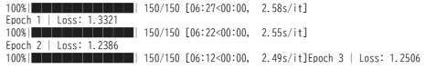

今回は前回までで扱ってきたVLM(Vision-Language Model)について、学習コード選定、モデル実装の上実際に学習まで行ってみました。
実装までと、試験の結果をまとめます。

## 本試験の目的と進め方

Q-Former + LoRA を用いた最小構成 VLM 実験について以下に示します。


### 1. この試験で何を確認したいのか（試験意図）

#### 背景

VLMは、

* 画像エンコーダ（Vision Encoder）
* 言語モデル（LLM）
* それらをつなぐ中間機構（Q-Former など）

から構成されます。

しかし実装・学習が複雑なため、

> 「本当に“画像情報”が言語生成に使われているのか？」
> 「どのモジュールがどの役割を果たしているのか？」

が分かりにくくなりがちです。

#### 本試験の狙い

**この実験では、次の一点だけを明確に確認します。**

> **Q-Former を介して画像特徴を与えることで、
> LLM の出力が画像に依存して変化するようになるか？**

つまり、

* Vision Encoder は「特徴抽出器」
* Q-Former は「視覚情報の要約・選別器」
* LLM（LoRA）は「画像条件付き言語生成器」

として **役割分担が成立しているか** を検証します。

#### なぜ Q-Former + LoRA なのか

* LLM 全体を学習すると
  → *言語能力の再学習* と *視覚条件付け* が混ざってしまう
* Q-Formerのみだと
  → LLM 側が画像を活用しきれない場合がある

そこで、

* **Q-Former：画像情報を抽出・圧縮**
* **LoRA：LLMが画像トークンを“どう使うか”だけ学習**

という **最小限かつ因果関係が追いやすい構成**を採用します。

### 2. この試験で「やらないこと」

本試験は**性能競争が目的ではありません**。

以下は意図的に行いません。

* ❌ 大規模データセットでの高精度評価
* ❌ Vision Encoder や LLM 本体のフルファインチューニング
* ❌ 複雑なタスク（VQA、指示追従など）

目的はあくまで **構造理解と動作確認** です。


### 3. モデル構成の全体像（概念図）

```
画像
 ↓
Vision Encoder（CLIP, freeze）
 ↓
視覚特徴列
 ↓
Q-Former（学習）
 ↓
少数の視覚トークン
 ↓
Linear Projection（学習）
 ↓
LLM 入力空間
 ↓
LLM + LoRA（LoRAのみ学習）
 ↓
テキスト生成
```

### 4. 試験をどのように進めるか（手順）

#### Step 1: 最小データでの準備

* データ：COCO / Flickr30k のごく一部
* タスク：**画像 → 短いキャプション生成**
* 目的：

  * loss が下がるか
  * 学習が正常に流れるか

#### Step 2: Freeze / Train の切り分け確認

| モジュール          | 状態     |
| -------------- | ------ |
| Vision Encoder | freeze |
| LLM 本体         | freeze |
| Q-Former       | train  |
| LLM LoRA       | train  |
| Projection     | train  |

→ **学習パラメータが少量であること**を確認する

#### Step 3: 学習が成立しているかの確認

学習がうまく進むかについて以下を確認します。

* loss が epoch ごとに減少する
* 同じ文章でも、画像を変えると生成が変わる
* Q-Former を固定すると性能が落ちる

これにより、

> 「画像 → Q-Former → LLM」
> という情報経路が実際に使われている

ことを確認します。

#### Step 4: 対照実験（重要）

理解を深めるために以下を比較します。

| 実験                | 期待される結果  |
| ----------------- | -------- |
| Q-Formerあり        | 画像依存の生成  |
| Q-Formerなし（平均プール） | 表現力が低下   |
| LoRAなし            | 画像を無視しがち |

→ **各構成要素の役割を分離して理解**できます。

### 5. この試験で得られるもの

#### 技術的に理解できること

* Q-Former の役割（なぜ Query が必要か）
* LLM が画像トークンをどう条件として使うか
* LoRA が「適応」だけを担う仕組み

#### 実装的に得られること

* BLIP-2 系 VLM の最小実装テンプレート
* Colab で再現可能な実験環境
* 将来の拡張（VQA / Instruct / 大規模化）の土台

### 6. この実験の位置づけ（まとめ）

この試験は、

> 「VLM を“ブラックボックスとして使う”前に、
> “中で何が起きているかを理解する”ための通過点」

です。

* 成功すれば
  → 自作 VLM の設計・改良が理論的にできる
* 失敗しても
  → どの接続・学習が効いていないかが分かる

ということを検証することを目的としています。

## 実験の対象

VLMで基本的なタスクである Image Captionを題材とします。

先程述べた目的に沿うように学習して画像の説明が出来ることを確認することがターゲットです。

また、実験を行う環境はgoogle colab上で行います。

### 学習データセット

データセットは **Flickr8k Dataset** というものを使います。

__概要__

Flickr8k は、
**画像と自然言語キャプションの対応関係を学習するための代表的な画像キャプション生成データセット**です。

__基本仕様__

| 項目       | 内容                |
| -------- | ----------------- |
| 画像数      | **8,000 枚**       |
| キャプション   | **各画像に 5 文ずつ**    |
| 総キャプション数 | 約 **40,000 文**    |
| 言語       | 英語                |
| 画像内容     | 人物・動物・日常風景・屋外活動など |


__データの構造__

__① 画像__

* JPEG 画像
* 実世界の写真（Flickr 由来）
* 解像度はばらつきあり

例：

* 子供が遊んでいる
* 犬が走っている
* 人が自転車に乗っている

__② キャプション（教師データ）__

各画像に対して **5 つの異なる説明文**があります。

例：

```
A man riding a bicycle on a city street.
A cyclist rides down the road.
A person on a bike in traffic.
A man is biking along the street.
A bicycle rider moves through the city.
```

→ **意味は同じだが表現が異なる**
→ 言語生成モデルの学習に非常に有効

__今回の学習での使い方__

入力と出力の対応は以下の通りで典型的な **Image Captioning（画像キャプション生成）** タスクです。

| モデル入力 | モデル出力   |
| ----- | ------- |
| 画像    | キャプション文 |

### モデルの構成

以下では、 **今回あなたが構築・学習した VLM（Vision-Language Model）の構成** を説明していきます。

__モデル全体像__

今回構築したモデルは、次の 4 つの主要コンポーネントから成ります。

```
画像
 ↓
Vision Encoder（CLIP）
 ↓
Q-Former（Query-based Transformer）
 ↓
Projection Layer
 ↓
LLM（GPT-2 + LoRA）
 ↓
テキスト（キャプション）
```

これは **BLIP-2 系 VLM の最小構成**を、
**Google Colab 上で動くサイズ**に落とし込んだものです。

__各コンポーネントの役割__

__① Vision Encoder（CLIP ViT）__

**役割**

* 画像を「視覚トークン列」に変換する

**特徴**

* 事前学習済み
* 高品質な視覚特徴を安定して抽出
* 学習中は **凍結（freeze）**

**なぜ凍結するか**

* 実験目的が「VLM の接続部の検証」であり、
* 画像認識性能そのものを改善する必要がないため

__② Q-Former（Query-based Transformer）__

**役割**

* 大量の視覚トークンから
* **少数の query token を使って重要情報だけを抽出**

**仕組み**

* Learnable query tokens
* Cross-Attention（query → image）

**出力**

* 固定長（例：32 個）の視覚要約トークン

**今回の実験での位置づけ**

* 本実験の**主役**
* 「視覚と言語をどう接続するか」の検証対象

__③ Projection Layer（線形写像）__

**役割**

* Q-Former 出力を
* LLM の埋め込み空間に変換

**なぜ必要か**

* Vision 側と LLM 側では

  * 次元数
  * 分布
    が異なるため

**構成**

* 単一の Linear Layer（最小構成）

__④ LLM（GPT-2 + LoRA）__

**役割**

* 視覚条件付きで自然言語を生成

**設定**

* GPT-2 small
* LoRA による軽量ファインチューニング
* ベース重みはほぼ凍結

**なぜ LoRA を使うか**

* Colab で学習可能
* 過学習を防ぐ
* 視覚情報への適応のみを促す

__今回構成の意図__

今回の目的は：

> **「Q-Former を含む VLM が視覚情報を言語生成に正しく注入できるか」を最小構成で検証すること**


__各設計選択の妥当性__

__Vision Encoder を凍結__

* 視覚特徴は十分高品質
* 変数を増やさない
* 実験の再現性が高い

__Q-Former を導入__

* 視覚→言語接続の最重要部分
* Query token による情報圧縮を検証可能
* 単純 concat より構造的

__単純な Projection__

* 不要な複雑性を排除
* 問題が起きたとき原因を特定しやすい

__小型 LLM + LoRA__

* 計算資源制約に適合
* 「画像条件付き生成」が成立するかに集中できる

## 実験結果

### コード

実際に組んだコードは以下のレポジトリに保管しています。

https://github.com/Shinichi0713/LLM-fundamental-study/tree/main/vlm/src/simple_llava


### 学習

3epoch学習させました。
未だ学習は十分ではないかもしれませんが、一旦性能を確認してみます。



### 評価


この絵を入力してみましたが出力は何も行われませんでした。
出てくるなり、[EOS] だったため文章生成自体されなかったという結果に終わりました。

その他の絵も同様だったため、今回作成したモデルでは思うようなcaptionはされないという結果になりました。

## 結論

google colabでも動作するということで、かなりモデルのサイズは小さくせざるをえませんでした。
また、学習時のパラメータを抑えるためにq-loraを用いて、LLM自体の学習は行わないようにしています。

今回の結果ですが、[EOS]が出てくること自体は、コードによる学習は行われたということになりそうです。
(ダメならば、もっと意味のないトークンが並ぶことが多いようです)

この場合、LLMからすると、まだ何を行うべきかが理解できていないということが解釈となりそうです。

原因は学習の不足、VLMの能力不足が理由に上がりそうです。

次回以降の反省点としていきたいと思います。


