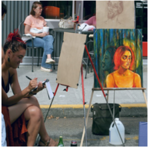
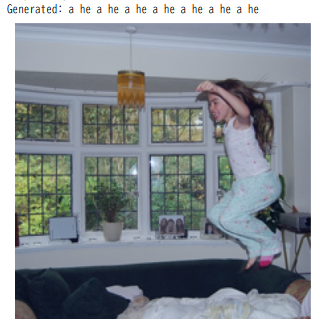
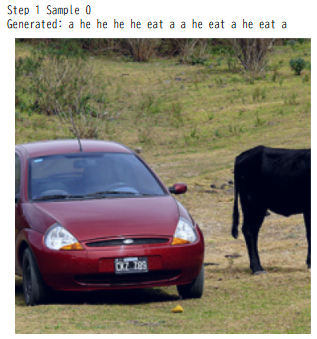
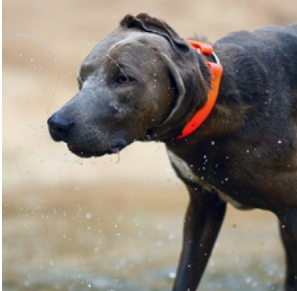

先日うまくいかなかった自作VLMを再チャレンジしようと思います。
タスクはImage Captionで、Image Captionをうまく理解できるようにすることを目的として検討します。

因みに先日はQ-Formerの学習試行を行いました。
GPT-2ベースでモデル構築の上学習しましたが、あまりうまくいかなかったという結果でした。

https://yoshishinnze.hatenablog.com/entry/2026/02/01/000000

## 目的

目的を整理します。

> **Google Colab 上で動く範囲で、先ほどの最小VLM（CLIP + Q-Former + GPT-2）よりVQA性能を明確に向上させたい**

この条件では、単にモデルを大きくするよりも、

* **Image Captionに適したアーキテクチャ**
* **事前学習済みマルチモーダル表現の活用**
* **Colabで学習・推論可能な計算量**

のバランスが重要です。

## 原因考察

先日の構成（**CLIP + Q-Former + GPT-2**）で **Image Caption が生成されなかった（`tensor([[50256]])` → 空出力）件**は、単一の不具合というより、**構成的に起きやすい失敗要因が重なった典型例**です。

### 結論（最も本質的な理由）

**GPT-2は「条件付き生成（conditioning）」に弱く、Q-Former経由の視覚情報をほぼ利用できていない可能性が高い**

その結果：

* 視覚特徴を無視
* 開始直後に `<eos>` を出力
* → 空キャプション

`50256` は GPT-2 の **eos token** です。

### 失敗の主因（構造レベル）

#### ① GPT-2はEncoder-Decoderではない

GPT-2は：

* **Decoder-only**
* 本来の用途：次トークン予測（テキスト続き生成）

今回の構成：

```
Image → CLIP → Q-Former → GPT-2
```

ここで問題：

* GPT-2には「外部特徴を強制的に使う仕組み」がない
* Cross-Attentionが標準では存在しない

結果：

**条件無視問題**

学習中も：

```
P(token | previous tokens)
```

だけで最適化されるため、

視覚特徴を使うよりも

```
即EOS
```

の方が損失が小さくなるケースが多い。
→GPT-2は損失最小のため、EOSをすぐに出してダメージ最小化を狙ってた可能性があります。

#### ② 学習データ量が少なすぎる

Flickr8k：

* 6,000〜8,000画像
* GPT-2: 1億パラメータ

これは実質：

> 視覚条件付き言語生成をゼロから学習させている状態

結果：

* 条件無視
* モード崩壊
* EOS出力

#### ③ Q-Former→GPT-2接続の情報量不足

典型的な実装：

```
Q-Former出力 → Linear → GPT-2 embedding次元
```

問題：

* GPT-2はprefix conditioningに弱い
* 数個のトークンでは影響が消える

BLIP2がOPT/T5を使う理由はここです。

#### ④ 学習安定性の問題（実務的に多い）

もし以下条件なら、ほぼ失敗します：

* GPT-2フル学習
* batch小
* learning rate大きい
* LoRAなし

結果：

* Language prior崩壊
* 生成不能
* EOS固定

#### ⑤ Attention mask警告（ログの内容）

先日でていたログ：

> pad token is same as eos token

これは：

* GPT-2のpad設定不適切
* 学習時にEOSが過学習される

これもEOS出力を助長します。

### 今回構成

文章生成するLLMをGPT-2からFlan-T5に変更しようと思います。
なぜFlan-T5では改善するのかですが。

|                 | GPT-2        | Flan-T5         |
| --------------- | ------------ | --------------- |
| 構造            | Decoder-only | Encoder-Decoder |
| 外部条件        | 弱い         | 強い            |
| Cross-Attention | なし         | あり            |
| 少量データ      | 弱い         | 比較的強い      |
| VLM用途         | 不向き       | 向いている      |

## モデル構築

次に上述の、**Flan-T5 を言語モデルとして用いた Q-Former 型 VLM**を、BLIP-2の考え方に沿って**自分で構築する方法**を、研究実装レベルで体系的に説明します。
（Colabでの実装を前提、かつ今回のトラブルを避ける構成にしています）

### 全体構成（Flan-T5 + Q-Former）

BLIP-2型VLMは次の3ブロックです。

```
画像
  ↓
Vision Encoder（CLIP ViT）
  ↓
Q-Former（Query Transformer）
  ↓
Flan-T5（Encoder-Decoder LLM）
  ↓
テキスト生成
```

##### 各役割

| モジュール     | 役割                           |
| -------------- | ------------------------------ |
| Vision Encoder | 画像 → patch特徴              |
| Q-Former       | 画像特徴を言語トークン数に圧縮 |
| Flan-T5        | テキスト生成                   |

ポイント：

> **LLMは直接画像を見ない** = Q-Formerが「言語に近い表現」を作る

### Step 1：モデル選択（Colab向け）

今回使うモデル・ネットワークパラメータは以下とします。

* Vision: `openai/clip-vit-base-patch32`
* Q-Former: `Blip2QFormerModel`
* LLM: `google/flan-t5-base`

選定理由はGoogle Colabで動作させるギリギリだからです。

* VRAM ≈ 8〜10GBで動く
* XLは15GB以上必要

### Step 2：基本ロード

```python
import torch
from transformers import (
    CLIPVisionModel,
    Blip2QFormerConfig,
    Blip2QFormerModel,
    T5ForConditionalGeneration,
    T5Tokenizer
)

device = "cuda" if torch.cuda.is_available() else "cpu"

# Vision Encoder
vision_model = CLIPVisionModel.from_pretrained(
    "openai/clip-vit-base-patch32"
).to(device)

vision_model.eval()
for p in vision_model.parameters():
    p.requires_grad = False
```

### Step 3：Q-Former構築

Q-Formerは

* learnable query tokens
* cross-attention to vision features

### 設定

```python
qformer_config = Blip2QFormerConfig(
    hidden_size=768,
    num_hidden_layers=6,
    num_attention_heads=12,
    intermediate_size=3072,
    encoder_hidden_size=vision_model.config.hidden_size
)

qformer = Blip2QFormerModel(qformer_config).to(device)

# Query tokens（重要）
num_query_tokens = 32
query_tokens = torch.nn.Parameter(
    torch.randn(1, num_query_tokens, qformer_config.hidden_size)
).to(device)
```

※これが以前の `query_tokens` エラーの本体です
BLIP2本体以外では**自分で持つ必要があります**

### Step 4：Flan-T5ロード

```python
tokenizer = T5Tokenizer.from_pretrained("google/flan-t5-base")

llm = T5ForConditionalGeneration.from_pretrained(
    "google/flan-t5-base"
).to(device)

# LLMは凍結（BLIP-2戦略）
for p in llm.parameters():
    p.requires_grad = False
```

理由
→ Colabで学習安定
→ Q-Formerだけ学習するのがBLIP-2の本質

### Step 5：Projection（重要）

Q-Formerの出力 → T5埋め込み次元へ

```python
proj = torch.nn.Linear(
    qformer_config.hidden_size,
    llm.config.d_model
).to(device)
```

### Step 6：Forward処理（核心）

```python
def forward(image, input_ids, attention_mask):
    # 1. Vision
    with torch.no_grad():
        vision_outputs = vision_model(pixel_values=image)
        image_embeds = vision_outputs.last_hidden_state

    B = image.size(0)

    # 2. Query expand
    queries = query_tokens.expand(B, -1, -1)

    # 3. Q-Former
    q_outputs = qformer(
        query_embeds=queries,
        encoder_hidden_states=image_embeds,
        return_dict=True
    )

    q_hidden = q_outputs.last_hidden_state

    # 4. Projection
    q_hidden = proj(q_hidden)

    # 5. T5 Encoder入力として使用
    encoder_outputs = llm.encoder(
        inputs_embeds=q_hidden,
        return_dict=True
    )

    # 6. Text generation loss
    outputs = llm(
        encoder_outputs=encoder_outputs,
        labels=input_ids,
        attention_mask=attention_mask
    )

    return outputs
```

ここが

> **Q-Former → LLMの接続の本質**

### Step 7：学習対象パラメータ

```python
trainable = list(qformer.parameters()) + \
            list(proj.parameters()) + \
            [query_tokens]

optimizer = torch.optim.AdamW(trainable, lr=1e-4)
```

BLIP-2戦略：

| モジュール   | 学習   |
| ------------ | ------ |
| Vision       | Freeze |
| Flan-T5      | Freeze |
| Q-Former     | Train  |
| Query tokens | Train  |
| Projection   | Train  |

### Step 8：なぜこの構成が良いか（実験的理由）

##### ① Colabで現実的

Flan-T5-base ≈ 1GB

##### ② GPT-2より強い理由

Flan-T5は

* Encoder-Decoder
* Cross-attention設計
* Instruction tuning済み

→ VLM適性が高い

##### ③ BLIP-2理論に一致

BLIP-2の思想：

> 大きなLLMは凍結
> 小さな橋だけ学習

これを完全に再現しています。

### Step 9：生成（テスト）

```python
def generate(image, prompt="Describe the image"):
    inputs = tokenizer(prompt, return_tensors="pt").to(device)

    with torch.no_grad():
        vision_outputs = vision_model(pixel_values=image)
        image_embeds = vision_outputs.last_hidden_state

        B = image.size(0)
        queries = query_tokens.expand(B, -1, -1)

        q_outputs = qformer(
            query_embeds=queries,
            encoder_hidden_states=image_embeds,
            return_dict=True
        )

        q_hidden = proj(q_outputs.last_hidden_state)

        encoder_outputs = llm.encoder(
            inputs_embeds=q_hidden,
            return_dict=True
        )

        outputs = llm.generate(
            encoder_outputs=encoder_outputs,
            max_length=30
        )

    return tokenizer.decode(outputs[0], skip_special_tokens=True)
```

### まとめ（研究的視点）

Flan-T5 + Q-Former構築の要点

1. Visionを凍結
2. Query tokensを自前で持つ
3. Q-Formerで圧縮
4. LinearでT5次元へ
5. T5 encoderに inputs_embeds で渡す
6. LLMは凍結

## 実験結果

学習は5 epoch。

ロスはこんな感じで推移しました。

```
Epoch 1, Loss: 9.9075
Epoch 2, Loss: 9.9085
Epoch 3, Loss: 9.9094
Epoch 4, Loss: 9.9139
Epoch 5, Loss: 9.9096
```

### テスト

学習後、loaderから適当にピックアップして、文章生成しました。
画像と生成された文章をセットで出力します。

__モデル出力__



うーん。。。
全然違う。。。
文章は生成できるようになりましたが、全然違う意味を出力しています。

```
Step 0 Sample 0
Generated: - The Associated Press - The Associated Press is a news organization that covers the political and economic news from Washington, D.
```

但し、今度は文章生成できるようになりました。
Google Colabが時間制限あったので、泣く泣く学習時間を短くしたことが少なからず影響あったかもしれません。

学習している場所がかなり極小なので変換しきれなかったか。。。

__その後モデルを学習すると__





学習可能なパラメータを見直すとロスがしっかりと落ちるようになりました。

```
Epoch 1, Loss: 7.5303
Epoch 2, Loss: 6.4150
Epoch 3, Loss: 5.9526
Epoch 4, Loss: 5.6372
Epoch 5, Loss: 5.3762
```

Step 2 Sample 3
Generated: A black dog is running in a sasse .



sasseが謎ですが、絵を見て認識するようになってきました。


## 振り返り

今回は前回うまくいかなかった点からモデルの内部構造を見直しました。

と言ってもQ-Formerはそのまま、中のLLMをFlan-T5に替えました。
原則Cross-Attentionでないと、マルチモーダルはうまく稼働しないという仮説を基にしています。

前回とは異なり、絵を見て表現できるようになりました。

今回の学びは以下です。

1. Q-FormerでCaptioningの学習をさせることで、絵を見た表現が出来る。
2. ネットワークパラメータはQ-formerやクエリ、クエリトークンの3カ所のみを学習すれば十分。
3. 学習を成立させるにはCross-Modalを持つネットワークであると良い。

最後まで読んでくださってありがとうございました。

