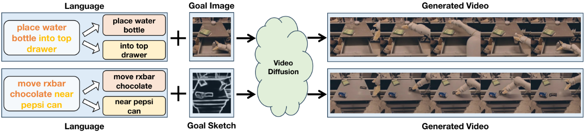
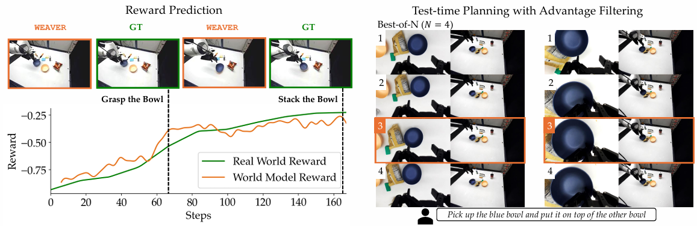
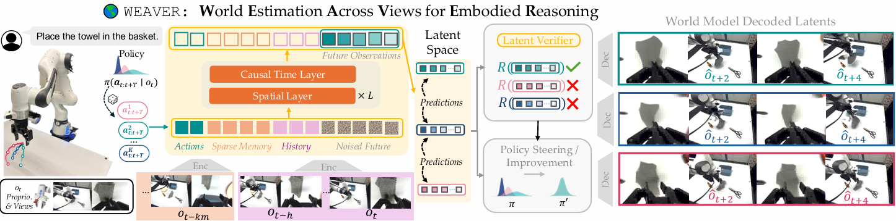

## 概要
「ワールドモデル（World Model）」について、わかりやすく説明いたします。

### 1. 核心となる考え方

ワールドモデルとは、**AIが「世界がどう動くか」を内部に構築した予測モデル**のことです。
つまり、AIが「今この行動を取ると、未来はこう変化するだろう」と想像できるようになるための「頭の中のシミュレータ」です。

### 2. 直感的な例え

**運転免許の学科試験を思い出してください。**

本番の車に乗る前に、教科書や教習所で「ハンドルを右に切ると車体は右に進む」「スピードが出ているときに急ブレーキを踏むと横滑りする」といった**世界のルール**を学びますよね。

ワールドモデルも同じです。
AIが実際に行動を起こす前に、あるいは行動しながら、「世界のルール」を学習し、頭の中で「もしこうしたらどうなる？」とシミュレーションできるようになります。

### 3. どうやって動くのか

ワールドモデルは主に以下の3つの要素で成り立ちます。

| 要素 | 役割 | 例え |
|------|------|------|
| **表現モデル（Representation Model）** | 目の前の情報を圧縮して理解する | カメラ映像から「車がいる」「道が曲がっている」を抽出 |
| **遷移モデル（Transition Model / Dynamics Model）** | 「次の状態はどうなるか」を予測する | アクセルを踏んだら速度が上がる、と予測 |
| **報酬予測（Reward Prediction）** | その行動が良い結果か悪い結果かを予測する | この操作ならゴールに近づく、あるいは衝突する |

AIはまず現実のデータ（動画、センサーデータなど）から「世界の法則」を学びます。
そして、実際に体を動かす前に、この内部モデルの中で「もし右に行ったら…」「もし止まったら…」と何十回もシミュレーションし、最良の行動を選びます。

### 4. 何が便利なのか

ワールドモデルがあると、AIは以下のことができるようになります。

- **少ない試行で学習できる**: 実際に何百回も転んでロボットを壊さなくても、頭の中で練習できる
- **計画が立てられる**: 「3手先まで読む」ような戦略的行動が可能になる
- **創造ができる**: 現実にない状況も想像できるため、物語生成や映像生成にも応用される

### 5. よく混同される概念との違い

**通常のAI（判別モデル）**: 「この画像は猫です」→ 今を見分ける
**ワールドモデル**: 「このボールを投げると、あそこに落ちます」→ 未来を予測・シミュレーションする

ワールドモデルは「何かを認識する」のではなく、**「世界がどう動くかを理解する」** ことを目指しています。

## 強化学習の環境との違い

とても良い質問です。この違いを理解すると、ワールドモデルの役割がさらに明確になります。

### 1. 核心となる違い

一言で言えば、

- **強化学習の環境**: 本物の世界（外側にあるもの）
- **ワールドモデル**: 本物をまねて頭の中で作った「模造品」（内側にあるもの）

です。

### 2. 直感的な例え

**自動車教習所を想像してください。**

- **RLの環境**: 実際の教習車と教習所のコース。本当にエンジンをかけて、本当にブレーキを踏む。ぶつかったら本当に凹む。
- **ワールドモデル**: 家でプレイする「運転シミュレータゲーム」。コントローラーを操作すると画面の車が動く。何度衝突しても怪我も出ないし、修理費もかからない。

AIにとっても同じです。RLの環境は「本当に行動して本当に結果を受け取る場所」ですが、ワールドモデルは「頭の中で安全に練習するための模擬空間」です。

### 3. 具体的な違い

| 比較項目 | 強化学習の環境 | ワールドモデル |
|---------|-------------|--------------|
| **存在場所** | 外側（シミュレータ、ロボット、ゲーム画面など） | 内側（AIのニューラルネットワークの中） |
| **正確さ** | 「本物」なので常に正しい | 予測なので、近似値。時々間違う |
| **試行のコスト** | 時間がかかる。壊れるリスクがある | 一瞬で何千回もシミュレーション可能 |
| **使い方** | 実際に行動して報酬をもらう | 「もしこうしたらどうなる？」と想像する |
| **情報の形** | 生の観測（画像、センサー値など） | 圧縮された表現や予測された次の状態 |

### 4. なぜ両方必要なのか

ここが重要なポイントです。ワールドモデルはRLを**補助する**ために使われます。

**RLだけの場合の問題点:**
ロボットが「歩く」を学びたいとき、実際に1万回転倒しながら学習するのは時間がかかり、ロボットも壊れます。

**ワールドモデルを使った場合:**
1. まず少しだけ本物の環境で遊んで、データを集める
2. そのデータから「世界の法則」を学んで、ワールドモデルを作る
3. これ以降の練習は**頭の中のワールドモデル**で行う。1秒で何百回も「右足を出したらどうなる？」とシミュレーション
4. 良さそうな歩き方が見つかったら、最後に本物の環境で試す

このように、**本物の環境は「最終試験」**、**ワールドモデルは「自宅での模擬試験」** のような関係です。

### 5. 境界：ワールドモデルの限界

ワールドモデルは便利ですが、完璧ではありません。

- **予測できない出来事**: 突然飛び出してきた自転車、風で飛ばされた紙など、学習時に見たことのないものは予測が外れます。
- **誤差の蓄積**: 「次の状態」を予測し、その予測された状態からさらに「次の次」を予測すると、少しずつズレが大きくなっていきます。

だからこそ、ワールドモデルで練習した後も、**時々本物の環境に戻って確認する**必要があるのです。

## 応用例

ワールドモデルの実際の応用例について、最新の研究動向も含めてご紹介いたします。

### 1. ロボティクス（ロボット制御）

これが最も古典的で、かつ現在も最も活発な応用分野です。

**Dreamer（DeepMind）**
強化学習エージェントが「頭の中のワールドモデル」で何千回も練習し、実際のロボット動作を大幅に効率化します。最新版のDreamer 4では、複雑な制御タスクをワールドモデル内部で学習できることが示されています。<source-chip title="TechXplore" url="https://techxplore.com/news/2025-10-deepmind-ai-agent-tasks-scalable.html" />

[**RoboDreamer**](https://arxiv.org/html/2404.12377v1)
ロボットが「想像力」を使って作業を計画できるようにするための構成要素型ワールドモデルです。言語指示（「赤いブロックを左に移動して」など）から、ロボットが頭の中で動作をシミュレーションし、最適な手順を見つけます。

[**WEAVER / MANIPDREAMER / DreamX-Phi 1.0**](http://arxiv.org/abs/2606.13672v2)
これらはいずれも「ロボットマニピュレーション（物体を掴む・動かす）」に特化したワールドモデルです。カメラ映像から「この動作をすると物体はこう動く」を予測し、失敗しにくい動作計画を立てます。

### 2. 自動運転

[自動運転車は「周囲の車や人が次にどう動くか」を正確に予測](https://arxiv.org/html/2411.14499v4)する必要があります。ワールドモデルはここで大活躍します。

- **周囲車両の行動予測**: 他の車が車線変更するか、停止するかを数秒先まで予測
- **リスクシミュレーション**: 「このまま走行したら衝突するか？」を頭の中で確認
- **悪天候・夜間の補完**: 視認性が悪い状況でも、学習した「世界の法則」から状況を推測

この分野では、ワールドモデルが「今の状況理解」と「未来予測」の両方を担います。

### 3. 動画生成・シミュレーション（Soraなど）

OpenAIの**Sora**のような動画生成モデルも、広義にはワールドモデルの一種と見なされています。

- **物理法則の学習**: ボールが落ちる、水が流れる、光の反射などを自然に再現
- **因果関係の把握**: 「火に近づくと氷が溶ける」といった関係を映像で表現

ただし、[Sora](https://arxiv.org/pdf/2403.05131)が「本当に世界の法則を理解しているのか、それとも見たことのあるパターンを巧みに繋いでいるだけなのか」は、現在も研究者の間で議論の最中です。

### 4. ゲームAI

**生成型ゲーム**
ワールドモデルが「次のゲーム画面」を生成し、プレイヤーの行動に応じてリアルタイムに世界を作り上げます。従来のあらかじめ作られたマップではなく、AIがその場で世界を「想像」しながら展開するゲームが研究されています。

### 5. 社会シミュレーション（Social Simulacra）

これは少し抽象的ですが、人々の行動や社会の動きをシミュレートする応用です。

- **都市の交通流シミュレーション**
- **災害時の人々の避難行動予測**
- **経済活動や世論形成のモデル化**

[人間の意思決定プロセスをワールドモデル](https://arxiv.org/html/2411.14499v4)として構築し、「この政策を実施したら社会はどう動くか」を仮想的に試験できます。

## 実際どんなものなのか？

応用例のうちロボティクスで触れたWEAVERを例にどんなものか考えてみます。

### 1. つまりこういうものです

**WEAVERは「ロボット専用の頭脳内シミュレータ」です。**

カメラで見た映像から「このまま動かしたら未来はこうなる」と予測し、その予測を使って「どの動作が一番うまくいきそうか」を自ら選べるようになるAIです。

構成だけで言うと以下のようなものです。

__構成__

**「ビジョンつきLLM（VLM）のエンコーダ」ではなく、「ビデオ生成モデルの pretrained encoder」です。**

WEAVERの論文では以下のように書かれています。

> 「ビデオ生成コミュニティから、pretrained encoder [35] の使用を採用した（out-of-distribution robustness のため）」<source-chip title="arXiv" url="http://arxiv.org/abs/2606.13672v2" />

つまり、**ビデオ生成モデル（動画を生成・圧縮するモデル）** のエンコーダを使っています。

__WEAVERの正確な構造__

| 構成要素 | 詳細 |
|---------|------|
| **エンコーダ** | ビデオ生成モデルの pretrained encoder（画像・動画を圧縮した潜在表現に変換） |
| **メモリ・アーキテクチャ** | 複数カメラ視点・過去の履歴を統合 |
| **予測機構** | Flow matching + Diffusion forcing で未来の潜在表現を予測 |
| **ヘッド1** | **Reward head**（その行動は成功するか） |
| **ヘッド2** | **Critic head / Value head**（長期的に見て有利か） |

__なぜ「ビデオ生成モデルのエンコーダ」なのか__

VLMのエンコーダは「画像の内容をテキストに繋ぐ」ために設計されています。

一方、WEAVERに必要だったのは「**画像や動画を圧縮して、未来のフレームを再構成できる潜在表現**」を作る能力です。これはビデオ生成モデルのエンコーダの方が適していました。

### 2. 直感的な例え

**料理動画を見ながら「あ、あそこで火が強すぎると焦げるな」と頭の中で想像するあなた**を想像してください。

- 目の前の食材や鍋の状態を見て（カメラ映像）
- 「もし今強火にしたら…」と未来を想像する（未来状態の予測）
- 「焦げて失敗しそうだから中火にしよう」と判断する（報酬・価値の評価）

WEAVERはまさにこれをロボットができるようにする技術です。

### 3. 何が他と違うのか

ワールドモデルは他にもありますが、WEAVERは3つの点で特別です。

| 特徴 | 他のモデル | WEAVER |
|------|----------|--------|
| **速さ** | 未来予測に時間がかかる | 5〜10倍速く予測できる |
| **長期的な一貫性** | 数秒先の予測で矛盾が出る | 長い作業でも予測がぶれにくい |
| **多視点対応** | 1台のカメラ前提 | 複数カメラの情報を統合できる |

つまり、**「速く・長く・正確に」** 想像できるのがWEAVERの強みです。

### 4. ロボットが何に使うのか

WEAVERを使うと、ロボットは以下のことができます。

1. **自分の動きを自己評価する**
   「今の動き、成功しそう？」→ 実際に動かさなくても頭の中で採点

2. **動きを練習して改善する**
   失敗しそうな動きを頭の中で何度も修正して、良い動きを見つける

3. **その場で計画を立てる**
   予期せぬ状況でも「この場合はこう動こう」と瞬時に考える

### 5. 境界：まだ完璧ではない

もちろん、WEAVERも限界があります。

- **予測はあくまで「想像」**: 本物と完全に一致するわけではありません
- **見たことのない状況には弱い**: 学習時にない珍しいケースでは予測が外れることも
- **実際に動かして確認は必要**: 頭の中だけでは不十分で、時々本物で検証が必要

## ワールドモデルのメリット/デメリット

ワールドモデルのメリットとデメリットについて、これまでの議論を踏まえて整理して説明いたします。

### メリット

__1. 実世界での試行回数を劇的に減らせる__

ロボットが実際に動かして学ぶには、時間がかかる上に機械を壊すリスクがあります。ワールドモデルは「頭の中で練習」できるため、現実世界での危険な失敗を大幅に減らせます。[WEAVERの論文](http://arxiv.org/abs/2606.13672v2)でも、**実世界での相互作用なしにポリシーを38%改善**できたと報告されています。

__2. 圧倒的な速度で学習・計画できる__

現実のロボットが1回動作する間に、ワールドモデル内では数千回のシミュレーションが可能です。WEAVERは従来のワールドモデルより**5〜10倍高速**に予測できるため、リアルタイムの計画にも使えます。

__3. 未来予測に基づく計画が立てられる__

「3手先まで読む」ような戦略的行動が可能になります。自動運転であれば「この車が割り込んでくる可能性がある」と予測して減速する、といった判断ができます。

__4. テスト時のスケーリング__

推論時に「より多くシミュレーションを回せば、より良い答えが出やすい」という性質があります。これは人間が「よく考えてから答える」のと同じで、計算資源を増やすことで性能が向上します。

### デメリット

__1. 予測誤差の蓄積（Compounding Error）__

「次の状態」を予測し、その予測結果からさらに「次の次」を予測すると、少しずつズレが大きくなっていきます。これを **「夢の中で夢を見る」** ような状態で、長期的な予測ほど現実から乖離しやすいです。

__2. 分布外（OOD）への脆弱性__

学習時に見たことのない状況では、予測が大きく外れることがあります。例えば、通常とは異なる形の物体や、予期しない障害物が現れた場合です。WEAVERはpretrainedエンコーダを使うことでこの問題を軽減していますが、完全には解決されていません。

__3. 高い学習コスト__

良いワールドモデルを作るには、まず十分な量の実世界データが必要です。モデル自体も複雑なため、学習に多くの計算資源と時間がかかります。

__4. 信頼性・安全性の課題__

ワールドモデルが「自信を持って間違った予測」を出すことがあります。モデル自身が予測の不確実性を正しく認識できない場合、間違った判断に基づいて行動してしまうリスクがあります。

__5. 長期予測の一貫性維持が難しい__

複数ステップにわたる作業（例：「箱を開けて、中身を取り出して、別の箱に入れる」）では、各ステップの予測が一貫している必要があります。これを維持するのは技術的に非常に難しく、WEAVERもこの「長期的一貫性」を主要な課題の一つとして掲げています。

### 比較リスト

| | メリット | デメリット |
|---|---|---|
| **効率性** | 実世界の試行を大幅に削減 | 最初に良いモデルを作るのが大変 |
| **速度** | 頭の中で何千回もシミュレーション | 予測誤差が蓄積して現実と乖離 |
| **能力** | 未来予測・計画が可能 | 学習時にない状況に弱い |
| **スケーラビリティ** | 計算を増やせば性能向上 | 長期予測の一貫性維持が難しい |
| **安全性** | 危険な失敗を事前に防げる | 自信満々で間違うことがある |

## 総括

今回説明したワールドモデルの「本質」について、これまでの議論を総括してお話しします。

### 1. ワールドモデルとは

一言で表すと、

> **「AIが世界の"因果構造"を頭の中に構築すること」** です。

「猫か犬かを見分ける」のは認識です。
「このボールを投げるとあそこに落ちる」のは予測です。
そして予測の裏にある「投げたら落ちる」という**力の関係・物理法則・因果の連鎖**を内部化していること。これがワールドモデルの本質です。

### 2. 直感：人間と同じことをAIにやらせる

人間は生まれてから世界と触れ合い、無意識のうちに「世界モデル」を獲得します。

- コップから水がこぼれるのを見て「水は高い所から低い所へ流れる」と学ぶ
- ボールを転がして「硬いものは跳ねる」と学ぶ
- 人の表情を見て「怒っていると次は叱られるかも」と予測する

これらはすべて「観察した事象の裏にあるルール」を頭の中に構築していることです。

ワールドモデルは、AIにこの能力を与えようとする試みです。

### 3. 本質をなぜ「因果構造」と呼ぶのか

これが重要なポイントです。

| レベル | 何をしているか | 例 |
|--------|-------------|-----|
| **パターン認識** | 「こう見えるものは猫だ」 | 画像分類 |
| **相関の記憶** | 「赤い信号の後は止まる車が多い」 | 統計的予測 |
| **因果構造の理解** | 「重力があるからボールは落ちる」 | ワールドモデル |

ワールドモデルは「赤い信号と停止車両が一緒に現れる」という相関を覚えるのではなく、「信号が赤→ドライバーがブレーキを踏む→車が止まる」という**因果の連鎖**を理解しようとします。

だからこそ、見たことのない状況でも「もしこうしたらどうなるか」を想像できるのです。

### 4. 境界：ワールドモデルが「本当に理解している」のか

これは現在も研究者の間で議論のある問いです。

**「本当の理解」か「ただの高度な模倣」か**

Soraが生成する動画は物理法則に従って見えます。ボールが跳ね、水が流れます。
しかし、これは「物理法則を理解している」からなのか、「ただ見たことのある動画のパターンを巧みに繋いでいる」だけなのか、判然としません。

WEAVERのようなロボット用ワールドモデルは、実際の行動結果と予測を比較できるため、「理解度」を検証しやすいという利点があります。

### 5. なぜワールドモデルがAGIに近づくと言われるのか

Yann LeCunをはじめとする研究者がワールドモデルを重視するのは、**「知能の本質は予測にある」** と考えているからです。

人間の脳も常に「次に何が起きるか」を予測しています。予測が外れると「驚き」として認識され、それが学習の原動力になります。

ワールドモデルが持つべき本質的な能力は：

1. **観測から抽象化する能力**（本質だけを取り出す）
2. **抽象空間で未来をシミュレートする能力**（頭の中で試す）
3. **予測と現実の差から学ぶ能力**（驚きから成長する）

この3つがそろったとき、AIは単なる「パターン認識機」から「世界を理解する存在」へと近づきます。

